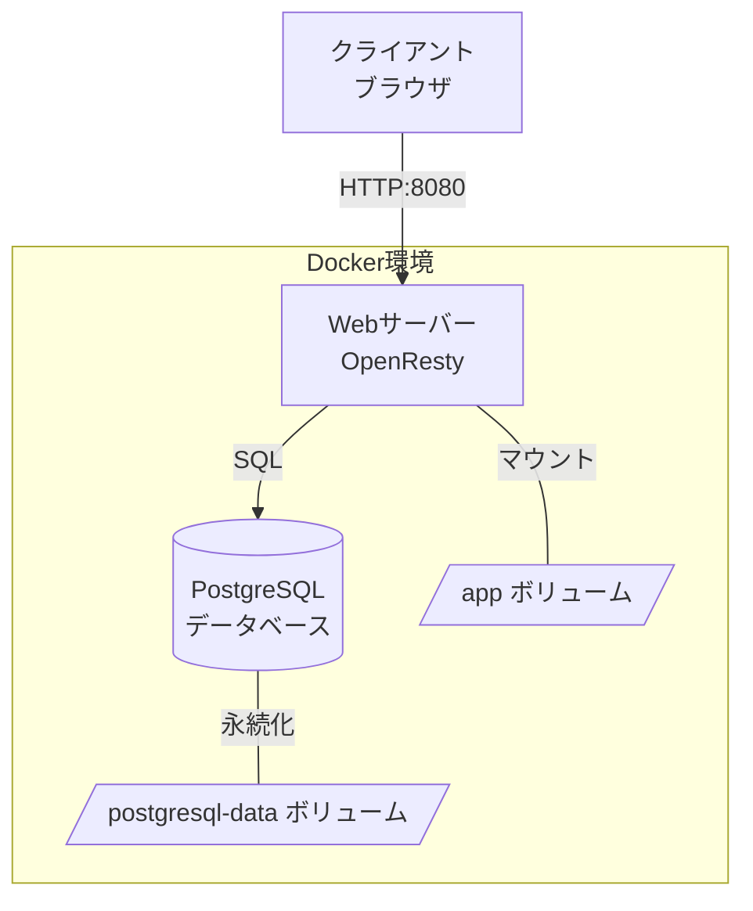

# LuaベースのWordPressライクなブログシステム - アーキテクチャ設計書

## 概要

本ドキュメントは、Docker Composeを使用してLuaベースのWordPressライクなブログシステムとPostgreSQLデータベースを構成するための設計書です。

## システム構成図



## 1. Docker Compose全体構成

### サービス構成

- **web**: OpenRestyベースのWebサーバー (Lua実行環境)
- **db**: PostgreSQL 15データベースサーバー

### ネットワーク

- カスタムブリッジネットワーク `LuaAIDiary-network` を使用
- サービス間通信はDockerの内部DNSで名前解決

### ボリューム

- `postgresql-data`: PostgreSQLデータの永続化用
- `./app`: アプリケーションコード (ホストとコンテナ間で共有)
- `./nginx`: Nginx設定ファイル
- `./logs`: アプリケーションログ

## 2. docker-compose.yml 構造

```yaml
version: '3.8'

services:
  web:
    build:
      context: .
      dockerfile: Dockerfile
    container_name: LuaAIDiary-web
    ports:
      - "8080:80"
    volumes:
      - ./app:/app
      - ./nginx/conf.d:/etc/nginx/conf.d
      - ./nginx/nginx.conf:/usr/local/openresty/nginx/conf/nginx.conf
      - ./logs:/var/log/nginx
    environment:
      - POSTGRES_HOST=db
      - POSTGRES_PORT=5432
      - POSTGRES_DB=LuaAIDiary
      - POSTGRES_USER=LuaAIDiary_user
      - POSTGRES_PASSWORD=LuaAIDiary_pass
    depends_on:
      - db
    networks:
      - LuaAIDiary-network
    restart: unless-stopped

  db:
    image: postgres:15-alpine
    container_name: LuaAIDiary-db
    environment:
      - POSTGRES_PASSWORD=root_password
      - POSTGRES_DB=LuaAIDiary
      - POSTGRES_USER=LuaAIDiary_user
    volumes:
      - postgresql-data:/var/lib/postgresql/data
      - ./postgresql/init:/docker-entrypoint-initdb.d
    ports:
      - "5432:5432"
    networks:
      - LuaAIDiary-network
    restart: unless-stopped

networks:
  LuaAIDiary-network:
    driver: bridge

volumes:
  postgresql-data:
    driver: local
```

## 3. Dockerfile (Webサーバー用)

### ベースイメージ

- `openresty/openresty:alpine`: 軽量で高性能なOpenRestyイメージ

### 必要なパッケージ

```dockerfile
FROM openresty/openresty:alpine

# 必要なパッケージのインストール
RUN apk add --no-cache \
    git \
    gcc \
    musl-dev \
    openssl-dev \
    postgresql-client

# LuaRocksのインストール (Luaパッケージマネージャー)
RUN apk add --no-cache luarocks

# 必要なLuaモジュールのインストール
RUN luarocks install pgmoon \
    && luarocks install lua-resty-template \
    && luarocks install lua-resty-session \
    && luarocks install lua-cjson \
    && luarocks install luasocket \
    && luarocks install bcrypt

# アプリケーションディレクトリの作成
RUN mkdir -p /app

# 作業ディレクトリの設定
WORKDIR /app

# ポート80を公開
EXPOSE 80

# OpenRestyの起動
CMD ["/usr/local/openresty/bin/openresty", "-g", "daemon off;"]
```

## 4. ディレクトリ構造

```
LuaAIDiary/
├── docker-compose.yml          # Docker Compose設定ファイル
├── Dockerfile                  # Webサーバー用Dockerfile
├── ARCHITECTURE.md             # 本設計書
├── README.md                   # プロジェクト概要
│
├── app/                        # Luaアプリケーションコード
│   ├── init.lua               # アプリケーション初期化
│   ├── config.lua             # 設定ファイル
│   ├── routes.lua             # ルーティング定義
│   │
│   ├── controllers/           # コントローラー層
│   │   ├── post_controller.lua
│   │   ├── user_controller.lua
│   │   └── admin_controller.lua
│   │
│   ├── models/                # モデル層 (データベース操作)
│   │   ├── post.lua
│   │   ├── user.lua
│   │   └── comment.lua
│   │
│   ├── views/                 # ビュー層 (テンプレート)
│   │   ├── layout.html
│   │   ├── home.html
│   │   ├── post.html
│   │   └── admin/
│   │       ├── dashboard.html
│   │       └── edit_post.html
│   │
│   ├── middleware/            # ミドルウェア
│   │   ├── auth.lua
│   │   └── logger.lua
│   │
│   ├── utils/                 # ユーティリティ関数
│   │   ├── database.lua
│   │   ├── validator.lua
│   │   └── helpers.lua
│   │
│   └── static/                # 静的ファイル
│       ├── css/
│       ├── js/
│       └── images/
│
├── nginx/                     # Nginx設定ファイル
│   ├── nginx.conf             # メインのNginx設定
│   └── conf.d/
│       └── default.conf       # サイト設定
│
├── postgresql/                # PostgreSQL関連
│   └── init/                  # 初期化SQLスクリプト
│       ├── 01_create_tables.sql  # テーブル定義
│       └── 02_seed.sql        # 初期データ
│
└── logs/                      # ログファイル
    ├── access.log
    └── error.log
```

## 5. Nginx設定ファイル

### nginx.conf (メイン設定)

```nginx
worker_processes auto;
error_log /var/log/nginx/error.log warn;
pid /var/run/nginx.pid;

events {
    worker_connections 1024;
}

http {
    include /etc/nginx/mime.types;
    default_type application/octet-stream;

    log_format main '$remote_addr - $remote_user [$time_local] "$request" '
                    '$status $body_bytes_sent "$http_referer" '
                    '"$http_user_agent" "$http_x_forwarded_for"';

    access_log /var/log/nginx/access.log main;

    sendfile on;
    tcp_nopush on;
    tcp_nodelay on;
    keepalive_timeout 65;
    types_hash_max_size 2048;

    # Lua共有辞書の設定
    lua_shared_dict sessions 10m;
    lua_shared_dict cache 10m;

    # Luaパッケージパスの設定
    lua_package_path "/app/?.lua;/app/?/init.lua;;";

    include /etc/nginx/conf.d/*.conf;
}
```

### conf.d/default.conf (サイト設定)

```nginx
server {
    listen 80;
    server_name localhost;

    root /app/static;
    index index.html;

    # 静的ファイルの配信
    location /static/ {
        alias /app/static/;
        expires 30d;
        add_header Cache-Control "public, immutable";
    }

    # Lua処理のエンドポイント
    location / {
        default_type 'text/html';
        content_by_lua_file /app/init.lua;
    }

    # APIエンドポイント
    location /api/ {
        default_type 'application/json';
        content_by_lua_file /app/routes.lua;
    }

    # 管理画面
    location /admin/ {
        default_type 'text/html';
        content_by_lua_file /app/controllers/admin_controller.lua;
    }

    # エラーページ
    error_page 404 /404.html;
    error_page 500 502 503 504 /50x.html;
}
```

## 6. PostgreSQL設定

### バージョン

- PostgreSQL 15 (高度なSQL機能、JSONB型、GINインデックス対応)

### 環境変数

| 変数名 | 値 | 説明 |
|--------|-----|------|
| POSTGRES_PASSWORD | root_password | PostgreSQLのパスワード |
| POSTGRES_DB | LuaAIDiary | 初期データベース名 |
| POSTGRES_USER | LuaAIDiary_user | アプリケーション用ユーザー |

### 初期化スクリプト (01_create_tables.sql)

```sql
-- ENUM型の定義
CREATE TYPE user_role AS ENUM ('admin', 'editor', 'author', 'subscriber');
CREATE TYPE post_status AS ENUM ('draft', 'published', 'trash');
CREATE TYPE comment_status AS ENUM ('pending', 'approved', 'spam', 'trash');

-- updated_atの自動更新トリガー関数
CREATE OR REPLACE FUNCTION update_updated_at_column()
RETURNS TRIGGER AS $$
BEGIN
    NEW.updated_at = CURRENT_TIMESTAMP;
    RETURN NEW;
END;
$$ LANGUAGE plpgsql;

-- ユーザーテーブル
CREATE TABLE IF NOT EXISTS users (
    id SERIAL PRIMARY KEY,
    username VARCHAR(50) UNIQUE NOT NULL,
    email VARCHAR(100) UNIQUE NOT NULL,
    password_hash VARCHAR(255) NOT NULL,
    display_name VARCHAR(100),
    role user_role DEFAULT 'subscriber',
    created_at TIMESTAMP DEFAULT CURRENT_TIMESTAMP,
    updated_at TIMESTAMP DEFAULT CURRENT_TIMESTAMP
);

CREATE TRIGGER update_users_updated_at
    BEFORE UPDATE ON users
    FOR EACH ROW
    EXECUTE FUNCTION update_updated_at_column();

CREATE INDEX idx_users_username ON users(username);
CREATE INDEX idx_users_email ON users(email);

-- 投稿テーブル
CREATE TABLE IF NOT EXISTS posts (
    id SERIAL PRIMARY KEY,
    title VARCHAR(255) NOT NULL,
    slug VARCHAR(255) UNIQUE NOT NULL,
    content TEXT,
    excerpt TEXT,
    author_id INTEGER NOT NULL,
    status post_status DEFAULT 'draft',
    published_at TIMESTAMP NULL,
    created_at TIMESTAMP DEFAULT CURRENT_TIMESTAMP,
    updated_at TIMESTAMP DEFAULT CURRENT_TIMESTAMP,
    FOREIGN KEY (author_id) REFERENCES users(id) ON DELETE CASCADE
);

CREATE TRIGGER update_posts_updated_at
    BEFORE UPDATE ON posts
    FOR EACH ROW
    EXECUTE FUNCTION update_updated_at_column();

CREATE INDEX idx_posts_slug ON posts(slug);
CREATE INDEX idx_posts_status ON posts(status);
CREATE INDEX idx_posts_published_at ON posts(published_at);
CREATE INDEX idx_posts_author_id ON posts(author_id);

-- 全文検索用GINインデックス
CREATE INDEX idx_posts_search ON posts USING GIN(to_tsvector('english', title || ' ' || COALESCE(content, '')));

-- コメントテーブル
CREATE TABLE IF NOT EXISTS comments (
    id SERIAL PRIMARY KEY,
    post_id INTEGER NOT NULL,
    author_name VARCHAR(100) NOT NULL,
    author_email VARCHAR(100) NOT NULL,
    content TEXT NOT NULL,
    status comment_status DEFAULT 'pending',
    created_at TIMESTAMP DEFAULT CURRENT_TIMESTAMP,
    updated_at TIMESTAMP DEFAULT CURRENT_TIMESTAMP,
    FOREIGN KEY (post_id) REFERENCES posts(id) ON DELETE CASCADE
);

CREATE TRIGGER update_comments_updated_at
    BEFORE UPDATE ON comments
    FOR EACH ROW
    EXECUTE FUNCTION update_updated_at_column();

CREATE INDEX idx_comments_post_id ON comments(post_id);
CREATE INDEX idx_comments_status ON comments(status);

-- カテゴリーテーブル
CREATE TABLE IF NOT EXISTS categories (
    id SERIAL PRIMARY KEY,
    name VARCHAR(100) NOT NULL,
    slug VARCHAR(100) UNIQUE NOT NULL,
    description TEXT,
    created_at TIMESTAMP DEFAULT CURRENT_TIMESTAMP
);

CREATE INDEX idx_categories_slug ON categories(slug);

-- 投稿とカテゴリーの中間テーブル
CREATE TABLE IF NOT EXISTS post_categories (
    post_id INTEGER NOT NULL,
    category_id INTEGER NOT NULL,
    PRIMARY KEY (post_id, category_id),
    FOREIGN KEY (post_id) REFERENCES posts(id) ON DELETE CASCADE,
    FOREIGN KEY (category_id) REFERENCES categories(id) ON DELETE CASCADE
);

-- タグテーブル
CREATE TABLE IF NOT EXISTS tags (
    id SERIAL PRIMARY KEY,
    name VARCHAR(50) NOT NULL,
    slug VARCHAR(50) UNIQUE NOT NULL,
    created_at TIMESTAMP DEFAULT CURRENT_TIMESTAMP
);

CREATE INDEX idx_tags_slug ON tags(slug);

-- 投稿とタグの中間テーブル
CREATE TABLE IF NOT EXISTS post_tags (
    post_id INTEGER NOT NULL,
    tag_id INTEGER NOT NULL,
    PRIMARY KEY (post_id, tag_id),
    FOREIGN KEY (post_id) REFERENCES posts(id) ON DELETE CASCADE,
    FOREIGN KEY (tag_id) REFERENCES tags(id) ON DELETE CASCADE
);
```

## 7. ポート設定とネットワーク構成

### ポートマッピング

| サービス | コンテナポート | ホストポート | 用途 |
|----------|----------------|--------------|------|
| web | 80 | 8080 | HTTP通信 |
| db | 5432 | 5432 | PostgreSQL接続 (開発用) |

### ネットワーク構成

- **ネットワーク名**: `LuaAIDiary-network`
- **ドライバー**: bridge
- **サービス間通信**:
  - Webコンテナからデータベースへの接続: `db:5432`
  - 内部DNS名でサービス名を使用

### セキュリティ考慮事項

- 本番環境ではPostgreSQLの5432ポートを外部公開しない
- 環境変数は`.env`ファイルで管理し、`.gitignore`に追加
- パスワードは強固なものに変更

## 8. 必要な設定ファイル一覧

### 必須ファイル

1. `docker-compose.yml` - Docker Compose設定
2. `Dockerfile` - Webサーバー用コンテナイメージ
3. `nginx/nginx.conf` - Nginxメイン設定
4. `nginx/conf.d/default.conf` - サイト別設定
5. `postgresql/init/01_create_tables.sql` - データベーススキーマ定義
6. `.env` - 環境変数設定 (任意)
7. `.gitignore` - Gitで管理しないファイルの指定

### アプリケーションファイル

1. `app/init.lua` - アプリケーションエントリーポイント
2. `app/config.lua` - アプリケーション設定
3. `app/routes.lua` - ルーティング定義
4. `app/utils/database.lua` - データベース接続ユーティリティ

## 9. 開発フロー

### 初期セットアップ

```bash
# プロジェクトのクローン
cd LuaAIDiary

# コンテナのビルドと起動
docker-compose up -d --build

# ログの確認
docker-compose logs -f

# ブラウザでアクセス
# http://localhost:8080
```

### 開発中の作業

```bash
# コンテナの停止
docker-compose stop

# コンテナの起動
docker-compose start

# コンテナの再起動
docker-compose restart web

# データベースへの接続
docker-compose exec db psql -U LuaAIDiary_user -d LuaAIDiary

# Webコンテナへの接続
docker-compose exec web sh

# ログの確認
docker-compose logs -f web
```

### データベースのバックアップとリストア

```bash
# バックアップ
docker-compose exec db pg_dump -U LuaAIDiary_user LuaAIDiary > backup.sql

# リストア
docker-compose exec -T db psql -U LuaAIDiary_user LuaAIDiary < backup.sql
```

## 10. 各サービス間の連携方法

### WebコンテナからPostgreSQLへの接続

Luaコード内でのデータベース接続例:

```lua
local pgmoon = require "pgmoon"

local pg = pgmoon.new({
    host = os.getenv("POSTGRES_HOST") or "db",
    port = tonumber(os.getenv("POSTGRES_PORT")) or 5432,
    database = os.getenv("POSTGRES_DB") or "LuaAIDiary",
    user = os.getenv("POSTGRES_USER") or "LuaAIDiary_user",
    password = os.getenv("POSTGRES_PASSWORD") or "LuaAIDiary_pass"
})

assert(pg:connect())

-- クエリの実行例
local result = pg:query("SELECT * FROM users LIMIT 10")

-- 接続を閉じる
pg:keepalive(10000, 100)
```

### 環境変数の受け渡し

- `docker-compose.yml`の`environment`セクションでWebコンテナに環境変数を設定
- Luaコード内で`os.getenv()`を使用して取得

### ボリュームマウントによるコード共有

- `./app`ディレクトリをコンテナの`/app`にマウント
- ホスト側でコードを編集すると即座にコンテナに反映
- OpenRestyの設定変更時は`docker-compose restart web`で反映

## 11. パフォーマンスとスケーラビリティの考慮

### キャッシュ戦略

- Lua共有辞書を使用した簡易キャッシュ
- 将来的にRedisの追加を検討

### データベース最適化

- 適切なインデックスの設定
- クエリの最適化
- コネクションプーリングの活用

### 水平スケーリング

- 複数のWebコンテナを起動可能
- ロードバランサー (Nginx/HAProxy) の追加
- セッション管理の外部化 (Redis等)

## 12. 今後の拡張性

### 追加可能なサービス

- Redis: キャッシュ/セッションストア
- Elasticsearch: 全文検索
- MinIO/S3: メディアファイルストレージ
- phpMyAdmin: データベース管理UI

### 監視とロギング

- Prometheus + Grafana: メトリクス監視
- ELKスタック: ログ集約と分析

## まとめ

本設計書は、Docker Composeを使用してLuaベースのWordPressライクなブログシステムを構築するための包括的なアーキテクチャを提供します。OpenRestyとPostgreSQLの組み合わせにより、高性能で拡張性のあるシステムを実現できます。PostgreSQLの高度な機能（JSONB型、GINインデックス、全文検索など）により、柔軟で強力なデータ管理が可能です。