# LuaAIDiary 詳細設計書

## 目次

1. [プロジェクト概要](#1-プロジェクト概要)
2. [システムアーキテクチャ](#2-システムアーキテクチャ)
3. [データベース設計](#3-データベース設計)
4. [WordPressテーマ互換レイヤー](#4-wordpressテーマ互換レイヤー)
5. [Gemini連携設計](#5-gemini連携設計)
6. [コア機能設計](#6-コア機能設計)
7. [セキュリティ設計](#7-セキュリティ設計)
8. [実装フェーズ計画](#8-実装フェーズ計画)

---

## 1. プロジェクト概要

### 1.1 プロジェクトの目的

LuaAIDiaryは、Lua製のWordPressライクな高性能ブログシステムです。以下の3つの主要な特徴を持ちます:

1. **高性能Lua実装**: OpenRestyによる非同期I/O処理で高速なレスポンスを実現
2. **WordPressテーマ直接導入**: 既存の公開WordPressテーマをそのまま使用可能になったらいいな
3. **Gemini AI連携**: ユーザー個別のAPIキーによる記事作成支援と改善提案

### 1.2 技術選定の理由

| 技術 | 選定理由 |
|------|----------|
| OpenResty | NginxにLuaJITを統合し、高性能な非同期処理を実現 |
| PostgreSQL 15 | 高度なSQL機能、JSONB型、GINインデックス、豊富な拡張機能に対応 |
| Lapis | Lua用軽量Webフレームワーク（オプション） |
| lua-resty-template | テンプレートエンジン |
| lua-resty-session | セッション管理 |
| lua-resty-http | Gemini API通信 |
| php-parser | PHPコード解析（テーマ互換用） |

### 1.3 対象ユーザー

- ブログ運営者（個人・企業）
- コンテンツクリエイター
- 開発者（カスタマイズ用途）

---

## 2. システムアーキテクチャ

### 2.1 全体構成図

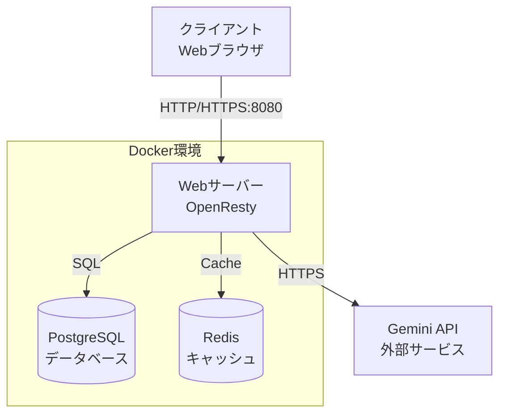

### 2.2 レイヤー構造

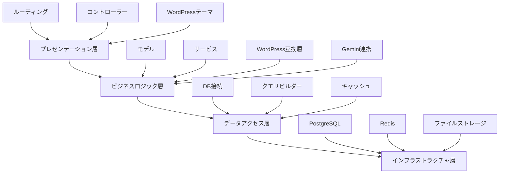

### 2.3 ディレクトリ構造

```
LuaAIDiary/
├── app/
│   ├── init.lua                    # アプリケーションエントリーポイント
│   ├── routes.lua                  # ルーティング定義
│   │
│   ├── config/                     # 設定ファイル
│   │   ├── database.lua           # DB接続設定
│   │   ├── app.lua                # アプリケーション設定
│   │   └── gemini.lua             # Gemini API設定
│   │
│   ├── controllers/               # コントローラー
│   │   ├── post_controller.lua
│   │   ├── user_controller.lua
│   │   ├── admin_controller.lua
│   │   ├── comment_controller.lua
│   │   └── gemini_controller.lua
│   │
│   ├── models/                    # モデル
│   │   ├── post.lua
│   │   ├── user.lua
│   │   ├── comment.lua
│   │   ├── category.lua
│   │   ├── tag.lua
│   │   └── user_setting.lua
│   │
│   ├── services/                  # サービス層
│   │   ├── gemini_service.lua    # Gemini API連携
│   │   ├── auth_service.lua      # 認証サービス
│   │   └── wp_compat/            # WordPress互換レイヤー
│   │       ├── php_runtime.lua    # PHP実行環境
│   │       ├── template_tags.lua  # テンプレートタグ
│   │       ├── theme_loader.lua   # テーマローダー
│   │       └── functions.lua      # WordPress関数エミュレーション
│   │
│   ├── middleware/                # ミドルウェア
│   │   ├── auth.lua              # 認証
│   │   ├── csrf.lua              # CSRF対策
│   │   ├── logger.lua            # ロギング
│   │   └── rate_limit.lua        # レート制限
│   │
│   ├── utils/                     # ユーティリティ
│   │   ├── validator.lua         # バリデーション
│   │   ├── helpers.lua           # ヘルパー関数
│   │   ├── query_builder.lua     # クエリビルダー
│   │   ├── cache.lua             # キャッシュ管理
│   │   └── sanitizer.lua         # サニタイズ処理
│   │
│   └── views/                     # ビューテンプレート
│       ├── layouts/
│       │   └── main.html
│       ├── admin/
│       │   ├── dashboard.html
│       │   ├── posts/
│       │   └── settings/
│       └── errors/
│           ├── 404.html
│           └── 500.html
│
├── wp-content/                    # WordPress互換ディレクトリ
│   ├── themes/                    # テーマディレクトリ
│   │   ├── twentytwentyfour/     # 公式テーマ例
│   │   └── custom-theme/         # カスタムテーマ
│   ├── plugins/                   # プラグイン（将来）
│   └── uploads/                   # アップロードファイル
│
├── static/                        # 静的ファイル
│   ├── css/
│   ├── js/
│   └── admin/                     # 管理画面アセット
│
└── tests/                         # テストファイル
    ├── unit/
    └── integration/
```

---

## 3. データベース設計

### 3.1 ER図

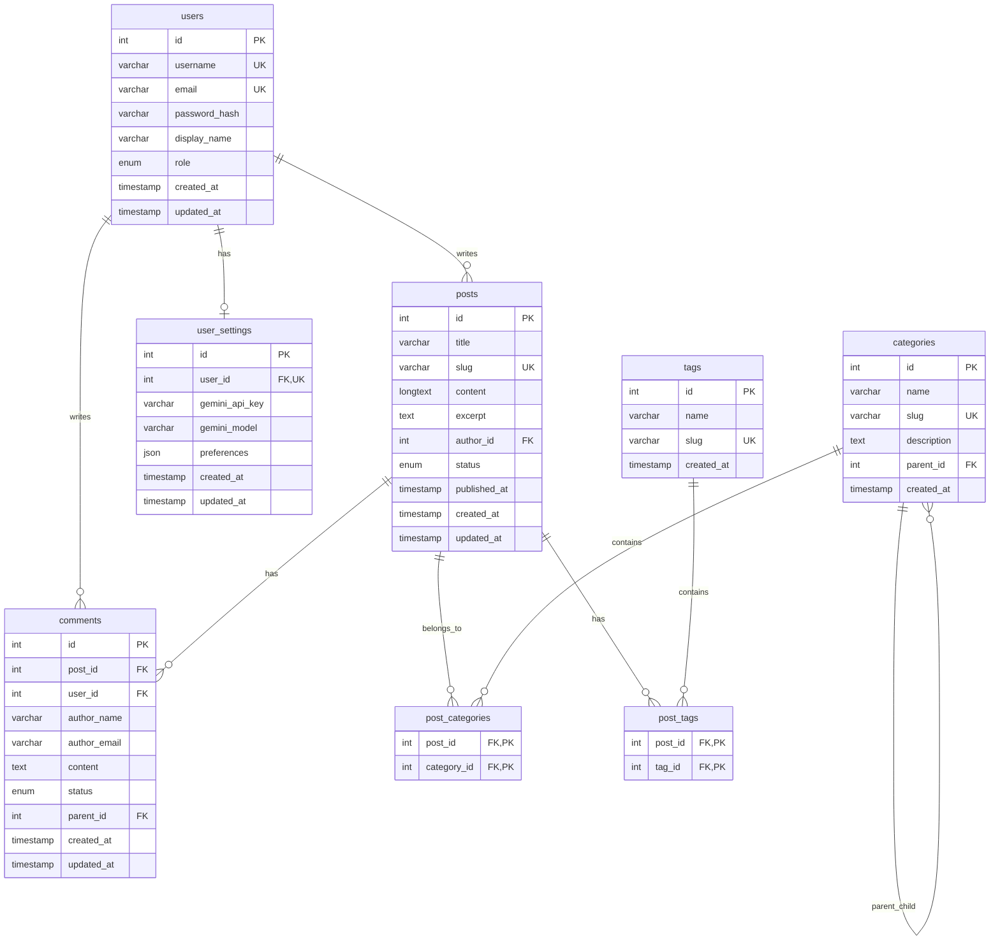

### 3.2 テーブル定義

#### 3.2.1 usersテーブル

```sql
-- ENUM型の定義
CREATE TYPE user_role AS ENUM ('admin', 'editor', 'author', 'subscriber');

CREATE TABLE users (
    id SERIAL PRIMARY KEY,
    username VARCHAR(50) UNIQUE NOT NULL,
    email VARCHAR(100) UNIQUE NOT NULL,
    password_hash VARCHAR(255) NOT NULL,
    display_name VARCHAR(100),
    role user_role DEFAULT 'subscriber',
    created_at TIMESTAMP DEFAULT CURRENT_TIMESTAMP,
    updated_at TIMESTAMP DEFAULT CURRENT_TIMESTAMP
);

-- updated_atの自動更新トリガー
CREATE OR REPLACE FUNCTION update_updated_at_column()
RETURNS TRIGGER AS $$
BEGIN
    NEW.updated_at = CURRENT_TIMESTAMP;
    RETURN NEW;
END;
$$ LANGUAGE plpgsql;

CREATE TRIGGER update_users_updated_at
    BEFORE UPDATE ON users
    FOR EACH ROW
    EXECUTE FUNCTION update_updated_at_column();

-- インデックス
CREATE INDEX idx_users_username ON users(username);
CREATE INDEX idx_users_email ON users(email);
CREATE INDEX idx_users_role ON users(role);
```

**フィールド説明:**
- `id`: ユーザー一意識別子
- `username`: ログインユーザー名（一意）
- `email`: メールアドレス（一意）
- `password_hash`: bcryptハッシュ化パスワード
- `display_name`: 表示名
- `role`: 権限レベル（admin, editor, author, subscriber）

#### 3.2.2 postsテーブル

```sql
-- ENUM型の定義
CREATE TYPE post_status AS ENUM ('draft', 'published', 'trash');

CREATE TABLE posts (
    id SERIAL PRIMARY KEY,
    title VARCHAR(255) NOT NULL,
    slug VARCHAR(255) UNIQUE NOT NULL,
    content TEXT,
    excerpt TEXT,
    author_id INTEGER NOT NULL,
    status post_status DEFAULT 'draft',
    published_at TIMESTAMP NULL,
    created_at TIMESTAMP DEFAULT CURRENT_TIMESTAMP,
    updated_at TIMESTAMP DEFAULT CURRENT_TIMESTAMP,
    
    FOREIGN KEY (author_id) REFERENCES users(id) ON DELETE CASCADE
);

-- updated_atの自動更新トリガー
CREATE TRIGGER update_posts_updated_at
    BEFORE UPDATE ON posts
    FOR EACH ROW
    EXECUTE FUNCTION update_updated_at_column();

-- インデックス
CREATE INDEX idx_posts_slug ON posts(slug);
CREATE INDEX idx_posts_status ON posts(status);
CREATE INDEX idx_posts_published_at ON posts(published_at);
CREATE INDEX idx_posts_author_id ON posts(author_id);

-- 全文検索用GINインデックス
CREATE INDEX idx_posts_title_content ON posts USING GIN(to_tsvector('english', title || ' ' || COALESCE(content, '')));
```

**フィールド説明:**
- `slug`: URL用スラッグ（一意）
- `content`: 記事本文（LONGTEXT: 4GB）
- `excerpt`: 記事抜粋
- `status`: 公開状態（下書き、公開、ゴミ箱）

#### 3.2.3 commentsテーブル

```sql
-- ENUM型の定義
CREATE TYPE comment_status AS ENUM ('pending', 'approved', 'spam', 'trash');

CREATE TABLE comments (
    id SERIAL PRIMARY KEY,
    post_id INTEGER NOT NULL,
    user_id INTEGER NULL,
    author_name VARCHAR(100) NOT NULL,
    author_email VARCHAR(100) NOT NULL,
    content TEXT NOT NULL,
    status comment_status DEFAULT 'pending',
    parent_id INTEGER NULL,
    created_at TIMESTAMP DEFAULT CURRENT_TIMESTAMP,
    updated_at TIMESTAMP DEFAULT CURRENT_TIMESTAMP,
    
    FOREIGN KEY (post_id) REFERENCES posts(id) ON DELETE CASCADE,
    FOREIGN KEY (user_id) REFERENCES users(id) ON DELETE SET NULL,
    FOREIGN KEY (parent_id) REFERENCES comments(id) ON DELETE CASCADE
);

-- updated_atの自動更新トリガー
CREATE TRIGGER update_comments_updated_at
    BEFORE UPDATE ON comments
    FOR EACH ROW
    EXECUTE FUNCTION update_updated_at_column();

-- インデックス
CREATE INDEX idx_comments_post_id ON comments(post_id);
CREATE INDEX idx_comments_status ON comments(status);
CREATE INDEX idx_comments_parent_id ON comments(parent_id);
```

**フィールド説明:**
- `user_id`: ログインユーザーの場合のID（NULL許可）
- `parent_id`: 親コメントID（スレッド表示用）
- `status`: 承認状態

#### 3.2.4 categoriesテーブル

```sql
CREATE TABLE categories (
    id SERIAL PRIMARY KEY,
    name VARCHAR(100) NOT NULL,
    slug VARCHAR(100) UNIQUE NOT NULL,
    description TEXT,
    parent_id INTEGER NULL,
    created_at TIMESTAMP DEFAULT CURRENT_TIMESTAMP,
    
    FOREIGN KEY (parent_id) REFERENCES categories(id) ON DELETE SET NULL
);

-- インデックス
CREATE INDEX idx_categories_slug ON categories(slug);
```

#### 3.2.5 tagsテーブル

```sql
CREATE TABLE tags (
    id SERIAL PRIMARY KEY,
    name VARCHAR(50) NOT NULL,
    slug VARCHAR(50) UNIQUE NOT NULL,
    created_at TIMESTAMP DEFAULT CURRENT_TIMESTAMP
);

-- インデックス
CREATE INDEX idx_tags_slug ON tags(slug);
CREATE INDEX idx_tags_name ON tags(name);
```

#### 3.2.6 user_settingsテーブル

```sql
CREATE TABLE user_settings (
    id SERIAL PRIMARY KEY,
    user_id INTEGER UNIQUE NOT NULL,
    gemini_api_key VARCHAR(255) NULL,
    gemini_model VARCHAR(50) DEFAULT 'gemini-1.5-pro',
    preferences JSONB,
    created_at TIMESTAMP DEFAULT CURRENT_TIMESTAMP,
    updated_at TIMESTAMP DEFAULT CURRENT_TIMESTAMP,
    
    FOREIGN KEY (user_id) REFERENCES users(id) ON DELETE CASCADE
);

-- updated_atの自動更新トリガー
CREATE TRIGGER update_user_settings_updated_at
    BEFORE UPDATE ON user_settings
    FOR EACH ROW
    EXECUTE FUNCTION update_updated_at_column();

-- インデックス
CREATE INDEX idx_user_settings_user_id ON user_settings(user_id);

-- JSONB用GINインデックス（高速なJSONクエリのため）
CREATE INDEX idx_user_settings_preferences ON user_settings USING GIN(preferences);
```

**フィールド説明:**
- `gemini_api_key`: 暗号化されたGemini APIキー
- `gemini_model`: 使用するGeminiモデル
- `preferences`: ユーザー設定（JSON形式）

#### 3.2.7 post_categoriesテーブル（中間テーブル）

```sql
CREATE TABLE post_categories (
    post_id INTEGER NOT NULL,
    category_id INTEGER NOT NULL,
    PRIMARY KEY (post_id, category_id),
    FOREIGN KEY (post_id) REFERENCES posts(id) ON DELETE CASCADE,
    FOREIGN KEY (category_id) REFERENCES categories(id) ON DELETE CASCADE
);
```

#### 3.2.8 post_tagsテーブル（中間テーブル）

```sql
CREATE TABLE post_tags (
    post_id INTEGER NOT NULL,
    tag_id INTEGER NOT NULL,
    PRIMARY KEY (post_id, tag_id),
    FOREIGN KEY (post_id) REFERENCES posts(id) ON DELETE CASCADE,
    FOREIGN KEY (tag_id) REFERENCES tags(id) ON DELETE CASCADE
);
```

### 3.3 インデックス戦略

#### パフォーマンス最適化のためのインデックス

1. **主キーインデックス**: すべてのテーブルで自動作成
2. **一意制約インデックス**: username, email, slug
3. **外部キーインデックス**: リレーション高速化
4. **検索用インデックス**: status, published_at
5. **全文検索インデックス**: title, content（GINインデックス）
6. **JSONB用GINインデックス**: preferences（高速なJSONクエリ）

#### インデックス使用例

```sql
-- 公開記事の取得（idx_posts_status, idx_posts_published_atを使用）
SELECT * FROM posts
WHERE status = 'published'
ORDER BY published_at DESC
LIMIT 10;

-- ユーザーの記事取得（idx_posts_author_idを使用）
SELECT * FROM posts
WHERE author_id = 1 AND status = 'published';

-- スラッグ検索（idx_posts_slugを使用）
SELECT * FROM posts WHERE slug = 'example-post';

-- 全文検索（GINインデックスを使用）
SELECT * FROM posts
WHERE to_tsvector('english', title || ' ' || COALESCE(content, '')) @@ to_tsquery('english', 'Lua & OpenResty');

-- JSONB検索（GINインデックスを使用）
SELECT * FROM user_settings
WHERE preferences @> '{"theme": "dark"}';
```

---

## 4. WordPressテーマ互換レイヤー

### 4.1 互換性の方針

**既存WordPressテーマの直接導入**: 公開されているWordPressテーマをそのまま使用可能にします。

#### 実装戦略

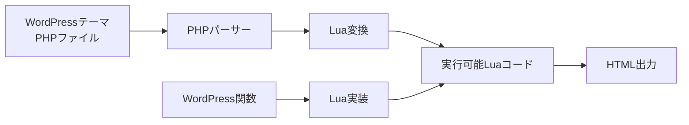

#### アプローチ

1. **PHPパーサー統合**: PHPコードをLuaで解釈
2. **WordPress関数エミュレーション**: 主要なWP関数をLuaで実装
3. **テーマディレクトリ互換**: `wp-content/themes/`を使用
4. **テンプレート階層**: WordPressと同じ優先順位

### 4.2 PHP実行環境の実装

#### PHPパーサーの選定

**オプション1: php-parser (推奨)**
- PHPコードをASTに変換
- Luaで解釈・実行

**オプション2: LuaPHP**
- PHPをLuaに変換するライブラリ

**オプション3: 外部PHPプロセス**
- `php-fpm`との連携（フォールバック）

#### PHP実行環境の実装例

```lua
-- services/wp_compat/php_runtime.lua

local _M = {}

-- PHPファイルを実行
function _M.execute_php_file(file_path, context)
    -- PHPファイルを読み込み
    local file = io.open(file_path, "r")
    if not file then
        return nil, "ファイルが見つかりません: " .. file_path
    end
    
    local php_code = file:read("*all")
    file:close()
    
    -- PHPコードを解析・実行
    return _M.execute_php_code(php_code, context)
end

-- PHPコードを実行
function _M.execute_php_code(php_code, context)
    -- コンテキストをグローバルスコープに設定
    _M.setup_wp_globals(context)
    
    -- PHPコードをLuaコードに変換
    local lua_code, err = _M.php_to_lua(php_code)
    if not lua_code then
        return nil, err
    end
    
    -- Luaコードを実行
    local func, err = loadstring(lua_code)
    if not func then
        return nil, "Luaコンパイルエラー: " .. err
    end
    
    -- 出力をキャプチャ
    local output = {}
    local old_print = print
    print = function(...)
        table.insert(output, table.concat({...}, "\t"))
    end
    
    local success, result = pcall(func)
    print = old_print
    
    if not success then
        return nil, "実行エラー: " .. result
    end
    
    return table.concat(output, "\n"), nil
end

-- PHPコードをLuaに変換（簡易版）
function _M.php_to_lua(php_code)
    -- <?php と ?> を除去
    php_code = php_code:gsub("<%?php", ""):gsub("%?>", "")
    
    -- echo を print に変換
    php_code = php_code:gsub("echo%s+", "print("):gsub(";", ");")
    
    -- 変数の $ を削除
    php_code = php_code:gsub("%$([%w_]+)", "%1")
    
    -- 配列記法の変換
    php_code = php_code:gsub("array%(", "{"):gsub("%)", "}")
    
    -- WordPress関数呼び出しを変換
    php_code = _M.convert_wp_functions(php_code)
    
    return php_code
end

-- WordPress関数をLua関数に変換
function _M.convert_wp_functions(code)
    local wp_functions = {
        "the_title",
        "the_content",
        "the_excerpt",
        "the_permalink",
        "get_header",
        "get_footer",
        "have_posts",
        "the_post"
    }
    
    for _, func_name in ipairs(wp_functions) do
        local pattern = func_name .. "%s*%("
        local replacement = "wp." .. func_name .. "("
        code = code:gsub(pattern, replacement)
    end
    
    return code
end

-- WordPressグローバル変数の設定
function _M.setup_wp_globals(context)
    _G.wp = require "services.wp_compat.template_tags"
    _G.wp.current_post = context.post
    _G.wp.posts = context.posts or {}
end

return _M
```

### 4.3 テーマ階層の実装

WordPressのテンプレート階層をそのまま実装します。

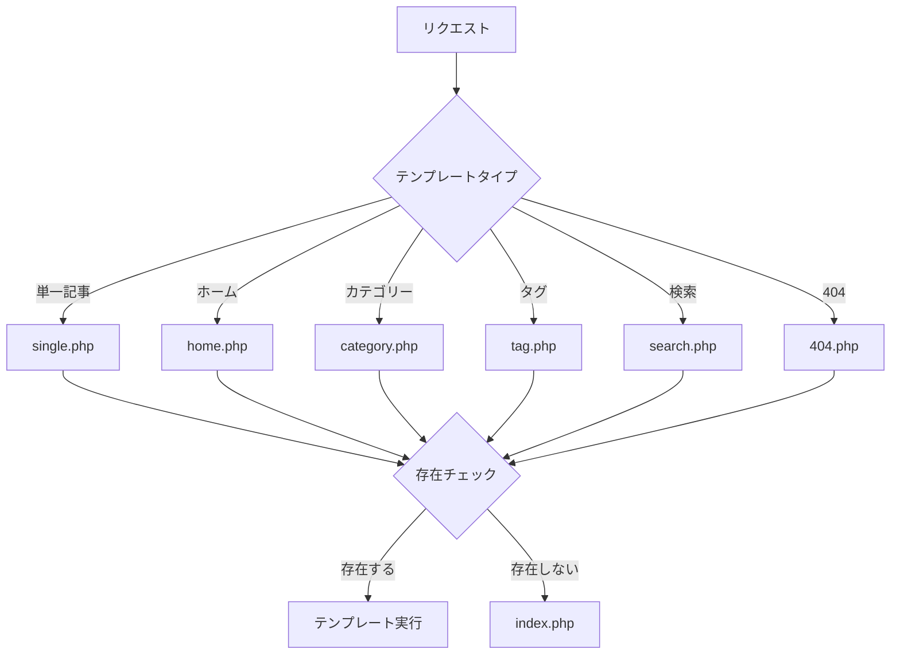

#### テーマローダーの実装

```lua
-- services/wp_compat/theme_loader.lua

local php_runtime = require "services.wp_compat.php_runtime"

local _M = {}

-- アクティブテーマのディレクトリ
_M.active_theme = "twentytwentyfour"  -- 設定から取得
_M.theme_dir = "/app/wp-content/themes/"

-- テンプレート階層定義
_M.template_hierarchy = {
    single = {
        'single-{post_type}-{slug}.php',
        'single-{post_type}.php',
        'single.php',
        'singular.php',
        'index.php'
    },
    page = {
        'page-{slug}.php',
        'page-{id}.php',
        'page.php',
        'singular.php',
        'index.php'
    },
    category = {
        'category-{slug}.php',
        'category-{id}.php',
        'category.php',
        'archive.php',
        'index.php'
    },
    tag = {
        'tag-{slug}.php',
        'tag-{id}.php',
        'tag.php',
        'archive.php',
        'index.php'
    },
    home = {
        'front-page.php',
        'home.php',
        'index.php'
    },
    search = {
        'search.php',
        'index.php'
    },
    ['404'] = {
        '404.php',
        'index.php'
    }
}

-- テンプレートを読み込んで実行
function _M.load_template(template_type, context)
    local templates = _M.template_hierarchy[template_type]
    if not templates then
        return nil, "不明なテンプレートタイプ: " .. template_type
    end
    
    -- テンプレート階層を順に確認
    for _, template_pattern in ipairs(templates) do
        local template_file = _M.resolve_template_path(template_pattern, context)
        local file_path = _M.theme_dir .. _M.active_theme .. "/" .. template_file
        
        if _M.file_exists(file_path) then
            ngx.log(ngx.INFO, "テンプレート読み込み: ", file_path)
            return php_runtime.execute_php_file(file_path, context)
        end
    end
    
    return nil, "テンプレートが見つかりません"
end

-- テンプレートパスの解決
function _M.resolve_template_path(pattern, context)
    local path = pattern
    
    -- プレースホルダーを置換
    if context.post then
        path = path:gsub("{post_type}", context.post.post_type or "post")
        path = path:gsub("{slug}", context.post.slug or "")
        path = path:gsub("{id}", context.post.id or "")
    end
    
    if context.category then
        path = path:gsub("{slug}", context.category.slug or "")
        path = path:gsub("{id}", context.category.id or "")
    end
    
    if context.tag then
        path = path:gsub("{slug}", context.tag.slug or "")
        path = path:gsub("{id}", context.tag.id or "")
    end
    
    return path
end

-- ファイルの存在確認
function _M.file_exists(path)
    local file = io.open(path, "r")
    if file then
        file:close()
        return true
    end
    return false
end

-- get_header() の実装
function _M.get_header(name)
    local file_name = name and ("header-" .. name .. ".php") or "header.php"
    local file_path = _M.theme_dir .. _M.active_theme .. "/" .. file_name
    
    if _M.file_exists(file_path) then
        local output, err = php_runtime.execute_php_file(file_path, {})
        if output then
            ngx.print(output)
        end
    end
end

-- get_footer() の実装
function _M.get_footer(name)
    local file_name = name and ("footer-" .. name .. ".php") or "footer.php"
    local file_path = _M.theme_dir .. _M.active_theme .. "/" .. file_name
    
    if _M.file_exists(file_path) then
        local output, err = php_runtime.execute_php_file(file_path, {})
        if output then
            ngx.print(output)
        end
    end
end

return _M
```

### 4.4 WordPress関数のLua実装

主要なWordPress関数をLuaで実装します。

```lua
-- services/wp_compat/template_tags.lua

local _M = {}

-- グローバルコンテキスト
_M.current_post = nil
_M.posts = {}
_M.post_index = 0

-- ========================================
-- The Loop 関数
-- ========================================

function _M.have_posts()
    return _M.post_index < #_M.posts
end

function _M.the_post()
    _M.post_index = _M.post_index + 1
    _M.current_post = _M.posts[_M.post_index]
end

-- ========================================
-- 記事データ取得関数
-- ========================================

function _M.the_title(before, after)
    if _M.current_post then
        before = before or ""
        after = after or ""
        ngx.print(before .. _M.escape_html(_M.current_post.title) .. after)
    end
end

function _M.get_the_title(post_id)
    local post = post_id and _M.get_post(post_id) or _M.current_post
    return post and post.title or ""
end

function _M.the_content(more_link_text)
    if _M.current_post then
        ngx.print(_M.current_post.content)
    end
end

function _M.get_the_content()
    return _M.current_post and _M.current_post.content or ""
end

function _M.the_excerpt()
    if _M.current_post then
        local excerpt = _M.current_post.excerpt
        if not excerpt or excerpt == "" then
            excerpt = _M.auto_excerpt(_M.current_post.content, 150)
        end
        ngx.print(_M.escape_html(excerpt))
    end
end

function _M.get_the_excerpt()
    if _M.current_post then
        local excerpt = _M.current_post.excerpt
        if not excerpt or excerpt == "" then
            return _M.auto_excerpt(_M.current_post.content, 150)
        end
        return excerpt
    end
    return ""
end

-- ========================================
-- URL・リンク関数
-- ========================================

function _M.the_permalink()
    ngx.print(_M.get_permalink())
end

function _M.get_permalink(post_id)
    local post = post_id and _M.get_post(post_id) or _M.current_post
    if post then
        return string.format("%s/%s", _M.home_url(), post.slug)
    end
    return ""
end

function _M.home_url(path)
    local base_url = ngx.var.scheme .. "://" .. ngx.var.host
    return path and (base_url .. "/" .. path) or base_url
end

function _M.site_url(path)
    return _M.home_url(path)
end

-- ========================================
-- 著者関数
-- ========================================

function _M.the_author()
    if _M.current_post and _M.current_post.author then
        ngx.print(_M.escape_html(_M.current_post.author.display_name))
    end
end

function _M.get_the_author()
    return _M.current_post and _M.current_post.author and _M.current_post.author.display_name or ""
end

function _M.the_author_posts_link()
    if _M.current_post and _M.current_post.author then
        local author = _M.current_post.author
        ngx.print(string.format(
            '<a href="%s/author/%s">%s</a>',
            _M.home_url(),
            author.username,
            _M.escape_html(author.display_name)
        ))
    end
end

-- ========================================
-- 日時関数
-- ========================================

function _M.the_time(format)
    ngx.print(_M.get_the_time(format))
end

function _M.get_the_time(format)
    if _M.current_post and _M.current_post.published_at then
        format = format or "%Y-%m-%d %H:%M:%S"
        return os.date(format, _M.current_post.published_at)
    end
    return ""
end

function _M.the_date(format)
    ngx.print(_M.get_the_date(format))
end

function _M.get_the_date(format)
    format = format or "%Y年%m月%d日"
    return _M.get_the_time(format)
end

-- ========================================
-- カテゴリー・タグ関数
-- ========================================

function _M.the_category(separator, parents)
    ngx.print(_M.get_the_category_list(separator, parents))
end

function _M.get_the_category_list(separator, parents)
    if not _M.current_post or not _M.current_post.categories then
        return ""
    end
    
    separator = separator or ", "
    local cats = {}
    
    for _, cat in ipairs(_M.current_post.categories) do
        table.insert(cats, string.format(
            '<a href="%s/category/%s">%s</a>',
            _M.home_url(),
            cat.slug,
            _M.escape_html(cat.name)
        ))
    end
    
    return table.concat(cats, separator)
end

function _M.the_tags(before, separator, after)
    ngx.print(_M.get_the_tag_list(before, separator, after))
end

function _M.get_the_tag_list(before, separator, after)
    if not _M.current_post or not _M.current_post.tags then
        return ""
    end
    
    before = before or "タグ: "
    separator = separator or ", "
    after = after or ""
    
    local tags = {}
    for _, tag in ipairs(_M.current_post.tags) do
        table.insert(tags, string.format(
            '<a href="%s/tag/%s">%s</a>',
            _M.home_url(),
            tag.slug,
            _M.escape_html(tag.name)
        ))
    end
    
    if #tags == 0 then
        return ""
    end
    
    return before .. table.concat(tags, separator) .. after
end

-- ========================================
-- 条件分岐タグ
-- ========================================

function _M.is_home()
    return ngx.var.uri == "/" or ngx.var.uri == "/home"
end

function _M.is_front_page()
    return ngx.var.uri == "/"
end

function _M.is_single()
    return _M.current_post ~= nil and ngx.var.uri:match("^/[^/]+$") ~= nil
end

function _M.is_page()
    return _M.current_post ~= nil and _M.current_post.post_type == "page"
end

function _M.is_category(category)
    if not ngx.var.uri:match("^/category/") then
        return false
    end
    if category then
        return ngx.var.uri:match("/category/" .. category)
    end
    return true
end

function _M.is_tag(tag)
    if not ngx.var.uri:match("^/tag/") then
        return false
    end
    if tag then
        return ngx.var.uri:match("/tag/" .. tag)
    end
    return true
end

function _M.is_archive()
    return _M.is_category() or _M.is_tag() or _M.is_date()
end

function _M.is_search()
    return ngx.var.uri == "/search" or ngx.var.args and ngx.var.args:match("s=")
end

function _M.is_404()
    return ngx.status == 404
end

-- ========================================
-- ヘッダー・フッター
-- ========================================

function _M.wp_head()
    -- メタタグ、CSS、JSの出力
    ngx.print([[
    <meta charset="UTF-8">
    <meta name="viewport" content="width=device-width, initial-scale=1.0">
    ]])
    
    -- テーマのstyle.css読み込み
    ngx.print(string.format(
        '<link rel="stylesheet" href="%s/wp-content/themes/%s/style.css">',
        _M.home_url(),
        "active_theme"  -- 実際はテーマ設定から取得
    ))
end

function _M.wp_footer()
    -- フッタースクリプトの出力
end

-- ========================================
-- ヘルパー関数
-- ========================================

function _M.escape_html(str)
    if not str then return "" end
    str = string.gsub(str, "&", "&amp;")
    str = string.gsub(str, "<", "&lt;")
    str = string.gsub(str, ">", "&gt;")
    str = string.gsub(str, '"', "&quot;")
    str = string.gsub(str, "'", "&#39;")
    return str
end

function _M.auto_excerpt(content, length)
    if not content then return "" end
    -- HTMLタグを除去
    content = content:gsub("<[^>]+>", "")
    -- 指定文字数で切り詰め
    if #content > length then
        return content:sub(1, length) .. "..."
    end
    return content
end

return _M
```

### 4.5 テーマのインストールと有効化

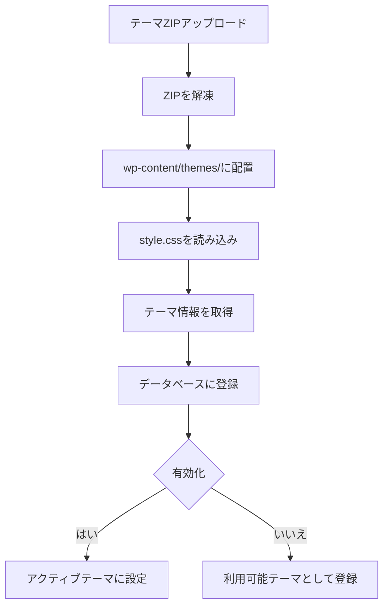

#### テーマ管理の実装

```lua
-- models/theme.lua

local _M = {}

_M.theme_dir = "/app/wp-content/themes/"

-- テーマ一覧を取得
function _M.get_all_themes()
    local themes = {}
    local pfile = io.popen('ls -1 "' .. _M.theme_dir .. '"')
    
    for dirname in pfile:lines() do
        local theme_info = _M.get_theme_info(dirname)
        if theme_info then
            table.insert(themes, theme_info)
        end
    end
    
    pfile:close()
    return themes
end

-- テーマ情報を取得（style.cssから）
function _M.get_theme_info(theme_name)
    local style_css = _M.theme_dir .. theme_name .. "/style.css"
    local file = io.open(style_css, "r")
    
    if not file then
        return nil
    end
    
    local content = file:read("*all")
    file:close()
    
    local info = {
        name = theme_name,
        theme_name = content:match("Theme Name:%s*(.-)%s*\n") or theme_name,
        description = content:match("Description:%s*(.-)%s*\n") or "",
        version = content:match("Version:%s*(.-)%s*\n") or "1.0",
        author = content:match("Author:%s*(.-)%s*\n") or "Unknown",
    }
    
    return info
end

return _M
```

---

## 5. Gemini連携設計

### 5.1 統合方法

#### アーキテクチャ

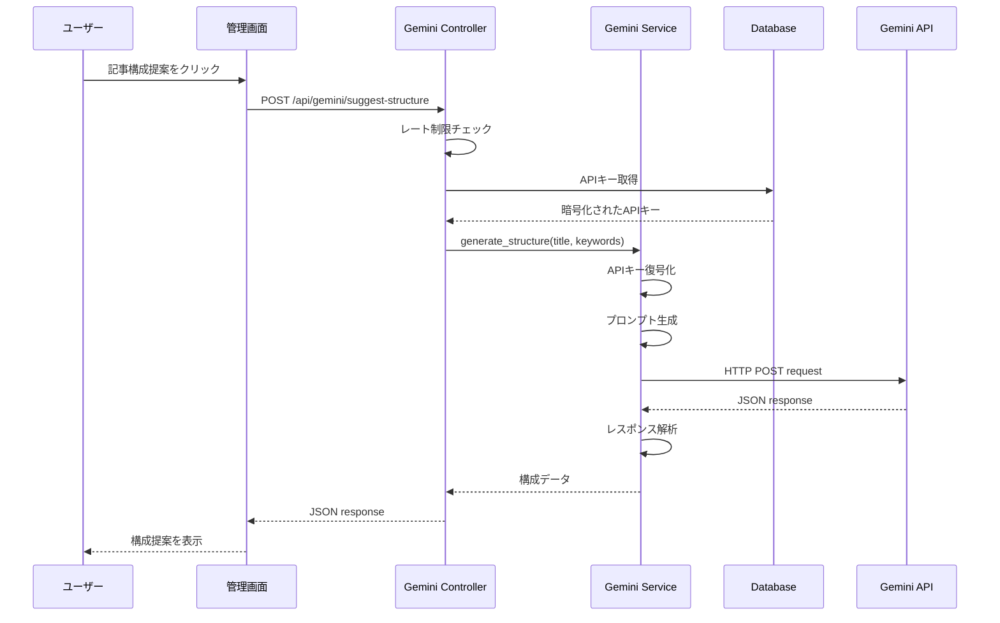

### 5.2 ユーザーAPIキー管理

#### セキュリティ要件

1. **暗号化保存**: AES-256-CBCでAPIキーを暗号化
2. **環境変数**: マスター暗号化キーは環境変数で管理
3. **アクセス制限**: 本人のみがAPIキーを参照・更新可能

#### 暗号化実装

```lua
-- utils/encryption.lua

local aes = require "resty.aes"
local str = require "resty.string"

local _M = {}

-- マスター暗号化キー（環境変数から取得）
local MASTER_KEY = os.getenv("ENCRYPTION_KEY") or "default_key_change_in_production"

-- APIキーを暗号化
function _M.encrypt_api_key(api_key)
    local cipher = aes:new(MASTER_KEY, nil, aes.cipher(256, "cbc"), {iv = MASTER_KEY:sub(1, 16)})
    local encrypted = cipher:encrypt(api_key)
    return str.to_hex(encrypted)
end

-- APIキーを復号化
function _M.decrypt_api_key(encrypted_key)
    local cipher = aes:new(MASTER_KEY, nil, aes.cipher(256, "cbc"), {iv = MASTER_KEY:sub(1, 16)})
    local decrypted = cipher:decrypt(str.hex_to_binary(encrypted_key))
    return decrypted
end

return _M
```

### 5.3 プロンプト設計戦略

#### 記事構成提案プロンプト

```lua
-- services/gemini_service.lua

function _M.generate_article_structure_prompt(title, keywords)
    return string.format([[
あなたはプロのライターです。以下のタイトルの記事構成を提案してください。

【記事タイトル】
%s

【キーワード】
%s

【出力形式】
以下のJSON形式で出力してください:
{
  "introduction": "導入文の提案",
  "headings": [
    {
      "level": 2,
      "title": "見出し1",
      "description": "この見出しで書く内容の概要"
    }
  ],
  "conclusion": "まとめ文の提案"
}

【要件】
- 読者に価値を提供する構成
- SEOを意識した見出し
- 論理的な流れ
- 見出しは5〜8個程度
]], title, keywords or "なし")
end
```

### 5.4 Gemini API呼び出し実装

```lua
-- services/gemini_service.lua

local http = require "resty.http"
local cjson = require "cjson"
local user_setting = require "models.user_setting"

local _M = {}

_M.GEMINI_API_BASE = "https://generativelanguage.googleapis.com/v1beta"

-- 記事構成を生成
function _M.generate_structure(user_id, title, keywords)
    local api_key = user_setting.get_gemini_api_key(user_id)
    if not api_key then
        return nil, "Gemini APIキーが設定されていません"
    end
    
    local prompt = _M.generate_article_structure_prompt(title, keywords)
    return _M.call_gemini_api(api_key, prompt, "gemini-1.5-pro")
end

-- Gemini API呼び出し
function _M.call_gemini_api(api_key, prompt, model)
    local httpc = http.new()
    httpc:set_timeout(30000)
    
    local endpoint = string.format(
        "%s/models/%s:generateContent?key=%s",
        _M.GEMINI_API_BASE,
        model,
        api_key
    )
    
    local request_body = {
        contents = {
            {parts = {{text = prompt}}}
        },
        generationConfig = {
            temperature = 0.7,
            topK = 40,
            topP = 0.95,
            maxOutputTokens = 2048
        }
    }
    
    local res, err = httpc:request_uri(endpoint, {
        method = "POST",
        headers = {["Content-Type"] = "application/json"},
        body = cjson.encode(request_body)
    })
    
    if not res or res.status ~= 200 then
        return nil, "APIエラー"
    end
    
    local response_data = cjson.decode(res.body)
    return response_data.candidates[1].content.parts[1].text, nil
end

return _M
```

---

## 6. コア機能設計

### 6.1 ルーティング設計

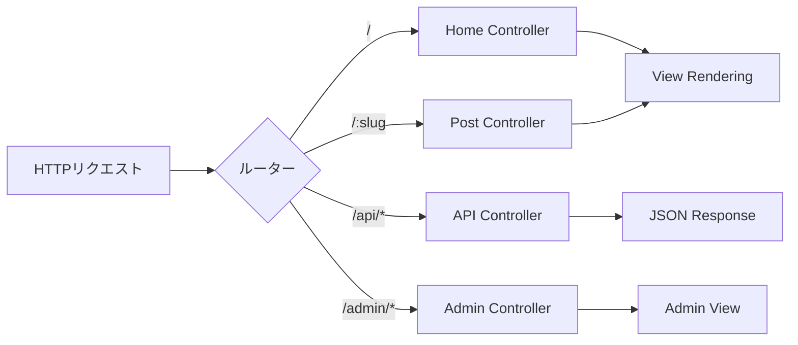

### 6.2 認証・認可フロー

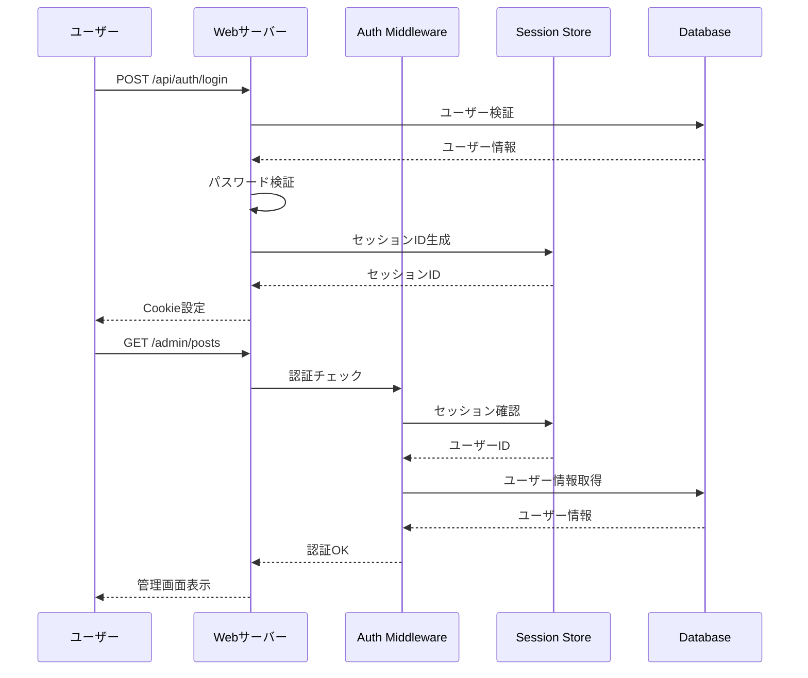

---

## 7. セキュリティ設計

### 7.1 セキュリティ対策一覧

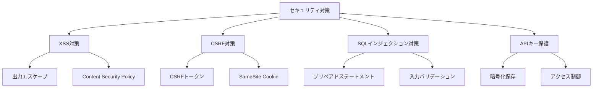

### 7.2 実装例（CSRF対策）

```lua
-- middleware/csrf.lua

local _M = {}

function _M.generate_token()
    local session = require "resty.session".start()
    local random = require "resty.random"
    local str = require "resty.string"
    
    local token = str.to_hex(random.bytes(32))
    session:set("csrf_token", token)
    session:save()
    
    return token
end

function _M.verify_token()
    local session = require "resty.session".start()
    local stored_token = session:get("csrf_token")
    local request_token = ngx.var.http_x_csrf_token
    
    if not stored_token or stored_token ~= request_token then
        ngx.status = 403
        ngx.say('{"error":"CSRFトークンが無効です"}')
        ngx.exit(403)
    end
    
    return true
end

return _M
```

---

## 8. 実装フェーズ計画

### 8.1 全体スケジュール

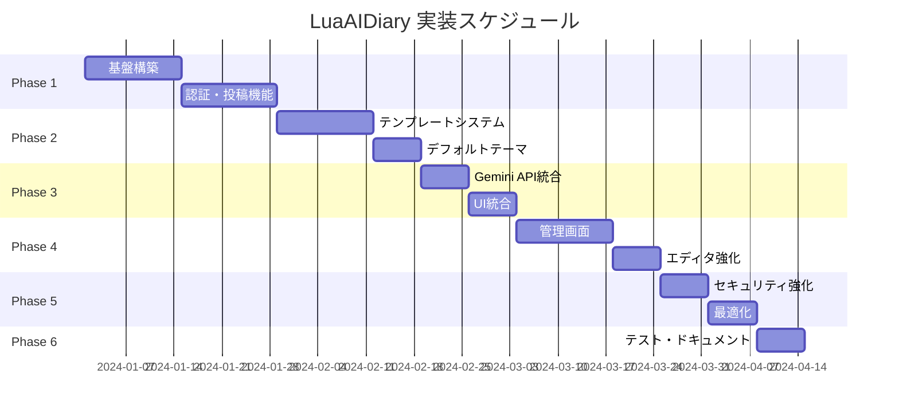

### 8.2 Phase 1: コアシステム（4週間）

#### Week 1-2: 基盤構築
- [ ] データベーススキーマ実装
- [ ] 基本的なMVC構造構築
- [ ] ルーティングシステム実装
- [ ] データベース接続・クエリビルダー実装

#### Week 3-4: 認証・投稿機能
- [ ] ユーザー認証システム
- [ ] セッション管理
- [ ] 投稿CRUD機能
- [ ] カテゴリー・タグ管理

### 8.3 Phase 2: テーマ互換レイヤー（3週間）

#### Week 5-6: PHPランタイム実装
- [ ] PHPパーサー統合
- [ ] テンプレートローダー実装
- [ ] WordPress関数実装（30個）
- [ ] The Loop エミュレーション

#### Week 7: テーマ対応
- [ ] Twenty Twenty-Fourテーマ動作確認
- [ ] テーマ切り替え機能
- [ ] style.css解析

### 8.4 Phase 3: Gemini連携（2週間）

- [ ] Gemini API通信実装
- [ ] APIキー暗号化・管理
- [ ] プロンプトテンプレート作成
- [ ] 管理画面UI統合

### 8.5 Phase 4: 管理画面とエディタ（3週間）

- [ ] ダッシュボード実装
- [ ] リッチテキストエディタ統合
- [ ] メディアアップロード
- [ ] プレビュー機能

### 8.6 Phase 5: セキュリティ・最適化（2週間）

- [ ] セキュリティ監査
- [ ] パフォーマンステスト
- [ ] キャッシュ実装
- [ ] 脆弱性スキャン

### 8.7 Phase 6: テスト・ドキュメント（1週間）

- [ ] 単体テスト作成
- [ ] 統合テスト実施
- [ ] ユーザーマニュアル作成
- [ ] API リファレンス作成

---

## 技術的な制約と考慮事項

### パフォーマンス目標
- ページ読み込み: 200ms以下
- API応答時間: 100ms以下
- Gemini応答時間: 5秒以内
- 同時接続数: 1000以上

### スケーラビリティ
- 水平スケーリング対応
- データベース接続プーリング
- Redis導入によるセッション外部化

---

## まとめ

本設計書は、LuaAIDiaryの実装に必要な詳細な技術仕様を提供します。

**主要な設計決定:**
1. **WordPressテーマ直接導入**: PHPランタイムで既存テーマを動作
2. **セキュリティ優先**: 暗号化、エスケープ、認証を重視
3. **段階的実装**: 6フェーズで確実に構築
4. **拡張性**: 将来的な機能追加を考慮

**次のステップ:**
1. 開発環境のセットアップ
2. Phase 1の実装開始
3. 定期的なコードレビュー
4. ユーザーフィードバックの収集