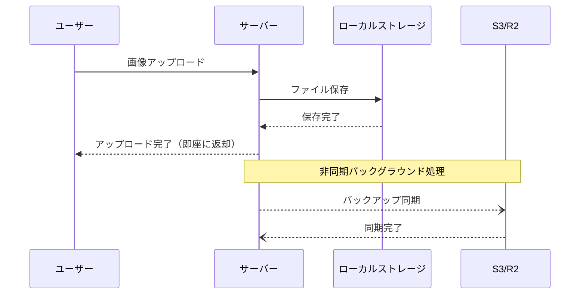
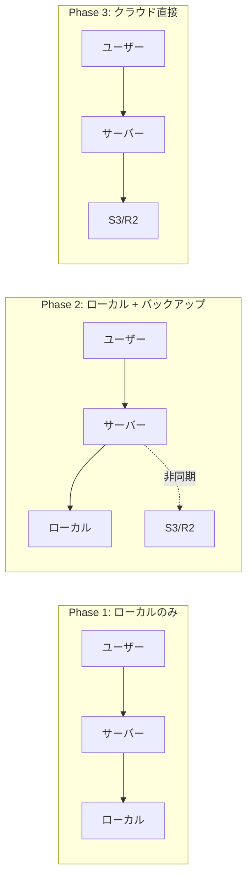
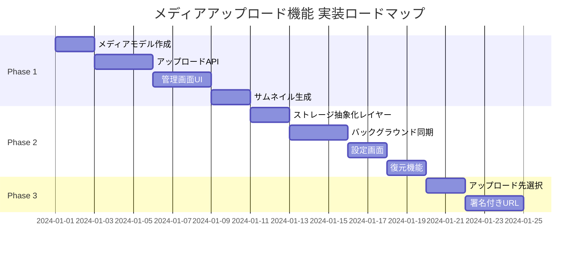
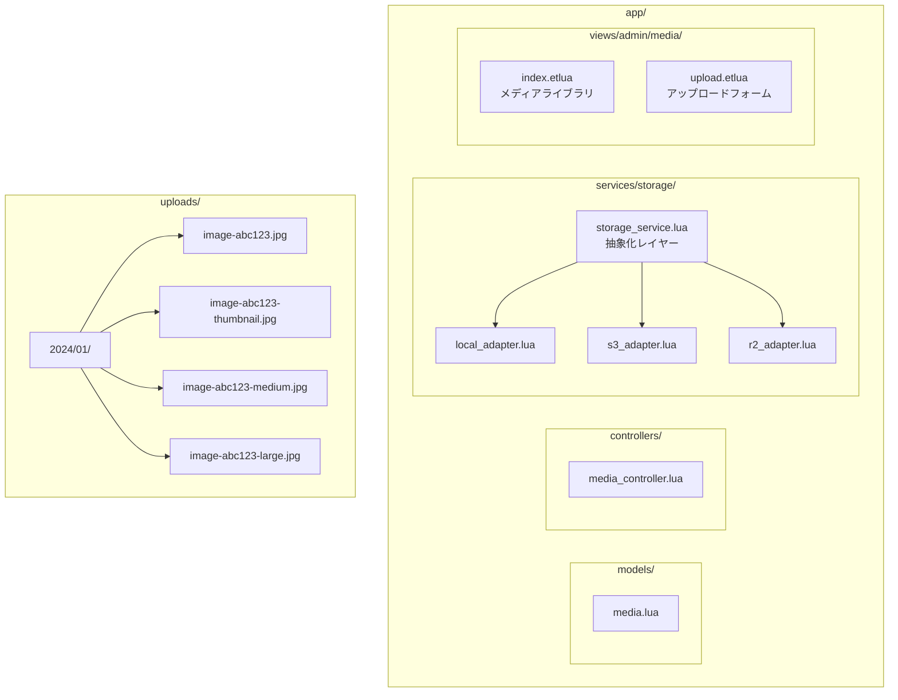
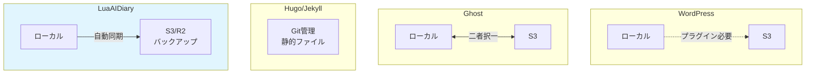
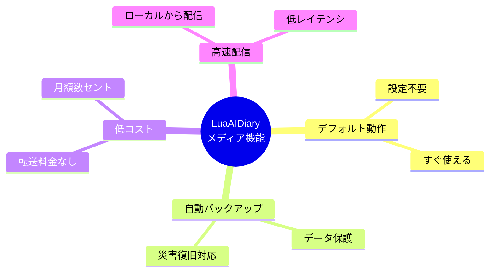

# メディアアップロード機能 設計ドキュメント

## 概要

LuaAIDiary にメディアアップロード機能を追加するための設計方針をまとめる。

## 設計方針

### 基本アーキテクチャ: ローカル + クラウドバックアップ



### この方式の利点

| 項目 | 効果 |
|------|------|
| 速度 | ローカルから配信 → 低レイテンシ |
| 耐久性 | S3/R2に自動バックアップ → データ損失防止 |
| コスト | 転送量ゼロ（バックアップのみ） → 最安 |
| 設定の簡単さ | デフォルトはローカルのみでOK |
| 災害復旧 | サーバー障害時にS3/R2から復元可能 |

---

## ストレージオプション

### Phase 1: ローカルストレージ（必須・デフォルト）

- Docker Volume にメディアファイルを保存
- 設定不要で即座に利用可能
- サムネイル自動生成

### Phase 2: クラウドバックアップ（オプション）

ローカルに保存しつつ、非同期でクラウドにバックアップ。

対応予定:
- **Amazon S3**
- **Cloudflare R2**（推奨：エグレス無料）

### Phase 3: クラウド直接アップロード（将来オプション）

ローカルを経由せず、直接 S3/R2 に保存する方式。



| 用途 | 推奨方式 |
|------|----------|
| 個人ブログ | ローカル + バックアップ |
| 大規模サイト | クラウド直接アップロード |
| マルチサーバー構成 | クラウド直接アップロード |

---

## コスト比較

### 個人ブログの想定（月間）

| 項目 | 容量/量 | S3料金 | R2料金 |
|------|---------|--------|--------|
| ストレージ | 1GB | $0.023 | $0.015 |
| PUT/POST | 1,000回 | $0.005 | 無料 |
| GET | 100,000回 | $0.04 | 無料 |
| データ転送 | 10GB | $0.90 | **無料** |
| **合計** | | **約$1** | **約$0.02** |

### ローカル + バックアップ方式の場合

| 項目 | 容量/量 | S3料金 | R2料金 |
|------|---------|--------|--------|
| ストレージ | 1GB | $0.023 | $0.015 |
| PUT（バックアップのみ） | 1,000回 | $0.005 | 無料 |
| GET/転送 | 0（ローカル配信） | $0 | $0 |
| **合計** | | **約$0.03** | **約$0.02** |

**結論**: バックアップ方式なら月額数セントで運用可能。

---

## 設定画面 UI 案

```
┌─ メディア設定 ─────────────────────────┐
│                                        │
│ ■ ストレージ設定                       │
│                                        │
│   保存先: ローカル（サーバー内）       │
│                                        │
│ ■ クラウドバックアップ                 │
│                                        │
│   ☑ クラウドバックアップを有効化       │
│                                        │
│   バックアップ先: [Cloudflare R2 ▼]    │
│                  ├─ Amazon S3          │
│                  └─ Cloudflare R2      │
│                                        │
│   エンドポイント: [xxxxxxxx.r2.cloudflarestorage.com] │
│   バケット名:     [luaaidiary-backup]  │
│   アクセスキー:   [************]       │
│   シークレット:   [************]       │
│                                        │
│   [接続テスト]  [今すぐ全ファイル同期] │
│                                        │
│   最終同期: 2024-01-15 10:30:00        │
│   同期済み: 150 / 150 ファイル         │
└────────────────────────────────────────┘
```

---

## 実装計画



### Phase 1: ローカルストレージ基盤

1. **メディアモデル作成** (`app/models/media.lua`)
   - ファイル情報（名前、サイズ、MIME、パス）
   - メタデータ（幅、高さ、alt テキスト）
   - アップロード日時、投稿との関連付け

2. **アップロードAPI** (`app/controllers/media_controller.lua`)
   - `POST /api/media` - ファイルアップロード
   - `GET /api/media` - メディア一覧
   - `GET /api/media/:id` - メディア詳細
   - `DELETE /api/media/:id` - メディア削除

3. **管理画面UI** (`app/views/admin/media/`)
   - メディアライブラリ一覧
   - アップロードフォーム（ドラッグ&ドロップ対応）
   - 投稿編集画面への埋め込み

4. **サムネイル生成**
   - アップロード時に複数サイズを自動生成
   - サイズ: thumbnail (150x150), medium (300x300), large (1024x1024)

### Phase 2: クラウドバックアップ

1. **ストレージ抽象化レイヤー** (`app/services/storage_service.lua`)
   - 共通インターフェース定義
   - ローカル/S3/R2 アダプター

2. **バックグラウンド同期**
   - `ngx.timer.at` を使用した非同期処理
   - アップロード完了後にバックグラウンドで S3/R2 に同期
   - 失敗時のリトライ機構

3. **設定画面**
   - クラウド認証情報の入力
   - 接続テスト機能
   - 手動同期ボタン

4. **復元機能**
   - S3/R2 からローカルへの復元コマンド
   - 管理画面からの復元 UI

### Phase 3: クラウド直接アップロード（将来）

1. **アップロード先選択**
   - 設定でローカル/S3/R2 を選択可能に

2. **署名付きURL**
   - クライアントから直接 S3/R2 にアップロード
   - サーバー負荷軽減

---

## ファイル構成（予定）



### ファイル一覧

| パス | 説明 |
|------|------|
| `app/models/media.lua` | メディアモデル |
| `app/controllers/media_controller.lua` | メディアAPI |
| `app/services/storage/storage_service.lua` | ストレージ抽象化レイヤー |
| `app/services/storage/local_adapter.lua` | ローカルストレージアダプター |
| `app/services/storage/s3_adapter.lua` | S3アダプター |
| `app/services/storage/r2_adapter.lua` | R2アダプター |
| `app/views/admin/media/index.etlua` | メディアライブラリ画面 |
| `app/views/admin/media/upload.etlua` | アップロードフォーム |
| `uploads/YYYY/MM/` | メディアファイル保存先 |

---

## セキュリティ考慮事項

- ファイルタイプの検証（MIME タイプ + マジックバイト）
- ファイルサイズ制限（設定可能、デフォルト 10MB）
- ファイル名のサニタイズ（UUID + 元の拡張子）
- アップロードディレクトリの実行権限無効化
- 認証済みユーザーのみアップロード可能

---

## 他ツールとの比較



| ツール | メディア戦略 |
|--------|-------------|
| WordPress | ローカルのみ（プラグインでS3対応） |
| Ghost | ローカル or S3（二者択一） |
| Hugo/Jekyll | 静的ファイル（Git管理） |
| **LuaAIDiary** | **ローカル + 自動クラウドバックアップ** |

### LuaAIDiary の差別化ポイント


