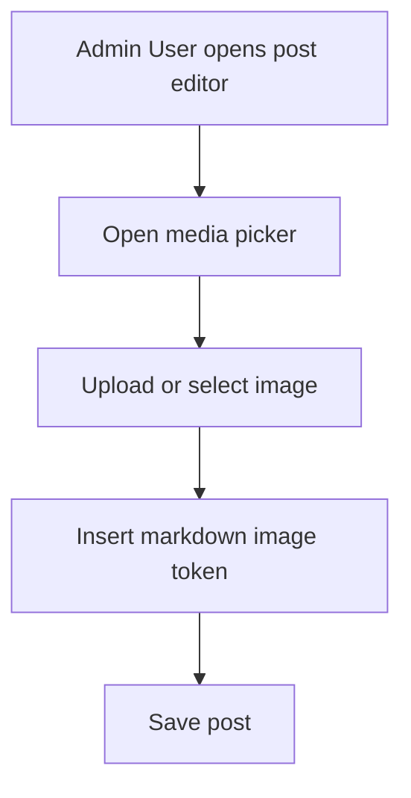
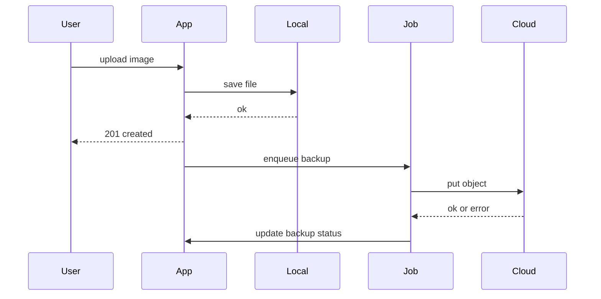

# 画像アップロード機能 詳細設計書

## 1. 目的

LuaAIDiary に対して、管理画面と記事作成画面で共通利用できる画像アップロード基盤を定義する。初期実装はローカル保存を採用し、将来拡張として Amazon S3 または Cloudflare R2 へのバックアップ連携を可能にする。

---

## 2. スコープ

### 2.1 対象

- 画像アップロード機能
- アップロード済み画像の管理機能
  - 削除
  - ファイル名変更
- 記事作成画面での同一メディア機能の再利用
- 将来の S3 R2 バックアップ拡張を考慮した設計

### 2.2 非スコープ

- 動画 音声 PDF など画像以外のメディア対応
- クライアントからの署名付き URL 直接アップロード
- CDN 配信最適化
- AI 自動タグ付け 画像解析
- 記事編集画面でのドラッグ アンド ドロップアップロードを必須要件として実装すること

### 2.3 スコープ注記

- 記事編集画面でのドラッグ アンド ドロップアップロードは将来検討とする
- Phase 1 では通常のファイル選択アップロードを必須とし DnD UX は非必須とする

---

## 3. 既存構成との整合方針

既存の Lua OpenResty Lapis 構成に合わせる。

- ルーティングは [`app/init.lua`](app/init.lua) の既存命名と同様に `app:get` `app:post` `app:put` `app:delete` を利用
- 管理画面権限は [`app/controllers/admin_controller.lua`](app/controllers/admin_controller.lua) と同じくセッション認証 + role 判定 admin editor を前提
- 記事編集画面は [`app/views/admin/posts/edit.etlua`](app/views/admin/posts/edit.etlua) にメディアピッカー UI を組み込み
- テーブル追加は [`postgresql/init/01_create_tables.sql`](postgresql/init/01_create_tables.sql) を直接変更せず、追加マイグレーションで対応

---

## 4. ユースケース

### 4.1 管理画面メディアライブラリ

1. 管理者 編集者がメディア画面を開く
2. 画像をアップロードする
3. 一覧で画像を確認する
4. ファイル名を変更する
5. 不要画像を削除する

### 4.2 記事作成画面

1. 管理者 編集者が [`posts/edit`](app/views/admin/posts/edit.etlua) を開く
2. メディア選択モーダルを起動
3. 既存画像を選択または新規アップロード
4. Markdown 本文へ画像記法を挿入
5. 必要に応じてその場で名称変更 削除



---

## 5. 画面 UX 要件

## 5.1 共通要件

- 対象形式: jpg jpeg png webp gif
- 最大サイズ: 初期値 10MB 設定で変更可能
- 複数ファイル同時アップロード対応
- 進捗表示と処理中状態を表示

## 5.2 管理画面メディア一覧

- 表示項目
  - サムネイル
  - ファイル名
  - MIME
  - サイズ
  - 登録日時
  - 利用状態 未使用 使用中
- 操作
  - アップロード
  - ファイル名変更
  - 削除
  - 検索 ファイル名前方一致

## 5.3 記事作成画面での再利用

- [`app/views/admin/posts/edit.etlua`](app/views/admin/posts/edit.etlua) にメディアボタンを追加
- モーダル内で一覧 アップロード 名称変更 削除を実行可能
- 挿入時は `![alt]` と画像 URL を本文へ追記
- DnD UX は将来検討とし Phase 1 では提供しない

## 5.4 バリデーションとエラー表示

- 拡張子不正 MIME 不一致 サイズ超過はアップロード拒否
- エラー表示はフォーム近傍 + トーストの二段構成
- サーバーエラー時は再試行導線を明示

## 5.5 413 エラー時の UI ハンドリング

- Nginx `client_max_body_size` 超過時は `413` を受け取り UI でファイルサイズ超過メッセージを表示
- 推奨文言: `ファイルサイズが上限 10MB を超えています。10MB 以下の画像を選択してください。`
- ハンドリング
  - 失敗したファイルのみエラー表示
  - 同時アップロード中の他ファイルは継続可能にする
  - 再選択導線を表示する

---

## 6. API 設計

## 6.1 認可 認証

- 認証方式: 既存セッション Cookie
- 更新系 API は CSRF トークン必須
- 権限: admin editor のみ許可

## 6.2 エンドポイント一覧

### POST `/api/media`

- 用途: 画像アップロード
- Request multipart form-data
  - `file`: binary required
  - `alt_text`: string optional
- 正常系レスポンス
  - `201 Created`: 新規保存時
  - `200 OK`: SHA-256 重複検知で既存 media を返却する時
- Response Body
  - `id`
  - `file_name`
  - `url`
  - `thumbnail_url`
  - `mime_type`
  - `size_bytes`
  - `deduplicated` boolean

#### POST `/api/media` レスポンス例

- 新規保存 `201`

```json
{
  "id": 101,
  "file_name": "sample.png",
  "url": "/uploads/2026/02/21/uuid.png",
  "thumbnail_url": "/uploads/2026/02/21/uuid_thumb_w300.png",
  "mime_type": "image/png",
  "size_bytes": 512345,
  "deduplicated": false
}
```

- 重複検知 `200`

```json
{
  "id": 88,
  "file_name": "existing.png",
  "url": "/uploads/2026/02/20/existing_uuid.png",
  "thumbnail_url": "/uploads/2026/02/20/existing_uuid_thumb_w300.png",
  "mime_type": "image/png",
  "size_bytes": 498765,
  "deduplicated": true
}
```

### GET `/api/media`

- 用途: 一覧取得
- Query
  - `page` optional
  - `per_page` optional
  - `q` optional
- Response 200
  - `items`
  - `pagination`

### PATCH `/api/media/:id`

- 用途: ファイル名変更
- Request JSON
  - `file_name`: string required
- Response 200
  - 更新後メディア情報

### DELETE `/api/media/:id`

- 用途: 論理削除
- Response 200
  - `deleted`: true

### GET `/api/media/:id`

- 用途: 詳細取得
- Response 200
  - 単一メディア情報

## 6.3 エラーコード

- `400` バリデーションエラー
- `401` 未認証
- `403` 権限不足
- `404` 対象なし
- `409` ファイル名競合
- `413` サイズ超過
- `415` 非対応 MIME
- `422` 不正入力
- `500` 内部エラー

## 6.4 サムネイル生成と失敗時挙動

- アップロード成功時に原本とは別に軽量サムネイルを生成する
  - 初期値: 幅 300px
  - 縦横比は維持
- サムネイル生成に失敗しても原本保存に成功していれば API は成功応答を返す
- 失敗時は `thumbnail_url` を `null` で返却し UI は原本 URL をフォールバック表示する
- 生成失敗は非同期リトライ対象としてジョブ化する
  - 指数バックオフ
  - 上限回数超過時は運用アラート対象

## 6.5 SHA-256 重複アップロード時の方針

- 同一ハッシュのファイルが存在する場合は新規保存せず既存 media を返して成功扱いにする
- ステータスコードは `200 OK` を返却し `deduplicated=true` を付与する
- 新規保存時のみ `201 Created` を返却する

---

## 7. データモデル設計

## 7.1 media テーブル案

| 列名 | 型 | 制約 | 用途 |
|---|---|---|---|
| id | BIGSERIAL | PK | メディアID |
| storage_disk | VARCHAR 20 | NOT NULL | local s3 r2 |
| storage_key | VARCHAR 512 | UNIQUE NOT NULL | 保存キー |
| file_name | VARCHAR 255 | NOT NULL | 表示名 |
| original_file_name | VARCHAR 255 | NOT NULL | 元ファイル名 |
| mime_type | VARCHAR 100 | NOT NULL | MIME |
| extension | VARCHAR 10 | NOT NULL | 拡張子 |
| size_bytes | BIGINT | NOT NULL CHECK > 0 | ファイルサイズ |
| width | INTEGER | NULL | 画像幅 |
| height | INTEGER | NULL | 画像高 |
| alt_text | TEXT | NULL | 代替テキスト |
| sha256_hash | CHAR 64 | NULL | 重複検知 |
| thumbnail_storage_key | VARCHAR 512 | NULL | サムネイル保存キー |
| thumbnail_width | INTEGER | NULL | サムネイル幅 |
| thumbnail_height | INTEGER | NULL | サムネイル高 |
| uploaded_by | INTEGER | NOT NULL FK users.id | 作成者 |
| backup_status | VARCHAR 20 | NOT NULL DEFAULT pending | バックアップ状態 |
| backup_attempts | INTEGER | NOT NULL DEFAULT 0 | 試行回数 |
| backup_last_error | TEXT | NULL | 最終エラー |
| deleted_at | TIMESTAMP | NULL | 論理削除 |
| created_at | TIMESTAMP | NOT NULL DEFAULT now | 作成日時 |
| updated_at | TIMESTAMP | NOT NULL DEFAULT now | 更新日時 |

## 7.2 media_post_usages テーブル案

記事内利用を追跡して安全削除判定に使う。

| 列名 | 型 | 制約 |
|---|---|---|
| media_id | BIGINT | PK FK media.id |
| post_id | INTEGER | PK FK posts.id |
| created_at | TIMESTAMP | NOT NULL DEFAULT now |

## 7.3 `media_post_usages` 同期ロジック

- 対象 API
  - 記事保存 `POST /api/posts`
  - 記事更新 `PUT /api/posts/:id`
- 手順
  1. Markdown 本文から画像 URL を抽出
  2. URL 正規化を実施
  3. 正規化後 URL から対応する `media.id` を解決
  4. 対象 `post_id` の既存行を Delete
  5. 新しい対応集合を Insert
- URL 正規化ルール
  - スキームとホストが同一の場合はパス部 `/uploads/...` に正規化
  - クエリ文字列とフラグメントは除去
  - 末尾スラッシュは除去
  - URL エンコード差異はデコード後に再エンコードして比較
- 存在しない media 参照
  - 記事保存自体は失敗させない
  - `media_post_usages` には登録しない
  - アプリログへ warning を出力し後続運用で検知可能にする
- トランザクション境界
  - 記事本体の保存と `media_post_usages` 洗い替えは同一トランザクションで実行する
  - いずれか失敗時はロールバックし整合性を維持する

## 7.4 論理削除方針

- API 削除は `deleted_at` を設定
- 一定期間経過後に物理削除ジョブで実削除
- 参照中メディアは削除不可にできる運用フラグを提供

## 7.5 監査項目

- 作成者 `uploaded_by`
- 更新者 `updated_by` 拡張列として追加可能
- 削除者 `deleted_by` 拡張列として追加可能
- 重要操作ログは将来 `audit_logs` 連携

---

## 8. ファイル保存方針

## 8.1 Phase 1 ローカル保存

- 保存先: `uploads/YYYY/MM/DD/`
- 公開 URL: `/uploads/...`
- ファイル名生成: `uuid + sanitized_extension`
- DB `storage_disk=local` を設定
- 原本保存成功後にサムネイルを生成する
  - 命名例: `uuid_thumb_w300.ext`
  - 失敗時は原本配信を継続し再試行ジョブへ投入

## 8.2 将来拡張 S3 R2 バックアップ

- ローカル保存成功をユーザー応答条件とする
- バックアップは非同期実行
- バックアップ状態を DB で追跡

---

## 9. バックアップ拡張設計

## 9.1 非同期ジョブ

- Phase 2 の第一候補は Redis キュー基盤とする
  - OpenResty から `lua-resty-redis` を利用
  - list 方式を初期採用し stream 方式は将来拡張候補
- `ngx.timer.at` 単独運用は補助用途に限定する
- 代替案として DB ポーリングを比較検討対象に残す
- 候補テーブル `media_backup_jobs`
  - `id` `media_id` `status` `attempts` `next_run_at` `last_error`

## 9.2 キュー方式比較

| 方式 | 長所 | 短所 | 採用判断 |
|---|---|---|---|
| Redis list stream | 低レイテンシ 複数ワーカー制御が容易 可観測性を拡張しやすい | Redis 運用が追加で必要 | 第一候補 |
| `ngx.timer.at` 単独 | 追加ミドルウェア不要 実装が軽い | ワーカ再起動時に揮発しやすい 永続性が弱い | 補助用途のみ |
| DB ポーリング | 永続性が高い 既存 DB のみで開始可能 | ポーリング負荷 遅延 ロック設計が必要 | 代替案 |

## 9.3 再試行と冪等性

- 指数バックオフ
- 上限回数超過で `failed`
- 管理画面から手動再実行
- 冪等性キー
  - `job_type + media_id + target_storage + sha256_hash` を論理キーとして重複実行を抑止
- ワーカーは実行前に冪等性キーを確認し完了済みならスキップ

## 9.4 整合性

- ローカル保存成功後のみジョブ投入
- バックアップ完了時に `media.backup_status=synced`
- ハッシュ比較で破損検知

## 9.5 障害時運用

- 外部ストレージ障害時もローカル配信継続
- 復旧後に未同期分をバッチ同期
- 失敗一覧を管理画面に表示
- DLQ 相当運用
  - 上限回数超過ジョブは `failed` として隔離状態で保持
  - 管理画面で再実行または破棄を選択可能にする
  - 隔離件数が閾値超過時はアラート通知



---

## 10. セキュリティ要件

- MIME 検証
  - Content-Type だけでなくマジックバイト検証
- 拡張子検証
  - 許可リスト方式
- サイズ制限
  - サーバー側で厳密チェック
- 権限制御
  - admin editor のみ更新系操作を許可
- パストラバーサル対策
  - クライアント入力から保存パスを組み立てない
  - 保存キーはサーバー生成のみ
- XSS 対策
  - 表示時のファイル名エスケープ

---

## 11. 運用要件

## 11.1 アップロードサイズ上限の整合

- [`docker/web/nginx.conf`](docker/web/nginx.conf) の `client_max_body_size` は `12M` を推奨値とする
- アプリケーション側の実ファイル上限は `10MB` を維持する
- 意図
  - Nginx 側をわずかに大きくし multipart オーバーヘッドを吸収
  - 実質的な業務上限はアプリ側 10MB に統一
- 413 発生時は `5.5 413 エラー時の UI ハンドリング` に従う

- 容量監視
  - ローカル使用量
  - バックアップ失敗件数
- ライフサイクル
  - 論理削除済みの物理削除ポリシー
- 命名規則
  - 内部保存名は UUID
  - 表示名はユーザー更新可
- バックアップ健全性監視
  - `pending failed` 件数アラート

---

## 12. テスト戦略

## 12.1 単体テスト

- バリデーション MIME 拡張子 サイズ
- ファイル名正規化
- バックアップ状態遷移

## 12.2 統合テスト

- API 認証 認可 CSRF
- DB 登録とファイル保存の整合
- 論理削除と一覧除外
- 記事保存時の `media_post_usages` 洗い替え
- 重複アップロード時の `200 deduplicated=true` 応答

## 12.3 E2E テスト

- 管理画面でアップロード 一覧 名称変更 削除
- 記事作成画面から画像挿入
- バックアップ失敗時の表示と再試行
- 413 サイズ超過時の UI 文言と再選択導線
- サムネイル生成失敗時の原本フォールバック表示

---

## 13. 段階的実装計画

## Phase 1 ローカル実装

1. テーブル追加マイグレーション作成
2. `media` API 実装
3. 管理画面メディアライブラリ実装
4. [`app/views/admin/posts/edit.etlua`](app/views/admin/posts/edit.etlua) へのメディアモーダル統合
5. 単体 統合 E2E 最低限シナリオ整備

## Phase 2 バックアップ連携

1. ストレージ抽象化サービス追加
2. 非同期ジョブ基盤追加
3. S3 R2 アダプタ実装
4. 同期状態監視 UI と再実行導線追加
5. 障害復旧運用手順書作成

---

## 14. 追加予定ファイル 参考

- `app/controllers/media_controller.lua`
- `app/models/media.lua`
- `app/services/storage_service.lua`
- `app/views/admin/media/index.etlua`
- `postgresql/init/06_add_media_tables.sql`

この詳細設計は、既存の要約版 [`docs/media_upload_design.md`](docs/media_upload_design.md) を補完する実装準備用ドキュメントとして扱う。
