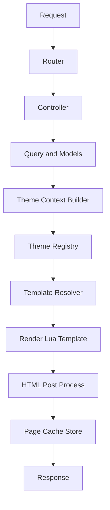
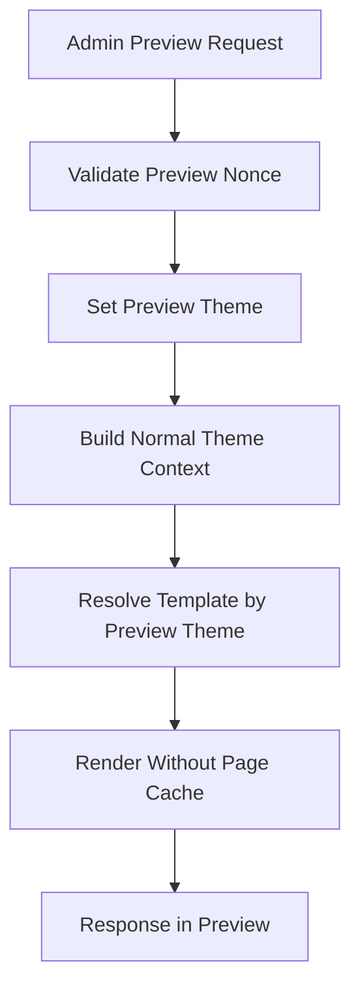

# LuaAIDiary 専用テーマシステム全体設計

## 1. 背景と目的

### 背景

LuaAIDiary には、WordPress テーマ互換レイヤーとして PHP テンプレート実行、WordPress 風テンプレート階層、主要な WordPress 関数エミュレーション、`WP_Query` 風クエリが導入されている。

一方で、既存 WordPress テーマを高い互換度で動かすには、PHP 実行範囲、WordPress 関数、プラグイン、テーマカスタマイザー、メニュー、コメント、アイキャッチ、SEO、国際化などの広い API 面を継続的に追従する必要がある。これは LuaAIDiary 本体の機能追加速度と安全性に対してリスクが大きい。

そのため、WordPress テーマ互換機能はいったんペンディングし、まず LuaAIDiary 専用テーマ機能を公式 API として定義する。

### 目的

- 現在の `luaaidiary-default` テーマを **Classic テーマ** として扱い、既存表示を壊さず段階的に移行する。
- 管理画面から複数テーマを一覧・プレビュー・適用できるようにする。
- テーマが DB やモデルを直接触らず、安定した Theme Context / Theme API 経由で表示できる契約を先に予約する。
- コメント、featured image、メニュー、SEO、多言語、RSS/Atom、sitemap などを後付けしてもテーマ契約が破綻しないようにする。
- WordPress 互換レイヤーと LuaAIDiary 専用テーマ API の境界を明確化し、将来の WordPress 互換再検討を安全に行える状態にする。

### 既存実装の軽い確認結果

| 項目 | 事実 | 設計上の扱い |
|---|---|---|
| テーマ互換レイヤー | `README_THEME_ENGINE.md` では WordPress テーマ互換レイヤー実装済みとして整理されている | 今回はペンディング対象。公式 API は LuaAIDiary 専用テーマ API に寄せる |
| テンプレート解決 | `template_loader.lua` は `index-simple.lua` など Lua テンプレートを先に探し、なければ PHP テンプレートへ fallback する | Classic テーマ移行の足場として活用可能。ただし新 API では `templates/*.lua` を推奨 |
| アクティブテーマ | `template_loader.lua` では `luaaidiary-default` が固定デフォルト。`theme_config.lua` には DB 保存想定の関数がある | 実 DB と整合する `site_settings` / `theme_settings` を新設・統合する |
| 管理画面設定 | `settings/index.etlua` は基本設定と Gemini 設定が中心 | 外観・テーマ管理は別画面に分離する |
| コメント | `comments` テーブルと `comment.lua` が存在し、状態 enum とツリー取得がある | 公開 UI / 管理 UI / CSRF / スパム判定をテーマ API として予約する |
| メディア | `media` モデルとメディア設計書があり、URL、サムネイル URL、alt などの概念がある | featured image は media API 上の投稿代表画像として設計する |

本設計書では、上記の事実と今後の推奨案を分けて記述する。

---

## 2. スコープ

### 初期実装で作るもの

1. LuaAIDiary 専用テーマのディレクトリ構造と `theme.json` 相当のメタ情報。
2. テーマ一覧スキャン、検証、現在テーマ取得、テーマ適用のサービス層。
3. Classic テーマとして `luaaidiary-default` を登録する互換メタ情報。
4. 管理画面の外観メニュー。
   - テーマ一覧
   - 現在テーマ表示
   - プレビュー
   - 適用
   - エラー表示
   - rollback
5. Theme Context v1。
   - `site`
   - `request`
   - `route`
   - `post`
   - `archive`
   - `pagination`
   - `navigation`
   - `assets`
   - `seo`
   - `language`
   - `comments`
   - `featured_image`
6. テンプレート解決器。
   - LuaAIDiary 専用テンプレートを優先
   - Classic テーマ fallback
   - PHP 互換 fallback は明示的に legacy 扱い
7. テーマ切替時のキャッシュ invalidation 方針。

### 今回は実装しないが予約するもの

以下は API、DB、テンプレート契約として先に予約し、初期 UI やデータが未実装の場合は `enabled = false`、空配列、`nil`、fallback URL を返す。

- コメント公開フォーム、コメント管理 UI、スパム対策拡張。
- featured image 管理 UI、サムネイル生成の拡張。
- メニュー / ナビゲーション管理 UI。
- サイトロゴ、favicon、SNS links、copyright。
- SEO metadata 編集 UI、AI description 生成。
- RSS/Atom、sitemap 生成。
- 言語設定、i18n routing、翻訳管理。
- テーマごとの高度なオプション UI。

### WordPress 互換レイヤーとの境界

| 領域 | LuaAIDiary 専用テーマ | WordPress 互換レイヤー |
|---|---|---|
| 位置づけ | 今後の公式テーマ API | legacy / experimental / pending |
| テンプレート | Lua テンプレート | PHP 風テンプレート |
| データ取得 | Theme Context 経由 | WordPress 関数エミュレーション、`WP_Query` 風 |
| 管理 UI | LuaAIDiary 管理画面 | WordPress 管理画面互換は対象外 |
| 互換保証 | semver と contract test で保証 | 当面保証しない |
| 将来 | 標準 | Phase 5 で再検討 |

---

## 3. テーマ構造案

### 推奨ディレクトリ構造

```text
wp-content/themes/
  luaaidiary-default/
    theme.json
    screenshot.png
    templates/
      home.lua
      single.lua
      archive.lua
      search.lua
      404.lua
      parts/
        header.lua
        footer.lua
        sidebar.lua
        post-card.lua
    assets/
      css/
        theme.css
      js/
        theme.js
      images/
        placeholder.png
    legacy/
      index-simple.lua
      single-simple.lua
      search-simple.lua
      index.php
      single.php
      archive.php
      header.php
      footer.php
      sidebar.php
      functions.php
```

既存ファイルをすぐ移動しない場合も、メタ情報上は `classic = true` として扱い、テンプレート解決器が既存配置へ fallback する。

### `theme.json` 相当のメタ情報

```json
{
  "schema_version": 1,
  "id": "luaaidiary-default",
  "name": "LuaAIDiary Default",
  "version": "1.0.0",
  "author": "LuaAIDiary",
  "description": "LuaAIDiary built-in classic theme",
  "engine": "luaaidiary-theme",
  "api_version": "1.0",
  "type": "classic",
  "status": "stable",
  "screenshot": "screenshot.png",
  "assets": {
    "styles": ["assets/css/theme.css"],
    "scripts": ["assets/js/theme.js"]
  },
  "templates": {
    "home": "templates/home.lua",
    "single": "templates/single.lua",
    "archive": "templates/archive.lua",
    "search": "templates/search.lua",
    "404": "templates/404.lua"
  },
  "supports": {
    "featured_image": true,
    "comments": false,
    "menus": ["header", "footer", "mobile", "social"],
    "seo": true,
    "language": true
  },
  "fallback": {
    "theme": "luaaidiary-default",
    "allow_legacy_simple_lua": true,
    "allow_legacy_php": false
  }
}
```

### テンプレート種類

| type | 用途 | 必須 | fallback |
|---|---|---:|---|
| `home` | トップ / 投稿一覧 | はい | `archive` -> `index` -> Classic `index-simple.lua` |
| `single` | 単一記事 | はい | `index` -> Classic `single-simple.lua` |
| `archive` | category / tag / author / date | いいえ | `home` -> `index` |
| `search` | 検索結果 | いいえ | `archive` -> `home` |
| `404` | Not Found | いいえ | built-in minimal 404 |
| `page` | 固定ページ将来用 | 予約 | `single` -> `index` |
| `feed_link` | feed link の露出パーツ | 予約 | header 自動挿入 |

### assets 方針

- テーマ assets は `/themes/{theme_id}/assets/...` の公開 URL で配信する。
- 物理パスは `wp-content/themes/{theme_id}/assets/...` に限定する。
- `../` を含む path、隠しファイル、実行可能拡張子の配信は禁止する。
- CSS / JS は `theme.json` で宣言されたものだけ自動読み込み対象とする。
- テーマ内テンプレートからは `context.assets.url("assets/css/theme.css")` のような helper 経由で参照する。

### preview screenshot

- `screenshot.png` または `screenshot.webp` をテーマルートに置く。
- 管理画面で未設定の場合は built-in placeholder を表示する。
- ファイルサイズと画像 MIME を検証する。
- 外部 URL screenshot は初期実装では禁止する。

### fallback 方針

1. アクティブテーマの専用テンプレートを探す。
2. アクティブテーマが Classic の場合、既存 `*-simple.lua` を探す。
3. 明示許可された場合のみ PHP 互換テンプレートを探す。
4. それでも見つからなければ `luaaidiary-default` の対応テンプレートへ fallback。
5. fallback 先でも失敗した場合は built-in minimal HTML を返す。

### Classic テーマ移行方針

- `luaaidiary-default` を `type = classic` として登録する。
- 既存の `index-simple.lua`、`single-simple.lua`、`search-simple.lua` は当面維持する。
- 新しい `templates/` に同等テンプレートを追加し、表示差分が許容範囲に収まった後に `*-simple.lua` を legacy 扱いへ移す。
- PHP テンプレートはサンプル互換用として残すが、初期の専用テーマ API では実行対象から外すことを推奨する。

---

## 4. 予定テーマラインナップと API 検証観点

この章は提案であり、テーマ名は仮称とする。実装順や名称は変更可能だが、各テーマが要求する表現要件を先に明文化し、Theme Context / Theme API の予約項目が実テーマ要件を満たすか検証するための基準として扱う。

### 4.1 現在テーマ: Classic

現在の `luaaidiary-default` は **Classic** として扱う。Classic は既存表示を維持する安全な基準テーマであり、Theme Context v1 の互換性、fallback chain、管理画面での preview / activate / rollback の基準ケースにする。

| 項目 | 内容 |
|---|---|
| テーマ名 | Classic |
| 目的・雰囲気 | 現在の LuaAIDiary 表示を壊さず維持する、素朴で安定した標準テーマ |
| 想定レイアウト | ヘッダー、記事一覧、単一記事、検索結果、サイドバー、フッターを持つ従来型ブログレイアウト |
| 強く依存する予約 API / Theme Context 項目 | `site`, `route`, `post`, `archive`, `pagination`, `navigation`, `assets`, `seo`, `language` |
| 初期実装で必要な最低契約 | 既存 `*-simple.lua` fallback、投稿一覧、単一記事、検索、基本 pagination、基本 site 情報、asset URL |
| 将来的な拡張ポイント | native `templates/` への移行、featured image、menu location、SEO head helper、多言語表示の標準例 |

### 4.2 追加予定テーマ案

| テーマ名 仮称 | 目的・雰囲気 | 想定レイアウト | 強く依存する予約 API / Theme Context 項目 | 初期実装で必要な最低契約 | 将来的な拡張ポイント |
|---|---|---|---|---|---|
| Aurora Modern | 近未来のトレンドを取り入れた、スタイリッシュで余白のある洗練テーマ。グラスモーフィズム、淡い光彩、滑らかなカード UI を中心にする | ヒーローエリア、グラス調カードグリッド、余白を広く取った単一記事、固定または半透明ヘッダー、モバイルでは 1 カラムカード | `site`, `archive.posts`, `post.featured_image`, `pagination`, `navigation`, `assets`, `seo`, `language` | カード用 post contract、featured image fallback、responsive asset、header / mobile menu、SEO metadata | テーマ設定による blur / transparency 強度、ダークモード、カード密度切替、OGP 最適化、多言語レイアウト確認 |
| Neon Glitch | cyberpunk 系の正式候補。レスポンシブ満載で、見ている側も気持ち悪くなるほどの強い演出、グリッチ、ネオン、カード主体の高密度 UI を狙う | 非対称カードグリッド、強いネオン配色、グリッチ見出し、スクロール連動演出、モバイルでは演出を抑えたカードスタック | `assets`, `archive.posts`, `post.featured_image`, `pagination`, `navigation.header`, `navigation.mobile`, `seo.ogp`, `request`, `language` | JS / CSS asset 宣言、カード一覧、featured image sizes、pagination window、mobile menu、`prefers-reduced-motion` 対応を前提にした theme settings | animation profile、演出強度設定、低負荷モード、画像遅延読み込み、検索結果カード、ページ遷移演出、アクセシビリティ監査 |
| Ink Editorial | 執筆・読書重視の minimal / editorial 系。本文の読みやすさ、タイポグラフィ、余白、脚注や長文への集中を優先する | 1 カラム本文、細い目次 / メタ情報、控えめな一覧、記事本文中心、画像は本文を邪魔しない幅で表示 | `post.content_html`, `post.content_text`, `post.author`, `post.categories`, `post.tags`, `seo`, `language`, `comments` | 単一記事 contract、本文 sanitize、基本メタ情報、前後記事または関連導線の予約、言語方向 `dir` | 読了時間、目次、脚注、コードハイライト、コメント表示、翻訳記事リンク、印刷 CSS |
| AI Lab Console | AI CMS らしさを出す assistant / lab 系。生成支援、分析、実験室、コンソール感を演出し、AI description やメタ情報を見せやすくする | ダッシュボード風ホーム、記事カードに AI 要約やタグを強調、サイドパネル、検索・フィルタ導線、単一記事ではメタ情報を整理 | `seo.generated`, `post.excerpt`, `tags`, `categories`, `search route`, `navigation`, `site.sns_links`, `assets` | 抜粋、タグ / カテゴリ、検索結果、SEO generated 情報の安全な optional 表示、基本 asset | AI 要約表示、ファクトチェック状態、関連記事推薦、管理者 preview 表示、実験的 UI 設定 |
| Prism Gallery | 写真・メディア重視の gallery / magazine 系。featured image とメディア密度を前面に出し、視覚的な一覧体験を検証する | Masonry 風カード、特集記事ヒーロー、画像主導の archive、単一記事では大きな featured image、モバイルは軽量グリッド | `featured_image`, `post.featured_image.sizes`, `archive.posts`, `pagination`, `assets`, `seo.ogp`, `language` | featured image fallback、画像サイズ、alt、カード一覧、pagination、OGP image | lazy loading、srcset、画像比率設定、メディアフィルタ、magazine layout、LCP 最適化 |
| Shizuku Diary | 和風・日記・落ち着いた個人ブログ系。静かな余白、日付、季節感、個人の日記らしい温度感を重視する | 日付別アーカイブ、縦のリズムを重視した一覧、落ち着いた単一記事、控えめなナビゲーション、フッターにプロフィール | `archive.type`, `archive.title`, `post.published_at`, `site`, `navigation.footer`, `language`, `seo` | 日付表示、archive 情報、site profile、footer navigation、基本 SEO | 和文タイポグラフィ、季節テーマ設定、著者プロフィール、月別アーカイブ、多言語時の日付書式 |

### 4.3 テーマ案から見た API 予約の意味

- Classic は既存互換と rollback の安全基準を検証する。
- Aurora Modern は標準的な native theme として、featured image、navigation、pagination、SEO、多言語の一般ケースを検証する。
- Neon Glitch は animation、responsive、featured image、pagination、menu、asset 読み込み負荷の限界ケースを検証する。
- Ink Editorial は長文、本文 HTML、言語方向、コメント、SEO description の品質を検証する。
- AI Lab Console は AI generated metadata、検索、タグ / カテゴリ、管理者 preview 表示の拡張余地を検証する。
- Prism Gallery は画像サイズ、alt、OGP、media density、pagination の UX を検証する。
- Shizuku Diary は日付、locale、個人ブログ導線、落ち着いた低負荷表現を検証する。

### 4.4 テーマ表現の安全性・アクセシビリティ注意点

- 強い animation、グリッチ、視差効果、点滅表現は motion sickness を起こしうるため、`prefers-reduced-motion` を尊重し、テーマ設定でも演出を軽減できる方針にする。
- Neon Glitch のような高演出テーマでも、本文表示、フォーム、ナビゲーション、pagination は演出なしで操作できる fallback 状態を持つ。
- コントラスト比、フォーカスリング、キーボード操作、スクリーンリーダーでの見出し構造、モバイルでのタップ領域を theme review の必須観点にする。
- グラスモーフィズムや半透明 UI は背景画像に依存して可読性が落ちやすいため、文字背景や overlay の最低コントラストをテーマ側で保証する。
- 過度な演出、blur、shadow、画像密度、カード密度は theme settings で段階的に弱められる設計を推奨する。
- featured image や gallery 表現では `alt` を必須表示契約に含め、装飾画像と意味のある画像を区別できる余地を残す。

---

## 5. テーマ選択・管理画面設計

### 管理画面構成

推奨ルート:

- `GET /admin/themes` テーマ一覧
- `GET /admin/themes/:theme_id/preview` プレビュー
- `POST /admin/themes/:theme_id/activate` 適用
- `GET /admin/themes/:theme_id/settings` テーマ設定 将来
- `POST /admin/themes/:theme_id/settings` テーマ設定保存 将来

管理メニューは既存の設定画面へ詰め込まず、`外観` または `テーマ` として独立させる。

### テーマ一覧 UI

表示項目:

- screenshot
- theme name
- version
- author
- description
- type `classic` / `native` / `legacy-wordpress`
- API version
- supports badges
- 現在のテーマラベル
- 検証状態
- プレビューボタン
- 適用ボタン

### プレビュー

初期実装では、以下のいずれかを採用する。

1. `?theme_preview={theme_id}&preview_nonce=...` を付けた公開画面プレビュー。
2. 管理画面内 iframe プレビュー。

推奨は 1。理由は、本番ルーティングと同じ controller / Theme Context / template resolve を通せるため。

プレビュー条件:

- 管理者権限が必要。
- nonce を必須化。
- preview theme は session または署名付き query のみで扱い、DB の active theme は変更しない。
- preview 中は cache を bypass する。

### 適用と rollback

テーマ適用処理:

1. 対象テーマ ID を validate。
2. `theme.json` を parse。
3. 必須テンプレートまたは fallback chain を検証。
4. screenshot / assets path を検証。
5. 代表ページで dry-run render を行う。
6. DB transaction を開始。
7. 現在テーマを `previous_theme_id` として記録。
8. active theme を更新。
9. page cache / theme registry cache / asset manifest cache を invalidation。
10. 成功通知を返す。

rollback 方針:

- dry-run render に失敗した場合は DB 更新しない。
- DB 更新後の cache invalidation で失敗した場合は transaction rollback 可能な範囲で戻す。
- 適用済みテーマが実リクエストで連続失敗した場合、管理者向け警告を出し、`previous_theme_id` へ戻す操作を提供する。
- `luaaidiary-default` は削除不可・無効化不可の safe theme とする。

### 保存先 DB / 設定モデル案

初期実装では、ユーザー個別設定ではなくサイト全体設定として保存する。

推奨テーブル:

```sql
CREATE TABLE site_settings (
    id SERIAL PRIMARY KEY,
    setting_key VARCHAR(100) UNIQUE NOT NULL,
    setting_value JSONB NOT NULL DEFAULT '{}'::jsonb,
    created_at TIMESTAMP DEFAULT CURRENT_TIMESTAMP,
    updated_at TIMESTAMP DEFAULT CURRENT_TIMESTAMP
);
```

active theme の例:

```json
{
  "active_theme_id": "luaaidiary-default",
  "previous_theme_id": null,
  "activated_at": "2026-08-12T00:00:00Z",
  "activated_by": 1
}
```

将来のテーマ別設定:

```sql
CREATE TABLE theme_settings (
    id SERIAL PRIMARY KEY,
    theme_id VARCHAR(100) NOT NULL,
    settings JSONB NOT NULL DEFAULT '{}'::jsonb,
    created_at TIMESTAMP DEFAULT CURRENT_TIMESTAMP,
    updated_at TIMESTAMP DEFAULT CURRENT_TIMESTAMP,
    UNIQUE(theme_id)
);
```

---

## 6. Theme Context / Theme API 設計

### 基本原則

- テーマは DB、モデル、`ngx` に直接依存しない。
- テーマに渡す context は serializable な Lua table を基本とする。
- 関数 helper は `assets`、`url`、`html` など安全なものに限定する。
- 未実装機能はフィールド自体を予約し、`enabled = false` や空値を返す。
- Theme Context は `version` を持ち、contract test で後方互換を守る。

### Theme Context 全体例

```lua
local context = {
  version = "1.0",
  site = site_context,
  request = request_context,
  route = route_context,
  post = post_context,
  archive = archive_context,
  pagination = pagination_context,
  navigation = navigation_context,
  assets = assets_api,
  seo = seo_context,
  language = language_context,
  comments = comments_context,
  featured_image = featured_image_context,
  helpers = helpers_api
}
```

### `site`

```lua
site = {
  name = "LuaAIDiary",
  description = "AI assisted diary and blog",
  url = "https://example.com",
  logo = {
    media_id = 10,
    url = "/uploads/2026/08/logo.webp",
    alt = "LuaAIDiary"
  },
  favicon = {
    url = "/uploads/2026/08/favicon.ico"
  },
  copyright = "© 2026 LuaAIDiary",
  sns_links = {
    { name = "github", url = "https://github.com/example" },
    { name = "x", url = "https://x.com/example" }
  },
  locale = "ja-JP",
  timezone = "Asia/Tokyo"
}
```

初期実装では `name`、`description`、`url`、`locale`、`timezone` から開始し、logo / favicon / SNS は予約フィールドとする。

### `request`

```lua
request = {
  method = "GET",
  path = "/category/tech",
  full_url = "https://example.com/category/tech?paged=2",
  query = { paged = "2" },
  is_preview = false,
  user = {
    is_authenticated = true,
    role = "admin"
  }
}
```

テーマは `request.user` を表示分岐に使えるが、認可判断は controller 側で完了させる。

### `route`

```lua
route = {
  type = "archive",
  name = "category",
  params = { slug = "tech" },
  template_candidates = { "category", "archive", "home" }
}
```

`type` 候補:

- `home`
- `single`
- `archive`
- `search`
- `404`
- `page` 将来

### `post`

単一記事または記事カード共通の Post Context。

```lua
post = {
  id = 123,
  title = "記事タイトル",
  slug = "post-slug",
  url = "/post-slug",
  excerpt = "抜粋",
  content_html = "<p>本文</p>",
  content_text = "本文",
  status = "published",
  published_at = "2026-08-12T09:00:00+09:00",
  updated_at = "2026-08-12T10:00:00+09:00",
  author = {
    id = 1,
    username = "admin",
    display_name = "Administrator",
    url = "/author/admin"
  },
  categories = {
    { id = 1, name = "技術", slug = "tech", url = "/category/tech" }
  },
  tags = {
    { id = 1, name = "Lua", slug = "lua", url = "/tag/lua" }
  },
  featured_image = featured_image_context,
  comments = comments_summary_context,
  seo = seo_context
}
```

### `archive/list`

```lua
archive = {
  type = "category",
  title = "技術",
  description = "技術カテゴリの記事",
  term = {
    id = 1,
    name = "技術",
    slug = "tech"
  },
  posts = {
    post_context_1,
    post_context_2
  },
  total_items = 42
}
```

home と search も `archive.posts` を使うことで、カードテンプレートを共通化できる。

### `pagination`

```lua
pagination = {
  current = 2,
  total = 5,
  per_page = 10,
  total_items = 42,
  prev = {
    page = 1,
    url = "/category/tech?paged=1",
    enabled = true
  },
  next = {
    page = 3,
    url = "/category/tech?paged=3",
    enabled = true
  },
  window = {
    { page = 1, url = "/category/tech?paged=1", current = false },
    { page = 2, url = "/category/tech?paged=2", current = true },
    { page = 3, url = "/category/tech?paged=3", current = false }
  }
}
```

### `navigation`

```lua
navigation = {
  locations = {
    header = {
      assigned_menu_id = 1,
      items = {
        { label = "Home", url = "/", current = false, children = {} },
        { label = "Tech", url = "/category/tech", current = true, children = {} }
      }
    },
    footer = { assigned_menu_id = nil, items = {} },
    mobile = { assigned_menu_id = 1, items = {} },
    social = { assigned_menu_id = 2, items = {} }
  }
}
```

初期実装では空メニューでも `locations` を返し、テーマ側が固定 HTML を書かなくても将来差し替えられる形にする。

### `assets`

```lua
assets = {
  theme_id = "luaaidiary-default",
  version = "1.0.0",
  url = function(path) end,
  css = {
    { href = "/themes/luaaidiary-default/assets/css/theme.css?v=1.0.0", media = "all" }
  },
  js = {
    { src = "/themes/luaaidiary-default/assets/js/theme.js?v=1.0.0", defer = true }
  }
}
```

### `seo`

```lua
seo = {
  title = "記事タイトル - LuaAIDiary",
  description = "記事の説明文",
  canonical = "https://example.com/post-slug",
  robots = "index,follow",
  ogp = {
    type = "article",
    title = "記事タイトル",
    description = "記事の説明文",
    url = "https://example.com/post-slug",
    image = "https://example.com/uploads/2026/08/image.webp"
  },
  twitter = {
    card = "summary_large_image",
    title = "記事タイトル",
    description = "記事の説明文",
    image = "https://example.com/uploads/2026/08/image.webp"
  },
  alternates = {
    { hreflang = "ja-JP", url = "https://example.com/post-slug" }
  },
  generated = {
    description_source = "excerpt",
    ai_description_available = false
  }
}
```

### `language`

```lua
language = {
  locale = "ja-JP",
  lang = "ja",
  dir = "ltr",
  timezone = "Asia/Tokyo",
  available_locales = { "ja-JP" },
  current_content_locale = "ja-JP",
  fallback_locale = "ja-JP",
  i18n_routing_enabled = false
}
```

### `comments`

```lua
comments = {
  enabled = false,
  open = false,
  count = 0,
  approved_count = 0,
  moderation_required = true,
  items = {},
  form = {
    action = "/posts/123/comments",
    method = "POST",
    csrf_token = "...",
    fields = {
      author_name = { required = true, max_length = 100 },
      author_email = { required = true, max_length = 100 },
      content = { required = true, max_length = 65535 }
    }
  }
}
```

### `featured_image`

```lua
featured_image = {
  enabled = true,
  media_id = 55,
  url = "/uploads/2026/08/main.webp",
  thumbnail_url = "/uploads/2026/08/main-thumb.webp",
  sizes = {
    thumbnail = { url = "/uploads/2026/08/main-thumb.webp", width = 150, height = 150 },
    medium = { url = "/uploads/2026/08/main-medium.webp", width = 300, height = 200 },
    large = { url = "/uploads/2026/08/main-large.webp", width = 1024, height = 683 }
  },
  alt = "画像の代替テキスト",
  width = 1200,
  height = 800,
  fallback = false
}
```

---

## 7. 予約機能の設計

### 7.1 コメント機能

#### 既存事実

- `comments` テーブルには `pending`、`approved`、`spam`、`trash` の状態 enum がある。
- `post_id`、`user_id`、`author_name`、`author_email`、`content`、`parent_id` を持つ。
- `comment.lua` には作成、投稿別取得、承認済み取得、ツリー取得、承認・スパム操作がある。

#### 推奨設計

- 公開 UI は Theme Context の `comments` 経由で描画する。
- コメント投稿 endpoint は本体 controller が提供し、テーマは form action と CSRF token を受け取るだけにする。
- 初期状態では `comments.enabled = false` とし、テーマがコメント UI を無理に表示しないようにする。
- 記事ごとのコメント可否を将来 `posts.comment_status` または `post_meta.comment_status` で管理する。

#### コメント Context 予約

```lua
comments = {
  enabled = true,
  open = true,
  count = 3,
  approved_count = 3,
  pending_count_for_admin = 1,
  items = {
    {
      id = 1,
      author_name = "読者",
      content_html = "<p>コメント</p>",
      status = "approved",
      created_at = "2026-08-12T10:00:00+09:00",
      children = {}
    }
  },
  form = {
    action = "/api/posts/123/comments",
    csrf_token = "...",
    require_login = false
  },
  policy = {
    moderation_required = true,
    spam_filter_enabled = true,
    max_depth = 3
  }
}
```

#### 管理 UI 予約

- コメント一覧。
- 承認待ち、承認済み、スパム、ゴミ箱フィルタ。
- 一括承認、一括スパム、一括削除。
- 投稿別コメント表示。
- IP / User-Agent / referrer 保存は privacy 方針と合わせて判断する。

#### セキュリティ予約

- CSRF token 必須。
- ハニーポット field。
- rate limit。
- 禁止語・URL 数・連投判定。
- HTML sanitize。
- 管理者通知。

### 7.2 featured image

#### 既存事実

- `media` モデルは `url`、`thumbnail_url`、`alt_text`、利用数などを返せる。
- メディア設計ではローカル保存、サムネイル、参照整合性が整理されている。

#### 推奨設計

- featured image は投稿に紐づく代表 media として扱う。
- 初期 DB は `posts.featured_media_id` 追加を推奨する。
- 複数用途の画像が増える場合は `post_media_roles` へ拡張する。
- テーマは必ず `post.featured_image` を見ればよく、DB や media モデルを直接参照しない。

#### fallback

- 投稿に featured image がない場合、テーマの `assets/images/placeholder.png` を使う。
- テーマが placeholder を持たない場合、本体 placeholder を使う。
- fallback 時は `fallback = true` を返す。

### 7.3 メニュー / ナビゲーション管理

#### 目的

固定 HTML ナビゲーションを避け、テーマごとの header / footer / mobile / social などの差異を menu location で吸収する。

#### menu location

推奨 location:

- `header`
- `footer`
- `mobile`
- `social`
- `sidebar` 将来

テーマは `theme.json` の `supports.menus` で location を宣言する。

#### DB 案

```sql
CREATE TABLE menus (
    id SERIAL PRIMARY KEY,
    name VARCHAR(100) NOT NULL,
    slug VARCHAR(100) UNIQUE NOT NULL,
    created_at TIMESTAMP DEFAULT CURRENT_TIMESTAMP,
    updated_at TIMESTAMP DEFAULT CURRENT_TIMESTAMP
);

CREATE TABLE menu_items (
    id SERIAL PRIMARY KEY,
    menu_id INTEGER NOT NULL REFERENCES menus(id) ON DELETE CASCADE,
    parent_id INTEGER NULL REFERENCES menu_items(id) ON DELETE CASCADE,
    label VARCHAR(100) NOT NULL,
    url TEXT NOT NULL,
    target VARCHAR(20) DEFAULT '_self',
    rel VARCHAR(100),
    sort_order INTEGER DEFAULT 0,
    created_at TIMESTAMP DEFAULT CURRENT_TIMESTAMP,
    updated_at TIMESTAMP DEFAULT CURRENT_TIMESTAMP
);

CREATE TABLE theme_menu_locations (
    id SERIAL PRIMARY KEY,
    theme_id VARCHAR(100) NOT NULL,
    location VARCHAR(50) NOT NULL,
    menu_id INTEGER NULL REFERENCES menus(id) ON DELETE SET NULL,
    UNIQUE(theme_id, location)
);
```

### 7.4 サイト共通情報 API

サイト共通情報は `site_settings` に集約し、Theme Context の `site` へ正規化して渡す。

予約項目:

- site name
- description
- url
- logo media
- favicon media
- copyright
- SNS links
- locale
- timezone
- default author 表示方針

### 7.5 ページネーション

ページネーションは controller / query 側で計算し、テーマは `pagination` を描画するだけにする。

必須項目:

- `current`
- `total`
- `per_page`
- `total_items`
- `prev`
- `next`
- `window`

既存の `wp_query.max_num_pages` と `query_vars.paged` から移行し、すべての一覧系で同じ Context を返す。

### 7.6 SEO メタデータ

SEO は本体が生成し、テーマは head 内に露出する。

優先順位:

1. 投稿 / term / page に明示設定された SEO metadata。
2. 投稿 excerpt。
3. 本文から自動抜粋。
4. site description。
5. 将来 AI description 生成結果。

予約 DB:

```sql
CREATE TABLE seo_metadata (
    id SERIAL PRIMARY KEY,
    owner_type VARCHAR(50) NOT NULL,
    owner_id INTEGER NOT NULL,
    title TEXT,
    description TEXT,
    canonical_url TEXT,
    og_image_media_id INTEGER NULL,
    robots VARCHAR(100),
    metadata JSONB NOT NULL DEFAULT '{}'::jsonb,
    created_at TIMESTAMP DEFAULT CURRENT_TIMESTAMP,
    updated_at TIMESTAMP DEFAULT CURRENT_TIMESTAMP,
    UNIQUE(owner_type, owner_id)
);
```

### 7.7 RSS/Atom・sitemap

RSS/Atom と sitemap はテーマ非依存の本体機能として設計する。

推奨ルート:

- `GET /feed.xml` RSS 2.0 または Atom
- `GET /atom.xml` Atom 明示版 将来
- `GET /sitemap.xml`
- `GET /sitemap-posts.xml` 将来分割

テーマからのリンク露出:

- `seo.alternates` または `site.feed_urls` に feed URL を含める。
- header helper が `<link rel="alternate" ...>` を出力できるようにする。
- sitemap は通常テーマ内リンク不要。ただし footer に露出したいテーマ向けに `site.sitemap_url` を予約する。

### 7.8 言語設定機能

初期は単一 locale を site settings で保持する。

予約項目:

- `locale`
- `lang`
- `dir`
- `timezone`
- `available_locales`
- `fallback_locale`
- `i18n_routing_enabled`

将来拡張:

- `/ja/...`、`/en/...` の i18n routing。
- 投稿単位の locale。
- 翻訳記事の関連付け。
- content fallback。
- 管理画面文言翻訳 readiness。

---

## 8. DB 変更案・マイグレーション方針

### 初期実装で追加する DB

#### `site_settings`

サイト全体設定を key-value JSONB として保存する。

用途:

- active theme
- site profile
- locale / timezone
- feed / seo 初期設定

#### `theme_settings`

テーマ別設定を保存する。

用途:

- color scheme
- layout option
- custom CSS 将来
- テーマ固有の表示設定

#### `theme_registry_cache` 任意

テーマ scan 結果を DB に cache する場合に使う。

```sql
CREATE TABLE theme_registry_cache (
    id SERIAL PRIMARY KEY,
    theme_id VARCHAR(100) UNIQUE NOT NULL,
    manifest JSONB NOT NULL,
    validation_status VARCHAR(30) NOT NULL DEFAULT 'unknown',
    validation_errors JSONB NOT NULL DEFAULT '[]'::jsonb,
    scanned_at TIMESTAMP DEFAULT CURRENT_TIMESTAMP
);
```

初期は DB cache なしで毎回 scan でもよいが、管理画面表示や invalidation を安定させるなら採用する。

### 初期または Phase 2 で追加する DB

#### `posts.featured_media_id`

```sql
ALTER TABLE posts
ADD COLUMN featured_media_id INTEGER NULL REFERENCES media(id) ON DELETE SET NULL;
```

media migration 適用後に追加する必要がある。

### 将来追加する DB

| 機能 | DB | 目的 |
|---|---|---|
| menus | `menus`, `menu_items`, `theme_menu_locations` | menu location と項目管理 |
| comments 拡張 | `comments` columns 追加 | IP hash、user_agent、comment_type、moderation_reason、csrf/spam trace |
| SEO | `seo_metadata` | 投稿 / term / archive の SEO 上書き |
| language | `site_languages`, `post_translations` | 多言語 routing と翻訳関連 |
| feeds | `feed_cache` 任意 | feed 生成 cache |
| sitemap | `sitemap_cache` 任意 | sitemap 生成 cache |

### マイグレーション方針

- 既存 `postgresql/init/01_create_tables.sql` を直接肥大化させず、追加 migration を作成する。
- 新規環境向けには init SQL に反映するか、起動時 migration 実行フローを整備する。
- `media` 依存の `featured_media_id` は media table 作成後に適用する。
- enum 変更は rollback が難しいため、将来拡張が多いものは VARCHAR + CHECK または lookup table も検討する。
- JSONB 設定は初期速度を優先し、検索や整合性が必要になった時点で正規化する。

---

## 9. ルーティング・レンダリングフロー

### 全体フロー



### 詳細

1. request を router が受ける。
2. controller が route type を決定する。
   - home
   - single
   - category archive
   - tag archive
   - search
   - 404
3. query / models が必要データを取得する。
4. Theme Context Builder が DB row をテーマ用の安定形へ変換する。
5. Theme Registry が active theme と manifest を返す。
6. Template Resolver が route type と manifest からテンプレートを解決する。
7. Lua template を sandbox 方針に沿って実行する。
8. HTML post process で必要に応じて head link、asset tag、nonce などを注入する。
9. cache 対象なら page cache へ保存する。
10. response を返す。

### Preview フロー



---

## 10. キャッシュ・アセット・セキュリティ

### キャッシュ

対象 cache:

- page cache
- theme registry cache
- theme manifest parse cache
- template path resolve cache
- asset manifest cache
- feed / sitemap cache 将来

テーマ切替時の invalidation:

- active theme key を変更した時点で全 page cache を破棄する。
- theme registry cache は対象テーマのみ再 scan する。
- asset URL は `theme_id` と `version` を含め、ブラウザ cache を制御する。
- preview request は page cache を読み書きしない。

### アセット

- `/themes/{theme_id}/assets/...` のみ公開する。
- theme_id は registry に存在するものだけ許可する。
- path traversal を拒否する。
- MIME を固定または allowlist で返す。
- JS は可能な限り `defer` を既定とする。
- inline script は CSP 対応を考慮し、nonce 予約を行う。

### template sandbox / 制限

初期実装の推奨:

- 信頼済みローカルテーマのみを対象とし、管理画面から任意 upload されたテーマ実行は許可しない。
- テーマ Lua は `loadfile` のまま始める場合でも、公式 API としては sandbox 化を前提に設計する。
- テーマから直接 `os.execute`、`io.popen`、任意 `require`、DB 接続を使わせない方針を予約する。
- 将来、`safe_require` と許可 module list を導入する。

### XSS

- Theme Context は `content_html` と `content_text` を明確に分ける。
- title、excerpt、author name、category name などは theme helper の escape を推奨する。
- Markdown 変換済み HTML は本体側で sanitize 済みにする。
- コメント HTML は必ず sanitize する。

### CSRF

- テーマ適用、テーマ設定保存、コメント投稿、メニュー保存は CSRF token 必須。
- preview nonce は CSRF token とは別に短命署名とする。

### アップロード画像

- media 設計に従い、保存先は `/uploads/...` とする。
- アップロードディレクトリでは script 実行禁止。
- MIME と magic byte を検証する。
- featured image は media record 経由で取得し、テーマがファイルパスを推測しない。

### 表現負荷とアクセシビリティ

- animation や scroll effect は `prefers-reduced-motion` を尊重し、reduce motion 時は必須操作に関係しない演出を停止または最小化する。
- テーマ設定に `motion_level`、`effect_intensity`、`density` などの軽減可能な値を予約し、過度な演出を利用者または管理者が弱められるようにする。
- キーボード操作、フォーカス可視性、モバイルタップ領域、header / mobile menu / pagination の操作性はテーマ共通の review 項目にする。
- コントラストは配色テーマや背景画像に依存して崩れやすいため、カード背景、本文領域、ボタン、リンク、フォームで最低限の可読性を保証する。
- 強い点滅、短周期の色変化、読ませる本文への過剰な glitch 表現は避け、必要な場合も decorative layer として分離する。

---

## 11. 段階的実装ロードマップ

### Phase 1: LuaAIDiary 専用テーマ基盤 + Classic 化 + 管理画面切替

- `theme.json` schema を定義する。
- `ThemeRegistry` を作成し、テーマ scan / validate / manifest parse を実装する。
- `luaaidiary-default` を Classic テーマとして登録する。
- Classic を基準テーマ化し、既存表示、fallback、rollback、Theme Context 最小契約の安定基準にする。
- `ThemeSettings` または `SiteSettings` モデルで active theme を保存する。
- テーマ一覧、プレビュー、適用 UI を追加する。
- Template Resolver を専用テンプレート優先にする。
- fallback chain と rollback を実装する。
- テーマ切替時の cache invalidation を実装する。

### Phase 2: Theme Context 拡充 + featured image + pagination + site API

- Theme Context Builder を導入する。
- `site` context を site settings と接続する。
- `pagination` を全一覧系で統一する。
- media API と連携して `featured_image` context を作る。
- 投稿編集画面に featured image 選択 UI を追加する。
- 記事カード用 contract を固定する。
- Aurora Modern のような Modern 系テーマを標準 native theme 候補として作り、Theme API の標準ケースを検証する。
- Modern 系では、余白、カード UI、featured image、navigation、pagination、SEO、多言語の一般的な組み合わせを優先的に確認する。

### Phase 3: menu/navigation + SEO + feed/sitemap

- menu location と menu 管理 DB を追加する。
- header / footer / mobile / social navigation を Theme Context へ渡す。
- SEO metadata DB と生成サービスを追加する。
- head 出力 helper を整備する。
- RSS/Atom と sitemap を本体機能として実装する。
- テーマから feed link を露出できる API を追加する。
- Neon Glitch のような Cyberpunk / Neon 系テーマで、animation、responsive、featured image、pagination、menu、asset 読み込み負荷を検証する。
- Prism Gallery のような media 系テーマで、OGP image、画像サイズ、alt、media density、pagination の実用性を検証する。

### Phase 4: comments + language/i18n

- コメント公開 API とフォーム contract を有効化する。
- コメント管理 UI を追加する。
- moderation、spam、rate limit、CSRF を強化する。
- site language settings を追加する。
- `language` context を全テンプレートへ渡す。
- i18n routing、content fallback、admin translation readiness を段階導入する。
- Ink Editorial や Shizuku Diary のような本文 / 日記系テーマで、content density、長文可読性、comments、language、日付表現、SEO description を検証する。
- AI Lab Console のような assistant / lab 系テーマで、AI generated metadata、検索、タグ / カテゴリ、preview 表示の拡張可能性を検証する。

### Phase 5: WordPress 互換再検討

- 専用テーマ API が安定した後、WordPress 互換レイヤーを継続するか判断する。
- 継続する場合も専用 Theme Context を内部標準とし、WordPress 関数は adapter として実装する。
- PHP 実行範囲、セキュリティ、互換保証レベルを明文化する。

---

## 12. テスト方針

### unit

- `theme.json` parse / validate。
- Theme Registry scan。
- Template Resolver fallback。
- Theme Context Builder のフィールド生成。
- pagination window 生成。
- asset URL 生成と path traversal 拒否。
- SEO metadata 生成。

### integration

- home / single / archive / search / 404 の controller から render まで。
- active theme 保存と取得。
- テーマ適用時の rollback。
- Classic テーマ fallback。
- media と featured image context の連携。
- comments context の無効時 / 有効時。

### e2e

- 管理画面でテーマ一覧を表示できる。
- preview が active theme を変更しない。
- テーマ適用後に公開画面が切り替わる。
- 不正テーマの適用が失敗し、現在テーマが維持される。
- safe theme へ戻せる。

### security

- テーマ ID path traversal。
- asset path traversal。
- template path traversal。
- CSRF なしのテーマ適用拒否。
- preview nonce なしの preview 拒否。
- コメント投稿 CSRF 予約テスト。
- HTML escape / sanitize contract。

### visual smoke

- home desktop / mobile。
- single desktop / mobile。
- search results。
- 404。
- テーマ切替前後の主要画面 screenshot 比較。

---

## 13. 未決事項と判断基準

### WordPress 互換をどこまで維持するか

判断基準:

- 専用テーマ API の安定性を損なわないか。
- PHP 実行の security risk を管理できるか。
- 実際に使いたい WordPress テーマの互換要求が明確か。
- 互換レイヤーが adapter として維持可能か。

推奨:

- Phase 5 まで compatibility promise を出さない。
- PHP template は legacy fallback として隔離する。

### DB 正規化度

判断基準:

- 管理画面で検索・並び替え・権限制御が必要か。
- データ整合性を DB constraint で守る必要があるか。
- 初期実装の変更速度を優先すべきか。

推奨:

- active theme、site profile、theme settings は JSONB key-value から開始する。
- menus、menu items、featured media、comments、SEO metadata は関係性が重要なため正規化する。

### テーマで許す Lua 実行範囲

判断基準:

- テーマを誰が配置できるか。
- 管理画面からテーマ upload を許すか。
- SaaS / マルチユーザー利用を想定するか。

推奨:

- 初期は信頼済みローカルテーマのみ。
- 将来 upload を許す場合は sandbox 必須。
- 公式テーマ API では `context` と `helpers` 以外へ依存しない書き方を推奨する。

### テーマ API の versioning

判断基準:

- 既存テーマを壊さず Context を拡張できるか。
- contract test を用意できるか。

推奨:

- `api_version = "1.0"` から開始する。
- フィールド追加は minor compatible。
- 既存フィールド削除・意味変更は major 変更扱い。

### Classic テーマの最終形

判断基準:

- 現在の表示を維持できるか。
- 新 Theme Context で再実装する価値があるか。
- PHP fallback を残す運用コストが許容できるか。

推奨:

- `luaaidiary-default` は最終的に native templates へ移行する。
- `*-simple.lua` は legacy fallback として一定期間残す。
- PHP files は WordPress 互換再検討まで実行しない方針にする。

---

## 実装着手時の注意点

- まず Theme Context Builder と Template Resolver を分離し、controller から直接テンプレートへ薄い context を渡す構造を解消する。
- 管理画面のテーマ適用は必ず dry-run render と CSRF 検証を通す。
- active theme はユーザー個別設定ではなくサイト全体設定として保存する。
- `luaaidiary-default` は常に safe fallback として残す。
- WordPress 互換関数を増やす前に、LuaAIDiary 専用 Theme API の contract test を優先する。
