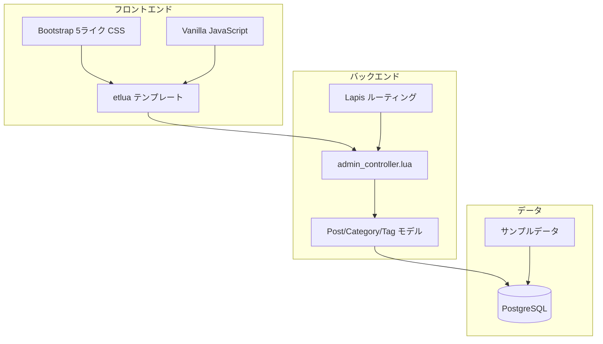

# 管理画面UI実装計画書（Week 6）

**作成日**: 2025-12-28  
**目的**: ダッシュボード上のすべてのリンクが動作するように管理画面の詳細ページを実装する

---

## 1. 実装概要

### 1.1 現状分析

#### ✅ 実装済み
- [`app/views/admin/dashboard.etlua`](app/views/admin/dashboard.etlua:1) - ダッシュボードUI
- [`app/views/admin/layout.etlua`](app/views/admin/layout.etlua:1) - 管理画面レイアウト
- [`app/controllers/admin_controller.lua`](app/controllers/admin_controller.lua:1) - ダッシュボードロジック
- [`app/controllers/post_controller.lua`](app/controllers/post_controller.lua:1) - 投稿API（JSON）
- [`app/models/post.lua`](app/models/post.lua:1) - 投稿モデル
- [`app/models/category.lua`](app/models/category.lua:1) - カテゴリーモデル
- [`app/models/tag.lua`](app/models/tag.lua:1) - タグモデル

#### ❌ 未実装（本計画で実装）
- `/admin/posts` - 投稿一覧ページ
- `/admin/posts/new` - 新規投稿作成ページ
- `/admin/posts/:id/edit` - 投稿編集ページ
- `/admin/categories` - カテゴリー管理ページ
- `/admin/tags` - タグ管理ページ
- `/admin/settings` - サイト設定ページ

### 1.2 技術スタック



---

## 2. 実装詳細

### 2.1 ルーティング設計

[`app/init.lua`](app/init.lua:1)に以下のルートを追加：

```lua
-- ========================================
-- 管理画面エンドポイント（拡張）
-- ========================================

-- 投稿管理
app:get("/admin/posts", function(self)
    return admin_controller.posts_index(self)
end)

app:get("/admin/posts/new", function(self)
    return admin_controller.posts_new(self)
end)

app:post("/admin/posts", function(self)
    return admin_controller.posts_create(self)
end)

app:get("/admin/posts/:id/edit", function(self)
    return admin_controller.posts_edit(self)
end)

app:post("/admin/posts/:id", function(self)
    return admin_controller.posts_update(self)
end)

app:post("/admin/posts/:id/delete", function(self)
    return admin_controller.posts_delete(self)
end)

-- カテゴリー管理
app:get("/admin/categories", function(self)
    return admin_controller.categories_index(self)
end)

app:post("/admin/categories", function(self)
    return admin_controller.categories_create(self)
end)

app:post("/admin/categories/:id", function(self)
    return admin_controller.categories_update(self)
end)

app:post("/admin/categories/:id/delete", function(self)
    return admin_controller.categories_delete(self)
end)

-- タグ管理
app:get("/admin/tags", function(self)
    return admin_controller.tags_index(self)
end)

app:post("/admin/tags", function(self)
    return admin_controller.tags_create(self)
end)

app:post("/admin/tags/:id", function(self)
    return admin_controller.tags_update(self)
end)

app:post("/admin/tags/:id/delete", function(self)
    return admin_controller.tags_delete(self)
end)

-- サイト設定
app:get("/admin/settings", function(self)
    return admin_controller.settings_index(self)
end)

app:post("/admin/settings", function(self)
    return admin_controller.settings_update(self)
end)
```

**注意**: 具体的なルートの定義位置は、`app:match("/admin", ...)`の後、`app:match("*", ...)`（404ハンドラー）の前に挿入する必要があります。

---

### 2.2 コントローラー実装

[`app/controllers/admin_controller.lua`](app/controllers/admin_controller.lua:1)に以下のメソッドを追加：

#### 2.2.1 投稿管理メソッド

```lua
-- 投稿一覧ページ
function AdminController.posts_index(self)
    -- 認証チェック
    local user, session, err = get_authenticated_user()
    if not user then
        return { redirect_to = "/admin/login?redirect=/admin/posts", status = 302 }
    end
    
    if not check_admin_permission(user) then
        ngx.status = 403
        return render_error("403 Forbidden", "このページへのアクセス権限がありません")
    end
    
    -- クエリパラメータ取得
    local args = self.req.params_get or {}
    local status = args.status or "all"
    local page = tonumber(args.page) or 1
    local per_page = 20
    local offset = (page - 1) * per_page
    
    -- 投稿を取得
    local options = {
        limit = per_page,
        offset = offset,
        order_by = "created_at DESC"
    }
    
    if status ~= "all" then
        options.where = string.format("status = '%s'", status)
    end
    
    local posts, err = Post:all(options)
    if not posts then
        posts = {}
    end
    
    -- 投稿数を取得（ページネーション用）
    local total_count = Post:count() or 0
    local total_pages = math.ceil(total_count / per_page)
    
    -- カテゴリーとタグを付与
    for _, post in ipairs(posts) do
        post.categories = Post.get_categories(post.id) or {}
        post.tags = Post.get_tags(post.id) or {}
    end
    
    -- テンプレートをレンダリング
    return render_admin_template("posts/index", {
        user = user,
        csrf_token = csrf.generate_token(session),
        posts = posts,
        status_filter = status,
        page = page,
        total_pages = total_pages,
        total_count = total_count
    })
end

-- 新規投稿作成ページ
function AdminController.posts_new(self)
    -- 認証チェック
    local user, session, err = get_authenticated_user()
    if not user then
        return { redirect_to = "/admin/login?redirect=/admin/posts/new", status = 302 }
    end
    
    if not check_admin_permission(user) then
        ngx.status = 403
        return render_error("403 Forbidden", "このページへのアクセス権限がありません")
    end
    
    -- カテゴリーとタグを取得
    local categories = Category:all() or {}
    local tags = Tag:all() or {}
    
    -- テンプレートをレンダリング
    return render_admin_template("posts/edit", {
        user = user,
        csrf_token = csrf.generate_token(session),
        post = nil,  -- 新規作成なのでnil
        categories = categories,
        tags = tags,
        is_new = true
    })
end

-- 投稿編集ページ
function AdminController.posts_edit(self)
    -- 認証チェック
    local user, session, err = get_authenticated_user()
    if not user then
        return { redirect_to = "/admin/login", status = 302 }
    end
    
    if not check_admin_permission(user) then
        ngx.status = 403
        return render_error("403 Forbidden", "このページへのアクセス権限がありません")
    end
    
    -- 投稿IDを取得
    local post_id = tonumber(self.params.id)
    if not post_id then
        return { redirect_to = "/admin/posts", status = 302 }
    end
    
    -- 投稿を取得
    local post, err = Post:find(post_id)
    if not post then
        return { redirect_to = "/admin/posts", status = 302 }
    end
    
    -- カテゴリーとタグを取得
    post.categories = Post.get_categories(post_id) or {}
    post.tags = Post.get_tags(post_id) or {}
    local all_categories = Category:all() or {}
    local all_tags = Tag:all() or {}
    
    -- テンプレートをレンダリング
    return render_admin_template("posts/edit", {
        user = user,
        csrf_token = csrf.generate_token(session),
        post = post,
        categories = all_categories,
        tags = all_tags,
        is_new = false
    })
end

-- 投稿作成処理（フォームPOST）
function AdminController.posts_create(self)
    -- 認証チェック
    local user, session, err = get_authenticated_user()
    if not user then
        return { redirect_to = "/admin/login", status = 302 }
    end
    
    -- CSRFトークン検証
    local csrf_valid, csrf_err = csrf.verify_token(session, self.params._csrf_token)
    if not csrf_valid then
        return render_error("403 Forbidden", csrf_err or "CSRF検証に失敗しました")
    end
    
    -- フォームデータから投稿を作成
    local post_data = {
        title = self.params.title,
        content = self.params.content,
        excerpt = self.params.excerpt or "",
        author_id = user.id,
        status = self.params.status or "draft",
        categories = parse_array_param(self.params.category_ids),
        tags = parse_array_param(self.params.tag_ids)
    }
    
    local post_id, err = Post.create_post(post_data)
    if not post_id then
        -- エラー時はフォームに戻る
        return render_admin_template("posts/edit", {
            user = user,
            csrf_token = csrf.generate_token(session),
            post = post_data,
            categories = Category:all() or {},
            tags = Tag:all() or {},
            is_new = true,
            error = err or "投稿の作成に失敗しました"
        })
    end
    
    -- 成功時は投稿一覧にリダイレクト
    return { redirect_to = "/admin/posts?created=1", status = 302 }
end

-- 投稿更新処理（フォームPOST）
function AdminController.posts_update(self)
    -- 認証チェック
    local user, session, err = get_authenticated_user()
    if not user then
        return { redirect_to = "/admin/login", status = 302 }
    end
    
    -- CSRFトークン検証
    local csrf_valid, csrf_err = csrf.verify_token(session, self.params._csrf_token)
    if not csrf_valid then
        return render_error("403 Forbidden", csrf_err or "CSRF検証に失敗しました")
    end
    
    local post_id = tonumber(self.params.id)
    if not post_id then
        return { redirect_to = "/admin/posts", status = 302 }
    end
    
    -- フォームデータから更新データを作成
    local update_data = {
        title = self.params.title,
        content = self.params.content,
        excerpt = self.params.excerpt,
        status = self.params.status,
        categories = parse_array_param(self.params.category_ids),
        tags = parse_array_param(self.params.tag_ids)
    }
    
    local ok, err = Post.update_post(post_id, update_data)
    if not ok then
        -- エラー時はフォームに戻る
        local post = Post:find(post_id)
        return render_admin_template("posts/edit", {
            user = user,
            csrf_token = csrf.generate_token(session),
            post = post,
            categories = Category:all() or {},
            tags = Tag:all() or {},
            is_new = false,
            error = err or "投稿の更新に失敗しました"
        })
    end
    
    -- 成功時は編集ページに戻る
    return { redirect_to = string.format("/admin/posts/%d/edit?updated=1", post_id), status = 302 }
end

-- 投稿削除処理
function AdminController.posts_delete(self)
    -- 認証チェック
    local user, session, err = get_authenticated_user()
    if not user then
        return { redirect_to = "/admin/login", status = 302 }
    end
    
    -- CSRFトークン検証
    local csrf_valid, csrf_err = csrf.verify_token(session, self.params._csrf_token)
    if not csrf_valid then
        return render_error("403 Forbidden", csrf_err or "CSRF検証に失敗しました")
    end
    
    local post_id = tonumber(self.params.id)
    if not post_id then
        return { redirect_to = "/admin/posts", status = 302 }
    end
    
    local ok, err = Post:delete(post_id)
    if not ok then
        return { redirect_to = "/admin/posts?error=delete_failed", status = 302 }
    end
    
    return { redirect_to = "/admin/posts?deleted=1", status = 302 }
end
```

#### 2.2.2 カテゴリー管理メソッド

```lua
-- カテゴリー管理ページ
function AdminController.categories_index(self)
    -- 認証チェック
    local user, session, err = get_authenticated_user()
    if not user then
        return { redirect_to = "/admin/login", status = 302 }
    end
    
    if not check_admin_permission(user) then
        ngx.status = 403
        return render_error("403 Forbidden", "このページへのアクセス権限がありません")
    end
    
    -- カテゴリー一覧を取得
    local categories = Category:all() or {}
    
    -- 各カテゴリーの投稿数を取得
    for _, category in ipairs(categories) do
        category.post_count = Category.count_posts(category.id) or 0
    end
    
    return render_admin_template("categories/index", {
        user = user,
        csrf_token = csrf.generate_token(session),
        categories = categories
    })
end

-- カテゴリー作成処理
function AdminController.categories_create(self)
    -- 認証チェック、CSRF検証、作成処理
    -- (posts_createと同様のパターン)
end

-- カテゴリー更新処理
function AdminController.categories_update(self)
    -- 認証チェック、CSRF検証、更新処理
end

-- カテゴリー削除処理
function AdminController.categories_delete(self)
    -- 認証チェック、CSRF検証、削除処理
end
```

#### 2.2.3 タグ管理メソッド

```lua
-- タグ管理ページ
function AdminController.tags_index(self)
    -- categories_indexと同様のパターン
end

-- タグ作成・更新・削除処理
function AdminController.tags_create(self) end
function AdminController.tags_update(self) end
function AdminController.tags_delete(self) end
```

#### 2.2.4 サイト設定メソッド

```lua
-- サイト設定ページ
function AdminController.settings_index(self)
    -- 認証チェック
    local user, session, err = get_authenticated_user()
    if not user then
        return { redirect_to = "/admin/login", status = 302 }
    end
    
    if not check_admin_permission(user) then
        ngx.status = 403
        return render_error("403 Forbidden", "このページへのアクセス権限がありません")
    end
    
    -- ユーザー設定を取得
    local user_settings = UserSettings:find_by_user_id(user.id) or {}
    
    return render_admin_template("settings/index", {
        user = user,
        csrf_token = csrf.generate_token(session),
        settings = user_settings
    })
end

-- サイト設定更新処理
function AdminController.settings_update(self)
    -- 認証チェック、CSRF検証、設定更新処理
end
```

#### 2.2.5 ヘルパー関数

```lua
-- 配列パラメータのパース（チェックボックスやマルチセレクト用）
local function parse_array_param(param)
    if not param then
        return {}
    end
    
    if type(param) == "table" then
        return param
    end
    
    -- カンマ区切りの文字列の場合
    if type(param) == "string" then
        local result = {}
        for id in param:gmatch("[^,]+") do
            table.insert(result, tonumber(id))
        end
        return result
    end
    
    return {}
end

-- 管理画面テンプレートのレンダリング
local function render_admin_template(template_name, data)
    local template_path = string.format("/app/views/admin/%s.etlua", template_name)
    local layout_path = "/app/views/admin/layout.etlua"
    
    -- テンプレートとレイアウトを読み込み
    local template_file = io.open(template_path, "r")
    if not template_file then
        ngx.log(ngx.ERR, "テンプレートファイルが見つかりません: ", template_path)
        ngx.status = 500
        return "テンプレートファイルが見つかりません"
    end
    local template_content = template_file:read("*all")
    template_file:close()
    
    local layout_file = io.open(layout_path, "r")
    if not layout_file then
        ngx.log(ngx.ERR, "レイアウトファイルが見つかりません: ", layout_path)
        ngx.status = 500
        return "レイアウトファイルが見つかりません"
    end
    local layout_content = layout_file:read("*all")
    layout_file:close()
    
    -- テンプレートをコンパイル
    local template = etlua.compile(template_content)
    local layout = etlua.compile(layout_content)
    
    -- データに_VERSIONを追加
    data._VERSION = _VERSION
    
    -- テンプレートをレンダリング
    local content = template(data)
    
    -- レイアウトデータを準備
    local layout_data = {
        user = data.user,
        csrf_token = data.csrf_token,
        content_for_layout = content,
        page_title = data.page_title or template_name,
        active_menu = data.active_menu or "dashboard",
        _VERSION = _VERSION
    }
    
    -- レイアウトをレンダリング
    local html = layout(layout_data)
    
    return html
end

-- エラーページのレンダリング
local function render_error(title, message)
    ngx.header.content_type = "text/html; charset=utf-8"
    return string.format([[
<!DOCTYPE html>
<html lang="ja">
<head>
    <meta charset="UTF-8">
    <meta name="viewport" content="width=device-width, initial-scale=1.0">
    <title>%s - LuaAIDiary</title>
    <style>
        body { font-family: Arial, sans-serif; text-align: center; padding: 50px; }
        h1 { color: #d9534f; }
        p { color: #666; }
        a { color: #337ab7; text-decoration: none; }
    </style>
</head>
<body>
    <h1>%s</h1>
    <p>%s</p>
    <p><a href="/admin/dashboard">ダッシュボードに戻る</a></p>
</body>
</html>
]], title, title, message)
end
```

---

### 2.3 ビューファイル実装

#### 2.3.1 投稿一覧ページ

**ファイル**: `app/views/admin/posts/index.etlua`

```html
<!-- ヘッダーセクション -->
<div class="page-header">
    <h1>📝 投稿管理</h1>
    <div class="page-actions">
        <a href="/admin/posts/new" class="btn btn-primary">新規投稿を作成</a>
    </div>
</div>

<!-- ステータスフィルター -->
<div class="filter-bar">
    <a href="/admin/posts?status=all" class="filter-link <%= status_filter == 'all' and 'active' or '' %>">
        すべて (<%= total_count %>)
    </a>
    <a href="/admin/posts?status=published" class="filter-link <%= status_filter == 'published' and 'active' or '' %>">
        公開済み
    </a>
    <a href="/admin/posts?status=draft" class="filter-link <%= status_filter == 'draft' and 'active' or '' %>">
        下書き
    </a>
    <a href="/admin/posts?status=trash" class="filter-link <%= status_filter == 'trash' and 'active' or '' %>">
        ゴミ箱
    </a>
</div>

<!-- 投稿テーブル -->
<div class="card">
    <% if posts and #posts > 0 then %>
        <table class="data-table">
            <thead>
                <tr>
                    <th>タイトル</th>
                    <th>著者</th>
                    <th>カテゴリー</th>
                    <th>タグ</th>
                    <th>ステータス</th>
                    <th>日付</th>
                    <th>操作</th>
                </tr>
            </thead>
            <tbody>
                <% for _, post in ipairs(posts) do %>
                    <tr>
                        <td>
                            <strong><a href="/admin/posts/<%= post.id %>/edit"><%= post.title %></a></strong>
                        </td>
                        <td><%= post.author_id %></td>
                        <td>
                            <% if post.categories and #post.categories > 0 then %>
                                <% for i, cat in ipairs(post.categories) do %>
                                    <%= cat.name %><%= i < #post.categories and ', ' or '' %>
                                <% end %>
                            <% else %>
                                <span class="text-muted">未分類</span>
                            <% end %>
                        </td>
                        <td>
                            <% if post.tags and #post.tags > 0 then %>
                                <% for i, tag in ipairs(post.tags) do %>
                                    <%= tag.name %><%= i < #post.tags and ', ' or '' %>
                                <% end %>
                            <% else %>
                                <span class="text-muted">-</span>
                            <% end %>
                        </td>
                        <td>
                            <% if post.status == "published" then %>
                                <span class="badge badge-success">公開</span>
                            <% elseif post.status == "draft" then %>
                                <span class="badge badge-secondary">下書き</span>
                            <% else %>
                                <span class="badge badge-danger"><%= post.status %></span>
                            <% end %>
                        </td>
                        <td>
                            <%= post.created_at and tostring(post.created_at):sub(1, 10) or '-' %>
                        </td>
                        <td>
                            <a href="/admin/posts/<%= post.id %>/edit" class="btn btn-sm btn-primary">編集</a>
                            <form method="POST" action="/admin/posts/<%= post.id %>/delete" style="display:inline;">
                                <input type="hidden" name="_csrf_token" value="<%= csrf_token %>">
                                <button type="submit" class="btn btn-sm btn-danger" onclick="return confirm('本当に削除しますか？')">削除</button>
                            </form>
                        </td>
                    </tr>
                <% end %>
            </tbody>
        </table>
        
        <!-- ページネーション -->
        <% if total_pages > 1 then %>
            <div class="pagination">
                <% for i = 1, total_pages do %>
                    <a href="/admin/posts?page=<%= i %>&status=<%= status_filter %>" 
                       class="page-link <%= i == page and 'active' or '' %>">
                        <%= i %>
                    </a>
                <% end %>
            </div>
        <% end %>
    <% else %>
        <div class="empty-state">
            <div style="font-size: 48px; margin-bottom: 15px;">📝</div>
            <p>投稿が見つかりませんでした</p>
            <a href="/admin/posts/new" class="btn btn-primary">新規投稿を作成</a>
        </div>
    <% end %>
</div>
```

#### 2.3.2 投稿編集ページ

**ファイル**: `app/views/admin/posts/edit.etlua`

```html
<div class="page-header">
    <h1><%= is_new and '✍️ 新規投稿' or '✏️ 投稿を編集' %></h1>
</div>

<% if error then %>
    <div class="alert alert-danger"><%= error %></div>
<% end %>

<form method="POST" action="<%= is_new and '/admin/posts' or ('/admin/posts/' .. post.id) %>" class="post-form">
    <input type="hidden" name="_csrf_token" value="<%= csrf_token %>">
    
    <div class="form-row">
        <!-- メインエディタエリア -->
        <div class="form-main">
            <div class="form-group">
                <label for="title">タイトル</label>
                <input type="text" id="title" name="title" class="form-control form-control-lg" 
                       value="<%= post and post.title or '' %>" required>
            </div>
            
            <div class="form-group">
                <label for="content">本文</label>
                <textarea id="content" name="content" class="form-control" rows="20" required><%= post and post.content or '' %></textarea>
            </div>
            
            <div class="form-group">
                <label for="excerpt">抜粋</label>
                <textarea id="excerpt" name="excerpt" class="form-control" rows="3"><%= post and post.excerpt or '' %></textarea>
                <small class="form-text">記事の要約を入力してください（省略可）</small>
            </div>
        </div>
        
        <!-- サイドバー -->
        <div class="form-sidebar">
            <!-- 公開設定 -->
            <div class="card">
                <div class="card-header">📤 公開設定</div>
                <div class="card-body">
                    <div class="form-group">
                        <label for="status">ステータス</label>
                        <select id="status" name="status" class="form-control">
                            <option value="draft" <%= (not post or post.status == 'draft') and 'selected' or '' %>>下書き</option>
                            <option value="published" <%= (post and post.status == 'published') and 'selected' or '' %>>公開</option>
                            <option value="trash" <%= (post and post.status == 'trash') and 'selected' or '' %>>ゴミ箱</option>
                        </select>
                    </div>
                    
                    <div class="form-actions">
                        <button type="submit" class="btn btn-primary btn-block">
                            <%= is_new and '投稿を作成' or '更新' %>
                        </button>
                        <a href="/admin/posts" class="btn btn-secondary btn-block">キャンセル</a>
                    </div>
                </div>
            </div>
            
            <!-- カテゴリー -->
            <div class="card">
                <div class="card-header">📁 カテゴリー</div>
                <div class="card-body">
                    <% if categories and #categories > 0 then %>
                        <% 
                        local selected_cat_ids = {}
                        if post and post.categories then
                            for _, cat in ipairs(post.categories) do
                                selected_cat_ids[cat.id] = true
                            end
                        end
                        %>
                        <% for _, category in ipairs(categories) do %>
                            <div class="form-check">
                                <input type="checkbox" class="form-check-input" 
                                       id="cat_<%= category.id %>" 
                                       name="category_ids[]" 
                                       value="<%= category.id %>"
                                       <%= selected_cat_ids[category.id] and 'checked' or '' %>>
                                <label class="form-check-label" for="cat_<%= category.id %>">
                                    <%= category.name %>
                                </label>
                            </div>
                        <% end %>
                    <% else %>
                        <p class="text-muted">カテゴリーがありません</p>
                    <% end %>
                </div>
            </div>
            
            <!-- タグ -->
            <div class="card">
                <div class="card-header">🏷️ タグ</div>
                <div class="card-body">
                    <% if tags and #tags > 0 then %>
                        <% 
                        local selected_tag_ids = {}
                        if post and post.tags then
                            for _, tag in ipairs(post.tags) do
                                selected_tag_ids[tag.id] = true
                            end
                        end
                        %>
                        <% for _, tag in ipairs(tags) do %>
                            <div class="form-check">
                                <input type="checkbox" class="form-check-input" 
                                       id="tag_<%= tag.id %>" 
                                       name="tag_ids[]" 
                                       value="<%= tag.id %>"
                                       <%= selected_tag_ids[tag.id] and 'checked' or '' %>>
                                <label class="form-check-label" for="tag_<%= tag.id %>">
                                    <%= tag.name %>
                                </label>
                            </div>
                        <% end %>
                    <% else %>
                        <p class="text-muted">タグがありません</p>
                    <% end %>
                </div>
            </div>
        </div>
    </div>
</form>
```

#### 2.3.3 カテゴリー管理ページ

**ファイル**: `app/views/admin/categories/index.etlua`

```html
<div class="page-header">
    <h1>📁 カテゴリー管理</h1>
</div>

<div class="form-row">
    <!-- 新規カテゴリー作成フォーム -->
    <div class="form-main">
        <div class="card">
            <div class="card-header">新規カテゴリーを追加</div>
            <div class="card-body">
                <form method="POST" action="/admin/categories">
                    <input type="hidden" name="_csrf_token" value="<%= csrf_token %>">
                    
                    <div class="form-group">
                        <label for="name">名前</label>
                        <input type="text" id="name" name="name" class="form-control" required>
                    </div>
                    
                    <div class="form-group">
                        <label for="slug">スラッグ</label>
                        <input type="text" id="slug" name="slug" class="form-control">
                        <small class="form-text">URLで使用される名前（省略可）</small>
                    </div>
                    
                    <div class="form-group">
                        <label for="description">説明</label>
                        <textarea id="description" name="description" class="form-control" rows="3"></textarea>
                    </div>
                    
                    <button type="submit" class="btn btn-primary">カテゴリーを追加</button>
                </form>
            </div>
        </div>
    </div>
    
    <!-- カテゴリー一覧 -->
    <div class="form-sidebar">
        <div class="card">
            <div class="card-header">カテゴリー一覧</div>
            <div class="card-body">
                <% if categories and #categories > 0 then %>
                    <table class="table">
                        <thead>
                            <tr>
                                <th>名前</th>
                                <th>投稿数</th>
                                <th>操作</th>
                            </tr>
                        </thead>
                        <tbody>
                            <% for _, category in ipairs(categories) do %>
                                <tr>
                                    <td><%= category.name %></td>
                                    <td><%= category.post_count or 0 %></td>
                                    <td>
                                        <form method="POST" action="/admin/categories/<%= category.id %>/delete" style="display:inline;">
                                            <input type="hidden" name="_csrf_token" value="<%= csrf_token %>">
                                            <button type="submit" class="btn btn-sm btn-danger" 
                                                    onclick="return confirm('本当に削除しますか？')">削除</button>
                                        </form>
                                    </td>
                                </tr>
                            <% end %>
                        </tbody>
                    </table>
                <% else %>
                    <p class="text-muted">カテゴリーがありません</p>
                <% end %>
            </div>
        </div>
    </div>
</div>
```

#### 2.3.4 タグ管理ページ

**ファイル**: `app/views/admin/tags/index.etlua`

（カテゴリー管理ページと同様の構造）

#### 2.3.5 サイト設定ページ

**ファイル**: `app/views/admin/settings/index.etlua`

```html
<div class="page-header">
    <h1>⚙️ サイト設定</h1>
</div>

<form method="POST" action="/admin/settings">
    <input type="hidden" name="_csrf_token" value="<%= csrf_token %>">
    
    <div class="card">
        <div class="card-header">基本設定</div>
        <div class="card-body">
            <div class="form-group">
                <label for="blog_title">ブログタイトル</label>
                <input type="text" id="blog_title" name="blog_title" class="form-control" 
                       value="<%= settings and settings.blog_title or 'LuaAIDiary' %>">
            </div>
            
            <div class="form-group">
                <label for="blog_description">ブログの説明</label>
                <textarea id="blog_description" name="blog_description" class="form-control" rows="3"><%= settings and settings.blog_description or '' %></textarea>
            </div>
        </div>
    </div>
    
    <div class="card">
        <div class="card-header">Gemini API設定</div>
        <div class="card-body">
            <div class="form-group">
                <label for="gemini_api_key">Gemini APIキー</label>
                <input type="password" id="gemini_api_key" name="gemini_api_key" class="form-control" 
                       placeholder="APIキーを入力">
                <small class="form-text">Google AI StudioでAPIキーを取得してください</small>
            </div>
        </div>
    </div>
    
    <div class="form-actions">
        <button type="submit" class="btn btn-primary">設定を保存</button>
    </div>
</form>
```

---

### 2.4 CSS拡張

[`static/css/admin.css`](static/css/admin.css:1)に以下を追加：

```css
/* ページヘッダー */
.page-header {
    display: flex;
    justify-content: space-between;
    align-items: center;
    margin-bottom: 30px;
    padding-bottom: 15px;
    border-bottom: 2px solid var(--border-color);
}

.page-actions {
    display: flex;
    gap: 10px;
}

/* フィルターバー */
.filter-bar {
    display: flex;
    gap: 20px;
    margin-bottom: 20px;
    padding: 15px;
    background: var(--card-bg);
    border-radius: var(--border-radius);
}

.filter-link {
    color: var(--text-secondary);
    text-decoration: none;
    padding: 5px 10px;
    border-radius: 4px;
    transition: all 0.2s;
}

.filter-link:hover {
    background: var(--hover-bg);
    color: var(--primary-color);
}

.filter-link.active {
    background: var(--primary-color);
    color: white;
    font-weight: 500;
}

/* フォームレイアウト */
.form-row {
    display: grid;
    grid-template-columns: 1fr 300px;
    gap: 30px;
}

.form-main {
    min-width: 0;
}

.form-sidebar {
    display: flex;
    flex-direction: column;
    gap: 20px;
}

.form-sidebar .card {
    position: sticky;
    top: 20px;
}

/* フォームグループ */
.form-group {
    margin-bottom: 20px;
}

.form-group label {
    display: block;
    margin-bottom: 8px;
    font-weight: 500;
    color: var(--text-primary);
}

.form-control {
    width: 100%;
    padding: 10px 12px;
    border: 1px solid var(--border-color);
    border-radius: var(--border-radius);
    font-size: 14px;
    transition: border-color 0.2s;
}

.form-control:focus {
    outline: none;
    border-color: var(--primary-color);
    box-shadow: 0 0 0 3px rgba(0, 123, 255, 0.1);
}

.form-control-lg {
    font-size: 20px;
    padding: 15px;
    font-weight: 500;
}

textarea.form-control {
    resize: vertical;
    font-family: monospace;
}

.form-text {
    display: block;
    margin-top: 5px;
    font-size: 12px;
    color: var(--text-secondary);
}

/* チェックボックス */
.form-check {
    margin-bottom: 10px;
}

.form-check-input {
    margin-right: 8px;
}

.form-check-label {
    font-weight: normal;
}

/* バッジ */
.badge {
    display: inline-block;
    padding: 4px 8px;
    font-size: 11px;
    font-weight: 500;
    border-radius: 3px;
    text-transform: uppercase;
}

.badge-success {
    background: #28a745;
    color: white;
}

.badge-secondary {
    background: #6c757d;
    color: white;
}

.badge-danger {
    background: #dc3545;
    color: white;
}

/* ページネーション */
.pagination {
    display: flex;
    justify-content: center;
    gap: 5px;
    padding: 20px 0;
}

.page-link {
    padding: 8px 12px;
    border: 1px solid var(--border-color);
    border-radius: 4px;
    color: var(--text-primary);
    text-decoration: none;
    transition: all 0.2s;
}

.page-link:hover {
    background: var(--hover-bg);
    border-color: var(--primary-color);
}

.page-link.active {
    background: var(--primary-color);
    color: white;
    border-color: var(--primary-color);
}

/* 空の状態 */
.empty-state {
    text-align: center;
    padding: 60px 20px;
    color: var(--text-secondary);
}

/* アラート */
.alert {
    padding: 15px;
    margin-bottom: 20px;
    border-radius: var(--border-radius);
    border-left: 4px solid;
}

.alert-danger {
    background: #f8d7da;
    border-color: #dc3545;
    color: #721c24;
}

.alert-success {
    background: #d4edda;
    border-color: #28a745;
    color: #155724;
}

/* レスポンシブ */
@media (max-width: 768px) {
    .form-row {
        grid-template-columns: 1fr;
    }
    
    .form-sidebar {
        order: -1;
    }
    
    .page-header {
        flex-direction: column;
        align-items: flex-start;
        gap: 15px;
    }
    
    .filter-bar {
        flex-direction: column;
        gap: 10px;
    }
}
```

---

### 2.5 JavaScript機能

**ファイル**: `static/js/admin.js`

```javascript
// フォーム送信時の確認
document.addEventListener('DOMContentLoaded', function() {
    // 削除ボタンの確認
    const deleteForms = document.querySelectorAll('form[action*="/delete"]');
    deleteForms.forEach(form => {
        form.addEventListener('submit', function(e) {
            if (!confirm('本当に削除しますか？この操作は取り消せません。')) {
                e.preventDefault();
            }
        });
    });
    
    // タイトルからスラッグを自動生成（カテゴリー・タグ用）
    const nameInput = document.getElementById('name');
    const slugInput = document.getElementById('slug');
    
    if (nameInput && slugInput) {
        nameInput.addEventListener('input', function() {
            if (!slugInput.value || slugInput.dataset.auto !== 'false') {
                slugInput.value = generateSlug(this.value);
                slugInput.dataset.auto = 'true';
            }
        });
        
        slugInput.addEventListener('input', function() {
            if (this.value) {
                this.dataset.auto = 'false';
            }
        });
    }
    
    // 成功メッセージの表示
    const urlParams = new URLSearchParams(window.location.search);
    if (urlParams.get('created')) {
        showNotification('投稿を作成しました', 'success');
    } else if (urlParams.get('updated')) {
        showNotification('投稿を更新しました', 'success');
    } else if (urlParams.get('deleted')) {
        showNotification('投稿を削除しました', 'success');
    }
});

// スラッグ生成関数（簡易版）
function generateSlug(text) {
    return text
        .toLowerCase()
        .trim()
        .replace(/[^\w\s-]/g, '')
        .replace(/[\s_-]+/g, '-')
        .replace(/^-+|-+$/g, '');
}

// 通知表示関数
function showNotification(message, type) {
    const notification = document.createElement('div');
    notification.className = `alert alert-${type}`;
    notification.textContent = message;
    notification.style.position = 'fixed';
    notification.style.top = '20px';
    notification.style.right = '20px';
    notification.style.zIndex = '9999';
    notification.style.minWidth = '300px';
    notification.style.animation = 'slideIn 0.3s ease-out';
    
    document.body.appendChild(notification);
    
    setTimeout(() => {
        notification.style.animation = 'slideOut 0.3s ease-in';
        setTimeout(() => {
            notification.remove();
        }, 300);
    }, 3000);
}
```

---

### 2.6 サンプルデータの追加

**ファイル**: `postgresql/init/03_sample_posts.sql`

```sql
-- サンプル投稿データ（テスト用）
-- このファイルはデータベース初期化時に自動実行されます

-- サンプル投稿1
INSERT INTO posts (title, slug, content, excerpt, author_id, status, published_at, created_at, updated_at)
VALUES 
(
    'LuaAIDiaryへようこそ',
    'welcome-to-luaaidiary',
    E'# LuaAIDiaryへようこそ\n\nこれはLuaで構築された高性能ブログシステムです。\n\n## 特徴\n\n- OpenRestyによる高速処理\n- WordPressテーマ互換\n- Gemini AI連携（準備中）\n\n詳しくは[ドキュメント](/docs)をご覧ください。',
    'LuaAIDiaryは、Luaで構築された高性能ブログシステムです。OpenRestyによる高速処理、WordPressテーマ互換、Gemini AI連携などの特徴があります。',
    1,  -- admin user
    'published',
    CURRENT_TIMESTAMP,
    CURRENT_TIMESTAMP,
    CURRENT_TIMESTAMP
),
(
    'ブログの使い方',
    'how-to-use-blog',
    E'# ブログの使い方\n\n管理画面から記事を投稿できます。\n\n## 記事の作成方法\n\n1. 管理画面にログイン\n2. 「新規投稿」をクリック\n3. タイトルと本文を入力\n4. 「公開」をクリック',
    '管理画面からブログ記事を簡単に投稿する方法を解説します。',
    1,
    'published',
    CURRENT_TIMESTAMP - INTERVAL '1 day',
    CURRENT_TIMESTAMP - INTERVAL '1 day',
    CURRENT_TIMESTAMP - INTERVAL '1 day'
),
(
    '下書き記事のサンプル',
    'draft-sample',
    E'これは下書き状態の記事です。\n\nまだ公開されていません。',
    '下書き記事のサンプルです。',
    1,
    'draft',
    NULL,
    CURRENT_TIMESTAMP - INTERVAL '2 hours',
    CURRENT_TIMESTAMP - INTERVAL '2 hours'
);

-- 投稿とカテゴリーの関連付け
INSERT INTO post_categories (post_id, category_id)
SELECT p.id, c.id
FROM posts p, categories c
WHERE p.slug = 'welcome-to-luaaidiary' AND c.slug = 'news';

INSERT INTO post_categories (post_id, category_id)
SELECT p.id, c.id
FROM posts p, categories c
WHERE p.slug = 'how-to-use-blog' AND c.slug = 'tech';

INSERT INTO post_categories (post_id, category_id)
SELECT p.id, c.id
FROM posts p, categories c
WHERE p.slug = 'draft-sample' AND c.slug = 'uncategorized';

-- 投稿とタグの関連付け
INSERT INTO post_tags (post_id, tag_id)
SELECT p.id, t.id
FROM posts p, tags t
WHERE p.slug = 'welcome-to-luaaidiary' AND t.slug IN ('lua', 'openresty');

INSERT INTO post_tags (post_id, tag_id)
SELECT p.id, t.id
FROM posts p, tags t
WHERE p.slug = 'how-to-use-blog' AND t.slug IN ('lua', 'postgresql');

COMMIT;
```

---

## 3. 実装順序

### Phase 1: 基盤整備
1. ヘルパー関数の追加（`render_admin_template`、`parse_array_param`）
2. サンプルデータの追加（`03_sample_posts.sql`）
3. CSSの拡張（`admin.css`）

### Phase 2: 投稿管理
1. 投稿一覧コントローラー（`posts_index`）
2. 投稿一覧ビュー（`posts/index.etlua`）
3. 投稿編集コントローラー（`posts_edit`、`posts_new`）
4. 投稿編集ビュー（`posts/edit.etlua`）
5. 投稿作成・更新・削除処理
6. ルーティングの追加

### Phase 3: カテゴリー・タグ管理
1. カテゴリー管理コントローラー
2. カテゴリー管理ビュー
3. タグ管理コントローラー
4. タグ管理ビュー
5. ルーティングの追加

### Phase 4: サイト設定
1. サイト設定コントローラー
2. サイト設定ビュー
3. ルーティングの追加

### Phase 5: JavaScript機能
1. `admin.js`の作成
2. レイアウトへのスクリプト追加

---

## 4. テスト計画

### 4.1 手動テスト項目

#### 投稿管理
- [ ] `/admin/posts`で投稿一覧が表示される
- [ ] ステータスフィルターが動作する
- [ ] `/admin/posts/new`で新規投稿フォームが表示される
- [ ] 新規投稿を作成できる
- [ ] カテゴリー・タグを選択できる
- [ ] `/admin/posts/:id/edit`で編集フォームが表示される
- [ ] 投稿を更新できる
- [ ] 投稿を削除できる
- [ ] ページネーションが動作する

#### カテゴリー・タグ管理
- [ ] `/admin/categories`でカテゴリー管理画面が表示される
- [ ] カテゴリーを追加できる
- [ ] カテゴリーを削除できる
- [ ] `/admin/tags`でタグ管理画面が表示される
- [ ] タグを追加できる
- [ ] タグを削除できる

#### サイト設定
- [ ] `/admin/settings`で設定画面が表示される
- [ ] 設定を更新できる

#### セキュリティ
- [ ] CSRFトークンが機能している
- [ ] 未認証ユーザーはリダイレクトされる
- [ ] 権限のないユーザーは403エラーになる

### 4.2 自動テスト（Busted）

**ファイル**: `tests/controllers/test_admin_ui_spec.lua`

```lua
describe("Admin UI Controllers", function()
    local admin_controller
    
    before_each(function()
        admin_controller = require("controllers.admin_controller")
    end)
    
    describe("posts_index", function()
        it("should return posts list", function()
            -- テスト実装
        end)
    end)
    
    -- 他のテストケース
end)
```

---

## 5. マイグレーション・デプロイ

### 5.1 データベースの更新

```bash
# Dockerコンテナを再起動してサンプルデータを投入
docker-compose down -v
docker-compose up -d
```

### 5.2 確認手順

1. ブラウザで`http://localhost:8080/admin/login`にアクセス
2. 管理者アカウントでログイン（username: `admin`）
3. ダッシュボードの各リンクをクリック
4. 投稿、カテゴリー、タグの作成・編集・削除を確認

---

## 6. 今後の拡張予定

### Week 7以降
- Markdownエディタの統合（SimpleMDE/EasyMDE）
- 画像アップロード機能
- Gemini AI統合（記事構成提案）
- リアルタイムプレビュー
- オートセーブ機能

---

## 7. 参考資料

- [Lapis公式ドキュメント](https://leafo.net/lapis/)
- [etlua テンプレートエンジン](https://github.com/leafo/etlua)
- [Bootstrap 5 ドキュメント](https://getbootstrap.com/docs/5.0/)

---

**作成者**: Claude (Architect Mode)  
**最終更新**: 2025-12-28
