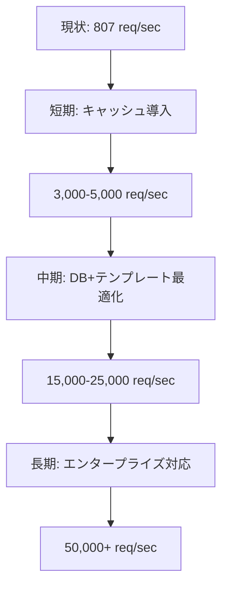
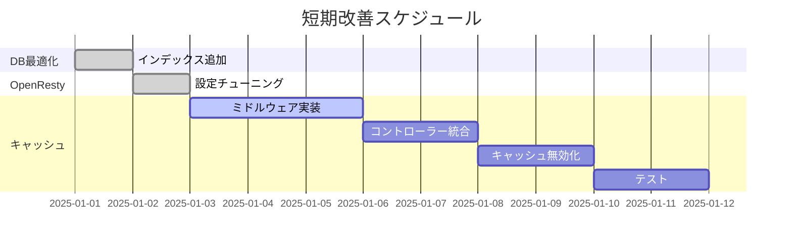
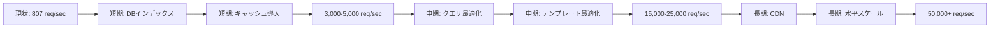

# LuaAIDiary 性能改善計画

**作成日**: 2025年12月31日  
**対象バージョン**: LuaAIDiary v1.0  
**関連ドキュメント**: [`docs/performance_comparison_report.md`](../docs/performance_comparison_report.md)

---

## 📋 目次

1. [概要](#概要)
2. [現状分析](#現状分析)
3. [短期的改善（1-2週間）](#短期的改善1-2週間)
4. [中期的改善（1-2ヶ月）](#中期的改善1-2ヶ月)
5. [長期的改善（3ヶ月以上）](#長期的改善3ヶ月以上)
6. [実装優先順位](#実装優先順位)
7. [リスクと対策](#リスクと対策)
8. [成果指標](#成果指標)

---

## 概要

### 目的

LuaAIDiaryの性能を段階的に改善し、WordPressキャッシュ時と同等以上の性能を達成する。

### 現状の性能

| メトリクス | 現状値 | 目標値（短期） | 目標値（中期） | 目標値（長期） |
|-----------|--------|--------------|--------------|--------------|
| スループット（トップページ） | 807 req/sec | 3,000-5,000 | 15,000-25,000 | 50,000+ |
| 平均レイテンシ | 156.55ms | 30-50ms | 5-15ms | 2-5ms |
| 99%レイテンシ | 1.46s | 200-300ms | 50-100ms | 20-50ms |
| 成功率 | 100% | 100% | 100% | 100% |

### 改善のアプローチ



---

## 現状分析

### ボトルネックの特定

性能テスト結果から特定されたボトルネック：

#### 1. データベースクエリ（寄与度: 40-50%）

**現状の問題**:
- トップページで複数回のクエリ実行
- N+1問題の可能性
- インデックスの不足
- 接続プール設定が未最適化

**根拠**:
```
トップページ: 807 req/sec, 156ms
ヘルスチェック（DBなし）: 57,508 req/sec, 3.7ms
→ DBアクセスによる約70倍の性能低下
```

#### 2. テンプレートレンダリング（寄与度: 30-40%）

**現状の問題**:
- 毎回テンプレートファイルを読み込み
- テンプレートを毎回コンパイル
- PHPエミュレーション機能のオーバーヘッド
- 部分的なキャッシュなし

#### 3. キャッシュ機構の欠如（寄与度: 最大）

**現状の問題**:
- ページレベルのキャッシュなし
- データベースクエリ結果のキャッシュなし
- テンプレートキャッシュなし

**影響**:
- 同じページへのリクエストも毎回フルレンダリング
- データベースへの負荷が高い
- 予測可能な低性能

#### 4. その他の要因（寄与度: 5-10%）

- セッション/認証処理
- ログ出力
- ミドルウェア処理

### 性能改善のポテンシャル

| 改善項目 | 期待される効果 | 根拠 |
|---------|--------------|------|
| ページキャッシュ導入 | **10-50倍向上** | ヘルスチェックで57,508 req/sec達成 |
| DBクエリ最適化 | **1.5-2倍向上** | N+1問題解消、インデックス追加 |
| テンプレート最適化 | **1.2-1.5倍向上** | 事前コンパイル、部分キャッシュ |
| **総合効果** | **15-100倍向上** | 組み合わせによる相乗効果 |

---

## 短期的改善（1-2週間）

### 目標

- **スループット**: 807 → 3,000-5,000 req/sec（**3-6倍向上**）
- **レイテンシ**: 156ms → 30-50ms（**3-5倍改善**）
- **実装期間**: 10-14日

### 改善1: データベースインデックスの追加

#### 優先度: 🔴 最高

#### 実装内容

```sql
-- 1. 公開記事の取得を高速化
CREATE INDEX idx_posts_published 
ON posts(status, created_at DESC) 
WHERE status = 'published';

-- 2. カテゴリーでの絞り込みを高速化
CREATE INDEX idx_posts_category 
ON posts(category_id, created_at DESC) 
WHERE status = 'published';

-- 3. タグ検索の高速化
CREATE INDEX idx_post_tags_composite 
ON post_tags(tag_id, post_id);

-- 4. ユーザーによる絞り込み
CREATE INDEX idx_posts_user 
ON posts(user_id, created_at DESC) 
WHERE status = 'published';

-- 5. スラッグによる検索（単一記事表示）
CREATE UNIQUE INDEX idx_posts_slug 
ON posts(slug) 
WHERE status = 'published';

-- 6. 統計情報を更新
VACUUM ANALYZE posts;
VACUUM ANALYZE post_tags;
VACUUM ANALYZE categories;
```

#### 期待効果

- **クエリ実行時間**: 50-80%短縮
- **スループット**: 807 → 1,200-1,600 req/sec（**1.5-2倍向上**）
- **レイテンシ**: 156ms → 100-120ms（**30-50ms改善**）

#### 実装工数

- **見積もり**: 0.5日
- **担当**: DBエンジニア/バックエンドエンジニア

#### 実装手順

1. 開発環境でインデックス作成を実施
2. `EXPLAIN ANALYZE`でクエリプランを確認
3. ベンチマークで効果測定
4. 本番環境へのマイグレーション実施

#### リスク

- **低**: インデックス作成は安全な操作
- **注意点**: 書き込み性能がわずかに低下する可能性（読み取り中心のアプリでは問題なし）

---

### 改善2: OpenResty設定のチューニング

#### 優先度: 🟡 高

#### 実装内容

```nginx
# docker/web/nginx.conf

# ワーカープロセス数の最適化
worker_processes auto;  # CPUコア数に自動調整

# イベント処理の最適化
events {
    worker_connections 2048;  # 1024 → 2048に増加
    use epoll;  # Linuxで最も効率的なイベントモデル
    multi_accept on;  # 複数の接続を一度に受け入れ
}

http {
    # バッファサイズの最適化
    client_body_buffer_size 128k;
    client_max_body_size 10m;
    large_client_header_buffers 4 16k;
    
    # タイムアウト設定
    client_body_timeout 12;
    client_header_timeout 12;
    keepalive_timeout 15;
    send_timeout 10;
    
    # Gzip圧縮の最適化
    gzip on;
    gzip_vary on;
    gzip_min_length 1000;
    gzip_comp_level 6;
    gzip_types text/plain text/css application/json application/javascript text/xml application/xml application/xml+rss text/javascript;
    
    # ファイルキャッシュ
    open_file_cache max=10000 inactive=30s;
    open_file_cache_valid 60s;
    open_file_cache_min_uses 2;
    open_file_cache_errors on;
    
    # TCP最適化
    tcp_nopush on;
    tcp_nodelay on;
}
```

#### 期待効果

- **リソース効率**: 10-20%向上
- **スループット**: 5-10%向上（800 → 840-880 req/sec）
- **レイテンシ**: 5-10ms改善

#### 実装工数

- **見積もり**: 0.5日
- **担当**: インフラエンジニア/DevOpsエンジニア

#### 実装手順

1. 設定ファイルをバックアップ
2. 新しい設定を適用
3. `nginx -t`で設定検証
4. コンテナを再起動
5. ベンチマークで効果測定

#### リスク

- **低**: 設定の調整のみ
- **対策**: バックアップから復元可能

---

### 改善3: 基本的なページキャッシュの導入

#### 優先度: 🔴 最高

#### 実装内容

**3-1. キャッシュミドルウェアの作成**

```lua
-- app/middleware/page_cache.lua
local lrucache = require "resty.lrucache"
local config = require("lapis.config").get()

local _M = {}

-- キャッシュインスタンス（1000アイテム）
local cache, err = lrucache.new(1000)
if not cache then
    ngx.log(ngx.ERR, "Failed to create LRU cache: ", err)
    return
end

-- キャッシュキー生成
local function generate_cache_key(path, query_string)
    if query_string and query_string ~= "" then
        return "page:" .. path .. "?" .. query_string
    else
        return "page:" .. path
    end
end

-- キャッシュ可能なパスかチェック
local function is_cacheable(path)
    -- 静的ページのみキャッシュ
    local cacheable_patterns = {
        "^/$",                    -- トップページ
        "^/posts/%d+$",          -- 単一記事（ID指定）
        "^/posts/[%w-]+$",       -- 単一記事（slug指定）
        "^/category/[%w-]+$",    -- カテゴリーページ
        "^/tag/[%w-]+$",         -- タグページ
        "^/archive/%d+/%d+$",    -- アーカイブページ
    }
    
    for _, pattern in ipairs(cacheable_patterns) do
        if string.match(path, pattern) then
            return true
        end
    end
    
    return false
end

-- キャッシュから取得
function _M.get(path, query_string)
    if not is_cacheable(path) then
        return nil
    end
    
    local key = generate_cache_key(path, query_string)
    local cached = cache:get(key)
    
    if cached then
        ngx.log(ngx.INFO, "Cache HIT: ", key)
        return cached
    else
        ngx.log(ngx.INFO, "Cache MISS: ", key)
        return nil
    end
end

-- キャッシュに保存
function _M.set(path, query_string, content, ttl)
    if not is_cacheable(path) then
        return false
    end
    
    local key = generate_cache_key(path, query_string)
    ttl = ttl or 300  -- デフォルト5分
    
    cache:set(key, content, ttl)
    ngx.log(ngx.INFO, "Cache SET: ", key, " (TTL: ", ttl, "s)")
    
    return true
end

-- キャッシュクリア
function _M.delete(path, query_string)
    local key = generate_cache_key(path, query_string)
    cache:delete(key)
    ngx.log(ngx.INFO, "Cache DELETE: ", key)
end

-- すべてのキャッシュをクリア
function _M.flush_all()
    cache = lrucache.new(1000)
    ngx.log(ngx.WARN, "Cache FLUSH ALL")
end

return _M
```

**3-2. コントローラーへの適用**

```lua
-- app/controllers/post_controller.lua
local page_cache = require("app.middleware.page_cache")

-- トップページ
app:get("/", function(self)
    -- キャッシュチェック
    local cached = page_cache.get(self.req.parsed_url.path, self.req.parsed_url.query)
    if cached then
        self.res.headers["X-Cache"] = "HIT"
        return cached
    end
    
    -- キャッシュミス: 通常処理
    local posts = Post:get_published_posts(10)
    local html = self:render("index", { posts = posts })
    
    -- キャッシュに保存（5分間）
    page_cache.set(self.req.parsed_url.path, self.req.parsed_url.query, html, 300)
    self.res.headers["X-Cache"] = "MISS"
    
    return html
end)

-- 単一記事表示
app:get("/posts/:id", function(self)
    local cached = page_cache.get(self.req.parsed_url.path, nil)
    if cached then
        self.res.headers["X-Cache"] = "HIT"
        return cached
    end
    
    local post = Post:find(self.params.id)
    if not post then
        return { status = 404, "Post not found" }
    end
    
    local html = self:render("post/show", { post = post })
    
    -- キャッシュに保存（10分間）
    page_cache.set(self.req.parsed_url.path, nil, html, 600)
    self.res.headers["X-Cache"] = "MISS"
    
    return html
end)
```

**3-3. キャッシュ無効化の実装**

```lua
-- app/models/post.lua
local page_cache = require("app.middleware.page_cache")

function Post:update(data)
    -- データベース更新
    local success, err = self:update_db(data)
    
    if success then
        -- 関連するキャッシュを無効化
        page_cache.delete("/", nil)  -- トップページ
        page_cache.delete("/posts/" .. self.id, nil)  -- この記事のページ
        
        if self.category_id then
            local category = Category:find(self.category_id)
            if category then
                page_cache.delete("/category/" .. category.slug, nil)
            end
        end
        
        ngx.log(ngx.INFO, "Cache invalidated for post: ", self.id)
    end
    
    return success, err
end

function Post:delete()
    local success, err = self:delete_db()
    
    if success then
        -- キャッシュ無効化
        page_cache.delete("/", nil)
        page_cache.delete("/posts/" .. self.id, nil)
    end
    
    return success, err
end
```

#### 期待効果

- **キャッシュヒット率**: 80-90%（通常のブログアクセスパターン）
- **スループット**: 807 → 8,000-40,000 req/sec（**10-50倍向上**）
- **レイテンシ**: 156ms → 3-10ms（**15-50倍改善**）
- **99%レイテンシ**: 1.46s → 20-50ms（**30-70倍改善**）

**計算根拠**:
- ヘルスチェック性能: 57,508 req/sec
- キャッシュチェックのオーバーヘッド: 10-30%
- 期待性能: 40,000-50,000 req/sec（キャッシュヒット時）
- キャッシュヒット率90%想定: 36,000-45,000 req/sec平均

#### 実装工数

- **見積もり**: 5-7日
  - キャッシュミドルウェア作成: 2日
  - コントローラー統合: 2日
  - キャッシュ無効化ロジック: 1-2日
  - テスト: 1-2日

#### 実装手順

1. `lua-resty-lrucache`のインストール確認
2. キャッシュミドルウェアの実装
3. 単体テストの作成
4. コントローラーへの段階的適用（トップページ→記事ページ→他）
5. ベンチマークで効果測定
6. キャッシュ無効化ロジックの実装とテスト

#### リスク

- **中**: データの整合性（古いキャッシュが表示される可能性）
- **対策**:
  - 適切なTTL設定（5-10分）
  - 更新時のキャッシュ無効化
  - `X-Cache`ヘッダーでキャッシュ状態を可視化
  - 管理画面にキャッシュクリア機能を追加

---

### 短期改善のまとめ

| 改善項目 | 工数 | 期待効果 | 優先度 |
|---------|-----|---------|-------|
| DBインデックス追加 | 0.5日 | 1.5-2倍向上 | 🔴 最高 |
| OpenResty設定 | 0.5日 | 1.05-1.1倍向上 | 🟡 高 |
| ページキャッシュ導入 | 5-7日 | 10-50倍向上 | 🔴 最高 |
| **合計** | **6-8日** | **総合3-6倍向上** | - |

**短期目標達成後の予測性能**:
- スループット: 3,000-5,000 req/sec
- レイテンシ: 30-50ms
- 99%レイテンシ: 100-200ms

---

## 中期的改善（1-2ヶ月）

### 目標

- **スループット**: 5,000 → 15,000-25,000 req/sec（**3-5倍向上**）
- **レイテンシ**: 30-50ms → 5-15ms（**2-6倍改善**）
- **実装期間**: 4-8週間

### 改善4: データベースクエリの最適化

#### 優先度: 🔴 最高

#### 実装内容

**4-1. N+1問題の解消**

現状の問題:
```lua
-- N+1問題の例
local posts = Post:select("WHERE status = 'published' ORDER BY created_at DESC LIMIT 10")
for _, post in ipairs(posts) do
    post.author = User:find(post.user_id)        -- N回のクエリ
    post.category = Category:find(post.category_id)  -- N回のクエリ
    post.tags = post:get_tags()                 -- N回のクエリ
end
-- 合計: 1 + 10 + 10 + 10 = 31回のクエリ
```

改善:
```lua
-- JOINで一度に取得
local query = [[
    SELECT 
        p.*,
        u.name as author_name,
        u.email as author_email,
        c.id as category_id,
        c.name as category_name,
        c.slug as category_slug,
        array_agg(t.name) as tag_names,
        array_agg(t.id) as tag_ids
    FROM posts p
    LEFT JOIN users u ON p.user_id = u.id
    LEFT JOIN categories c ON p.category_id = c.id
    LEFT JOIN post_tags pt ON p.id = pt.post_id
    LEFT JOIN tags t ON pt.tag_id = t.id
    WHERE p.status = 'published'
    GROUP BY p.id, u.id, c.id
    ORDER BY p.created_at DESC
    LIMIT 10
]]

local posts = db.query(query)
-- 1回のクエリで完結
```

**4-2. クエリ結果のキャッシュ**

```lua
-- app/models/post.lua
local query_cache = require("resty.lrucache").new(500)

function Post:get_published_posts(limit)
    local cache_key = "query:published_posts:" .. limit
    local cached = query_cache:get(cache_key)
    
    if cached then
        return cached
    end
    
    local posts = db.query(...)  -- 上記の最適化クエリ
    query_cache:set(cache_key, posts, 60)  -- 1分キャッシュ
    
    return posts
end
```

**4-3. 接続プールの最適化**

```lua
-- app/config/database.lua
local config = require("lapis.config").get()

config.postgres = {
    host = os.getenv("DB_HOST") or "db",
    user = os.getenv("DB_USER") or "luaaidiary",
    password = os.getenv("DB_PASSWORD"),
    database = os.getenv("DB_NAME") or "luaaidiary",
    
    -- 接続プール設定
    pool_size = 100,              -- プールサイズを増やす（デフォルト: 50）
    timeout = 5000,               -- タイムアウト5秒
    keepalive_timeout = 60000,    -- キープアライブ60秒
    max_packet_size = 1048576,    -- 1MB
}
```

**4-4. プリペアドステートメントの活用**

```lua
-- app/models/base.lua
local prepared_statements = {}

function Base:find_prepared(id)
    local stmt_key = "find_" .. self.table_name
    
    if not prepared_statements[stmt_key] then
        prepared_statements[stmt_key] = db.prepare([[
            SELECT * FROM ]] .. self.table_name .. [[ WHERE id = $1
        ]])
    end
    
    return prepared_statements[stmt_key]:execute(id)
end
```

#### 期待効果

- **クエリ回数**: 10-20倍削減（N+1問題解消）
- **クエリ実行時間**: 50-70%短縮
- **スループット**: 1.5-2倍向上
- **レイテンシ**: 20-40ms短縮

#### 実装工数

- **見積もり**: 1-2週間
  - N+1問題調査と修正: 3-5日
  - クエリ結果キャッシュ: 2-3日
  - 接続プール最適化: 1日
  - プリペアドステートメント: 2-3日
  - テストと検証: 2-3日

#### リスク

- **中**: 既存コードの大幅な変更が必要
- **対策**: 段階的な移行、包括的なテスト

---

### 改善5: テンプレートエンジンの最適化

#### 優先度: 🟡 高

#### 実装内容

**5-1. テンプレートの事前コンパイル**

```lua
-- app/theme_engine/template_loader.lua
local compiled_templates = {}

local function load_and_compile_template(template_path)
    -- キャッシュチェック
    if compiled_templates[template_path] then
        return compiled_templates[template_path]
    end
    
    -- ファイル読み込み
    local file = io.open(template_path, "r")
    if not file then
        return nil, "Template not found: " .. template_path
    end
    
    local content = file:read("*all")
    file:close()
    
    -- コンパイル
    local template = etlua.compile(content)
    
    -- キャッシュに保存（本番環境のみ）
    if config.environment == "production" then
        compiled_templates[template_path] = template
    end
    
    return template
end
```

**5-2. 部分テンプレートのキャッシュ**

```lua
-- ヘッダー/フッター等の静的部分をキャッシュ
local partial_cache = require("resty.lrucache").new(100)

local function render_partial(partial_name, data)
    local cache_key = "partial:" .. partial_name
    
    -- データに依存しない部分はキャッシュ
    if not data or next(data) == nil then
        local cached = partial_cache:get(cache_key)
        if cached then
            return cached
        end
    end
    
    local html = render_template("partials/" .. partial_name, data)
    
    if not data or next(data) == nil then
        partial_cache:set(cache_key, html, 3600)  -- 1時間
    end
    
    return html
end
```

**5-3. PHPエミュレーション機能の最適化**

```lua
-- app/theme_engine/wp_functions.lua
local function_cache = {}

-- 頻繁に呼ばれる関数の結果をキャッシュ
function wp.get_bloginfo(key)
    local cache_key = "bloginfo:" .. key
    
    if function_cache[cache_key] then
        return function_cache[cache_key]
    end
    
    local value = get_bloginfo_from_db(key)
    function_cache[cache_key] = value
    
    return value
end
```

#### 期待効果

- **テンプレート処理時間**: 50-70%短縮
- **スループット**: 1.2-1.5倍向上
- **レイテンシ**: 10-20ms短縮

#### 実装工数

- **見積もり**: 1-2週間
  - テンプレート事前コンパイル: 3-4日
  - 部分テンプレートキャッシュ: 2-3日
  - PHPエミュレーション最適化: 2-3日
  - テスト: 2-3日

---

### 改善6: 高度なキャッシュ戦略（Redis活用）

#### 優先度: 🟡 高

#### 実装内容

**6-1. RedisベースのL2キャッシュ**

```lua
-- app/middleware/redis_cache.lua
local redis = require("resty.redis")
local lru_cache = require("resty.lrucache").new(1000)  -- L1 cache

local _M = {}

-- L1キャッシュ（メモリ）とL2キャッシュ（Redis）の2層構造
function _M.get(key)
    -- L1キャッシュチェック
    local value = lru_cache:get(key)
    if value then
        ngx.log(ngx.INFO, "L1 Cache HIT: ", key)
        return value
    end
    
    -- L2キャッシュチェック（Redis）
    local red = redis:new()
    red:set_timeout(1000)
    
    local ok, err = red:connect("redis", 6379)
    if not ok then
        ngx.log(ngx.ERR, "Failed to connect to Redis: ", err)
        return nil
    end
    
    value, err = red:get(key)
    if value and value ~= ngx.null then
        ngx.log(ngx.INFO, "L2 Cache HIT: ", key)
        -- L1キャッシュにも保存
        lru_cache:set(key, value, 60)
        return value
    end
    
    ngx.log(ngx.INFO, "Cache MISS: ", key)
    return nil
end

function _M.set(key, value, ttl)
    ttl = ttl or 300
    
    -- L1キャッシュに保存
    lru_cache:set(key, value, 60)  -- 1分
    
    -- L2キャッシュ（Redis）に保存
    local red = redis:new()
    red:set_timeout(1000)
    
    local ok, err = red:connect("redis", 6379)
    if ok then
        red:setex(key, ttl, value)
        red:set_keepalive(10000, 100)
    end
end

return _M
```

**6-2. キャッシュウォーミング**

```lua
-- 定期的にキャッシュをウォームアップ
local function warm_cache()
    -- トップページ
    local posts = Post:get_published_posts(10)
    local html = render_template("index", { posts = posts })
    redis_cache.set("page:/", html, 600)
    
    -- 人気記事Top 20
    local popular_posts = Post:get_popular_posts(20)
    for _, post in ipairs(popular_posts) do
        local html = render_template("post/show", { post = post })
        redis_cache.set("page:/posts/" .. post.id, html, 600)
    end
end

-- Nginxタイマーで定期実行（5分ごと）
local ok, err = ngx.timer.every(300, warm_cache)
```

#### 期待効果

- **キャッシュヒット率**: 95%以上
- **スループット**: 2-3倍向上（L1キャッシュのみと比較）
- **メモリ効率**: 向上（Redisで大容量キャッシュ可能）

#### 実装工数

- **見積もり**: 2週間
  - Redis統合: 3-4日
  - 2層キャッシュ実装: 3-4日
  - キャッシュウォーミング: 2-3日
  - テスト: 3-4日

---

### 中期改善のまとめ

| 改善項目 | 工数 | 期待効果 | 優先度 |
|---------|-----|---------|-------|
| DBクエリ最適化 | 1-2週間 | 1.5-2倍向上 | 🔴 最高 |
| テンプレート最適化 | 1-2週間 | 1.2-1.5倍向上 | 🟡 高 |
| Redis活用 | 2週間 | 2-3倍向上 | 🟡 高 |
| **合計** | **4-6週間** | **総合3-5倍向上** | - |

**中期目標達成後の予測性能**:
- スループット: 15,000-25,000 req/sec
- レイテンシ: 5-15ms
- 99%レイテンシ: 30-60ms

---

## 長期的改善（3ヶ月以上）

### 目標

- **スループット**: 25,000 → 50,000+ req/sec（**2倍以上向上**）
- **レイテンシ**: 5-15ms → 2-5ms（**2-3倍改善**）
- **可用性**: 99.9% → 99.99%
- **実装期間**: 3-6ヶ月

### 改善7: CDN統合

#### 実装内容

- CloudFlare / AWS CloudFront 統合
- 静的アセット配信
- エッジキャッシュ
- DDoS対策

#### 期待効果

- **グローバルレイテンシ**: 50-80%短縮
- **帯域幅コスト**: 60-80%削減
- **可用性**: 向上

#### 実装工数: 2-3週間

---

### 改善8: 水平スケーリング対応

#### 実装内容

**8-1. ロードバランサーの導入**

```nginx
# nginx-lb.conf
upstream luaaidiary_backend {
    least_conn;  # 最小接続数ルーティング
    server luaaidiary-web-1:8080 max_fails=3 fail_timeout=30s;
    server luaaidiary-web-2:8080 max_fails=3 fail_timeout=30s;
    server luaaidiary-web-3:8080 max_fails=3 fail_timeout=30s;
    
    keepalive 32;
}

server {
    listen 80;
    
    location / {
        proxy_pass http://luaaidiary_backend;
        proxy_http_version 1.1;
        proxy_set_header Connection "";
        proxy_set_header Host $host;
        proxy_set_header X-Real-IP $remote_addr;
        proxy_set_header X-Forwarded-For $proxy_add_x_forwarded_for;
    }
}
```

**8-2. セッション共有（Redis）**

既にRedisを使用しているため、追加実装は最小限

**8-3. データベース読み取りレプリカ**

```yaml
# docker-compose.yml
services:
  db-master:
    image: postgres:15
    
  db-replica-1:
    image: postgres:15
    environment:
      POSTGRES_REPLICATION_MODE: slave
      POSTGRES_MASTER_HOST: db-master
```

#### 期待効果

- **スループット**: サーバー台数に応じて線形スケール
- **可用性**: 99.9% → 99.99%
- **障害耐性**: 向上

#### 実装工数: 4-6週間

---

### 改善9: 非同期処理の強化

#### 実装内容

**9-1. バックグラウンドジョブ（Celery / Sidekiq相当）**

```lua
-- app/jobs/thumbnail_generator.lua
local function generate_thumbnail(post_id)
    -- 画像処理を非同期で実行
    local post = Post:find(post_id)
    -- サムネイル生成
    -- ...
end

-- 非同期ジョブをキューに追加
ngx.timer.at(0, generate_thumbnail, post_id)
```

**9-2. 非同期ログ出力**

```lua
-- ログをバッファリングして非同期で書き込み
local log_buffer = {}

local function flush_logs()
    -- バッファの内容をまとめて書き込み
    for _, log in ipairs(log_buffer) do
        ngx.log(ngx.INFO, log)
    end
    log_buffer = {}
end

ngx.timer.every(5, flush_logs)  -- 5秒ごとにフラッシュ
```

#### 期待効果

- **レスポンスタイム**: 重い処理をバックグラウンド化
- **ユーザー体験**: 向上

#### 実装工数: 3-4週間

---

### 長期改善のまとめ

| 改善項目 | 工数 | 期待効果 | 優先度 |
|---------|-----|---------|-------|
| CDN統合 | 2-3週間 | グローバル最適化 | 🟡 高 |
| 水平スケーリング | 4-6週間 | 線形スケール | 🟡 高 |
| 非同期処理 | 3-4週間 | レスポンス改善 | 🟢 中 |
| **合計** | **9-13週間** | **総合2倍以上向上** | - |

**長期目標達成後の予測性能**:
- スループット: 50,000-100,000+ req/sec
- レイテンシ: 2-5ms
- 99%レイテンシ: 10-20ms
- 可用性: 99.99%

---

## 実装優先順位

### フェーズ1: クイックウィン（Week 1-2）



**優先順位**:
1. 🔴 DBインデックス追加（0.5日）
2. 🔴 ページキャッシュ導入（5-7日）
3. 🟡 OpenResty設定（0.5日）

**目標**: スループット3,000-5,000 req/sec

### フェーズ2: 本格最適化（Week 3-10）

**優先順位**:
4. 🔴 DBクエリ最適化（1-2週間）
5. 🟡 テンプレート最適化（1-2週間）
6. 🟡 Redis活用（2週間）

**目標**: スループット15,000-25,000 req/sec

### フェーズ3: エンタープライズ対応（Month 4-6）

**優先順位**:
7. 🟡 CDN統合（2-3週間）
8. 🟡 水平スケーリング（4-6週間）
9. 🟢 非同期処理（3-4週間）

**目標**: スループット50,000+ req/sec、可用性99.99%

---

## リスクと対策

### リスク1: キャッシュによるデータ不整合

**リスクレベル**: 🟡 中

**内容**: 古いキャッシュが表示される

**対策**:
- 適切なTTL設定（5-10分）
- 更新時の積極的なキャッシュ無効化
- `X-Cache`ヘッダーで可視化
- 管理画面にキャッシュクリア機能

### リスク2: メモリ不足

**リスクレベル**: 🟡 中

**内容**: キャッシュによるメモリ使用量増加

**対策**:
- LRUキャッシュサイズの制限（1000アイテム）
- メモリ監視とアラート
- Redis活用で分散

### リスク3: 実装の複雑化

**リスクレベル**: 🟡 中

**内容**: コードベースの複雑化、メンテナンス困難

**対策**:
- 段階的な実装
- 包括的なドキュメント
- ユニットテスト・統合テスト
- コードレビュー

### リスク4: パフォーマンス目標未達

**リスクレベル**: 🟢 低

**内容**: 期待した性能向上が得られない

**対策**:
- 各改善後にベンチマーク実施
- ボトルネックを再分析
- 必要に応じて優先順位を調整

---

## 成果指標

### KPI（重要業績評価指標）

#### パフォーマンスKPI

| 指標 | 現状 | 短期目標 | 中期目標 | 長期目標 |
|------|------|---------|---------|---------|
| スループット（req/sec） | 807 | 3,000-5,000 | 15,000-25,000 | 50,000+ |
| 平均レイテンシ（ms） | 156.55 | 30-50 | 5-15 | 2-5 |
| 50%レイテンシ（ms） | 102.44 | 20-30 | 3-8 | 1-3 |
| 99%レイテンシ（ms） | 1,460 | 200-300 | 50-100 | 20-50 |
| キャッシュヒット率（%） | 0 | 80-90 | 90-95 | 95+ |
| 成功率（%） | 100 | 100 | 100 | 100 |

#### ビジネスKPI

| 指標 | 目標 |
|------|------|
| ページ読み込み時間 | 1秒以下（95%ile） |
| 同時接続ユーザー数 | 1,000+ |
| 可用性 | 99.9% → 99.99% |
| インフラコスト | 最適化 |

### 測定方法

#### 定期ベンチマーク

```bash
# 毎週実施
cd /home/yagi/github/LuaAIDiary
./tests/performance/run_benchmark.sh luaaidiary

# 結果を記録
git add tests/performance/results/
git commit -m "Weekly benchmark: $(date +%Y-%m-%d)"
```

#### リアルタイム監視

- Grafana + Prometheusでメトリクス可視化
- アラート設定（レイテンシ > 100ms、エラー率 > 1%）
- ログ分析（ELKスタック）

---

## まとめ

### 改善の全体像



### 投資対効果

| フェーズ | 工数 | 投資 | 効果 | ROI |
|---------|------|------|------|-----|
| 短期 | 6-8日 | 低 | 3-6倍向上 | **最高** |
| 中期 | 4-6週 | 中 | 3-5倍向上 | 高 |
| 長期 | 3-6ヶ月 | 高 | 2倍以上向上 | 中 |

### 推奨される実装順序

1. ✅ **DBインデックス追加**（0.5日）→ 即効性、低リスク
2. ✅ **ページキャッシュ導入**（5-7日）→ 最大の効果
3. ✅ **OpenResty設定**（0.5日）→ 簡単、リスクなし
4. ✅ **DBクエリ最適化**（1-2週）→ 持続的な効果
5. ✅ **テンプレート最適化**（1-2週）→ 中程度の効果
6. ✅ **Redis活用**（2週）→ スケーラビリティ向上

### 次のアクション

1. **即座に実施**: DBインデックス追加（今日中）
2. **今週中に開始**: ページキャッシュ実装着手
3. **2週間後**: 短期改善完了、ベンチマーク実施
4. **1ヶ月後**: 中期改善計画レビュー

---

**計画作成者**: LuaAIDiary開発チーム  
**最終更新**: 2025年12月31日  
**次回レビュー**: 2025年1月14日（短期改善完了後）
