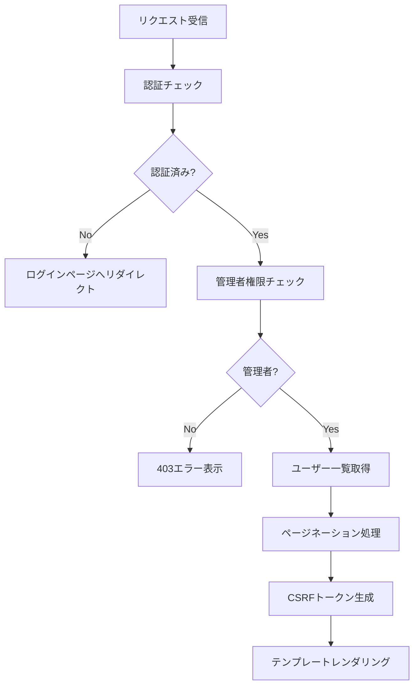
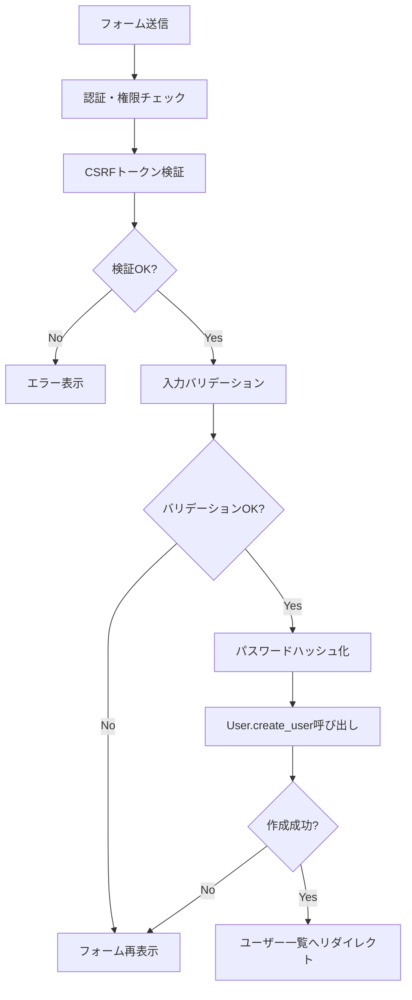
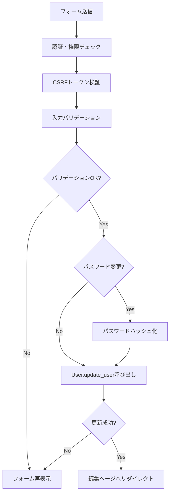
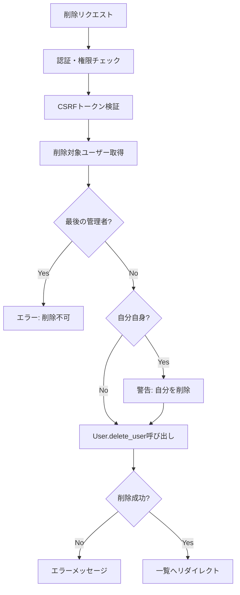
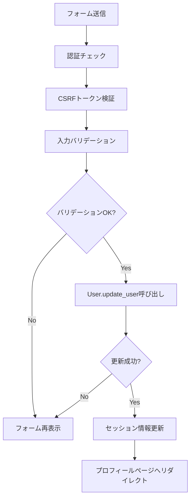
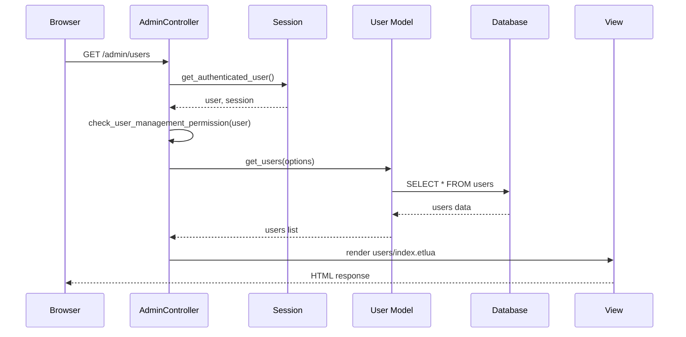
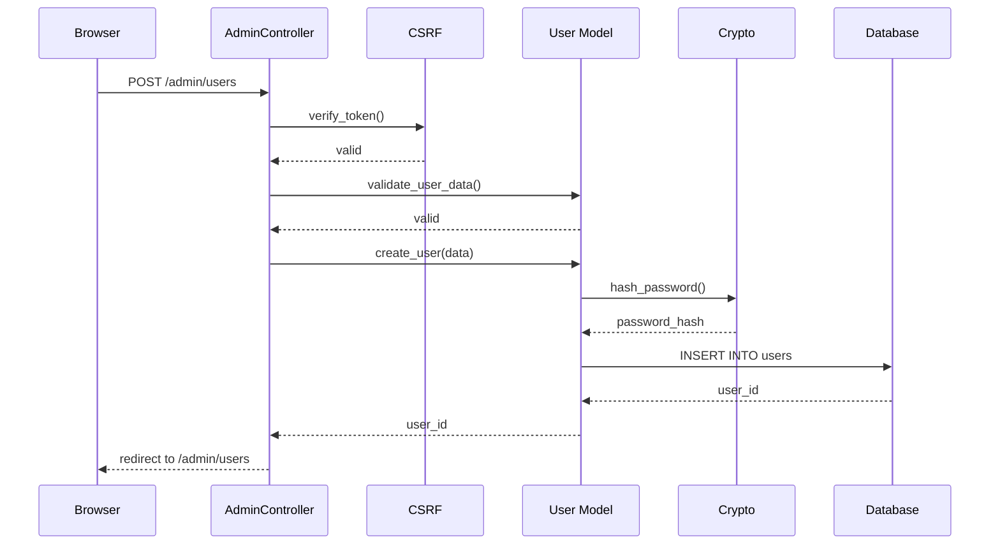
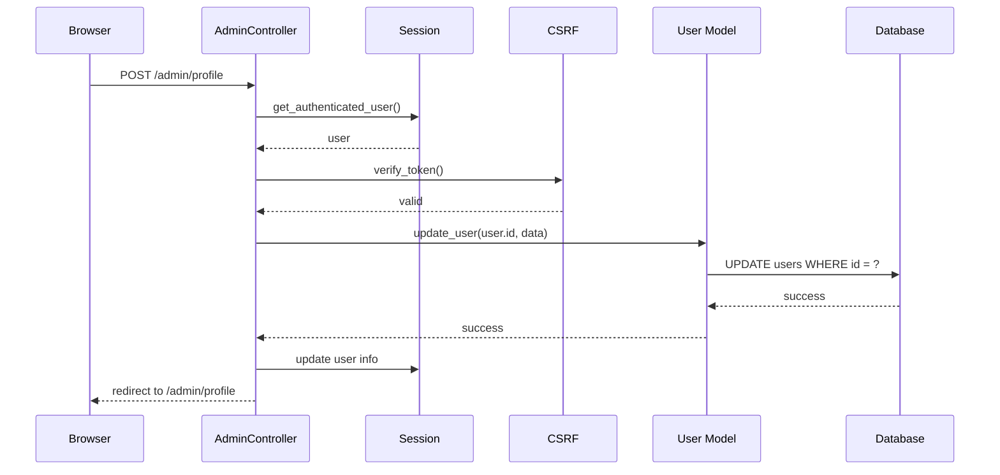

# ユーザー管理機能設計ドキュメント

## 概要

LuaAIDiaryにユーザー管理機能を追加します。管理者は全ユーザーの管理（一覧、編集、追加、削除）が可能で、通常ユーザーは自分のプロフィール編集（ユーザー名、パスワード）ができます。

---

## 1. データベーススキーマ

### 1.1 現在のusersテーブル構造

既存のテーブル定義（`postgresql/init/01_create_tables.sql`）:

```sql
CREATE TABLE users (
    id SERIAL PRIMARY KEY,
    username VARCHAR(50) UNIQUE NOT NULL,
    email VARCHAR(100) UNIQUE NOT NULL,
    password_hash VARCHAR(255) NOT NULL,
    display_name VARCHAR(100),
    role user_role_enum DEFAULT 'subscriber',
    created_at TIMESTAMP DEFAULT CURRENT_TIMESTAMP,
    updated_at TIMESTAMP DEFAULT CURRENT_TIMESTAMP
);

-- role ENUM型: 'admin', 'editor', 'author', 'subscriber'
```

### 1.2 インデックス

```sql
CREATE INDEX idx_users_username ON users(username);
CREATE INDEX idx_users_email ON users(email);
CREATE INDEX idx_users_role ON users(role);
```

### 1.3 スキーマ変更の必要性

**結論: スキーマ変更不要**

現在のスキーマで必要な機能はすべて実装可能です。

---

## 2. ルーティング設計

### 2.1 管理者用ルート（`/admin/users/*`）

| メソッド | パス | アクション | 説明 | 権限 |
|---------|------|-----------|------|------|
| GET | `/admin/users` | `users_index` | ユーザー一覧表示 | admin |
| GET | `/admin/users/new` | `users_new` | 新規ユーザー作成フォーム | admin |
| POST | `/admin/users` | `users_create` | 新規ユーザー作成処理 | admin |
| GET | `/admin/users/:id/edit` | `users_edit` | ユーザー編集フォーム | admin |
| POST | `/admin/users/:id` | `users_update` | ユーザー更新処理 | admin |
| POST | `/admin/users/:id/delete` | `users_delete` | ユーザー削除処理 | admin |

### 2.2 通常ユーザー用ルート（`/admin/profile`）

| メソッド | パス | アクション | 説明 | 権限 |
|---------|------|-----------|------|------|
| GET | `/admin/profile` | `profile_show` | プロフィール表示 | 認証済み |
| GET | `/admin/profile/edit` | `profile_edit` | プロフィール編集フォーム | 認証済み |
| POST | `/admin/profile` | `profile_update` | プロフィール更新処理 | 認証済み |

**注**: パスワード変更機能は既に `/admin/change-password` で実装済みのため、プロフィール編集ではユーザー名とメールアドレスのみを扱います。

### 2.3 app/init.luaへのルート追加例

```lua
-- ========================================
-- 管理画面 - ユーザー管理エンドポイント
-- ========================================

-- ユーザー一覧
app:get("/admin/users", function(self)
    return admin_controller.users_index(self)
end)

-- 新規ユーザーフォーム
app:get("/admin/users/new", function(self)
    return admin_controller.users_new(self)
end)

-- ユーザー作成
app:post("/admin/users", function(self)
    return admin_controller.users_create(self)
end)

-- ユーザー編集フォーム
app:get("/admin/users/:id/edit", function(self)
    return admin_controller.users_edit(self)
end)

-- ユーザー更新
app:post("/admin/users/:id", function(self)
    return admin_controller.users_update(self)
end)

-- ユーザー削除
app:post("/admin/users/:id/delete", function(self)
    return admin_controller.users_delete(self)
end)

-- ========================================
-- プロフィール管理エンドポイント
-- ========================================

-- プロフィール表示
app:get("/admin/profile", function(self)
    return admin_controller.profile_show(self)
end)

-- プロフィール編集フォーム
app:get("/admin/profile/edit", function(self)
    return admin_controller.profile_edit(self)
end)

-- プロフィール更新
app:post("/admin/profile", function(self)
    return admin_controller.profile_update(self)
end)
```

---

## 3. コントローラー設計

### 3.1 AdminController拡張（`app/controllers/admin_controller.lua`）

#### 3.1.1 管理者用ユーザー管理アクション

##### `users_index(self)` - ユーザー一覧

**処理フロー:**


**実装詳細:**
- ページネーション対応（1ページ20件）
- ロールフィルター機能（クエリパラメータ `?role=admin`）
- 各ユーザーの投稿数も表示
- ソート機能（作成日時、ユーザー名）

**必要なデータ:**
```lua
{
    users = {
        { id, username, email, display_name, role, created_at, post_count },
        ...
    },
    pagination = {
        current_page = 1,
        total_pages = 5,
        total_count = 100,
        per_page = 20
    },
    role_filter = "all",  -- or "admin", "editor", etc.
    csrf_token = "...",
    user = current_user
}
```

##### `users_new(self)` - 新規ユーザー作成フォーム

**処理フロー:**
- 認証・管理者権限チェック
- CSRFトークン生成
- ロール選択肢を準備
- フォームテンプレートをレンダリング

**必要なデータ:**
```lua
{
    roles = { "admin", "editor", "author", "subscriber" },
    csrf_token = "...",
    user = current_user,
    error_message = nil
}
```

##### `users_create(self)` - 新規ユーザー作成処理

**処理フロー:**


**バリデーション:**
- username: 必須、3-50文字、英数字とアンダースコア、重複チェック
- email: 必須、メール形式、重複チェック
- password: 必須、8文字以上、英字+数字
- role: 必須、有効なロール値

##### `users_edit(self)` - ユーザー編集フォーム

**処理フロー:**
- 認証・管理者権限チェック
- ユーザーIDからユーザー情報取得
- CSRFトークン生成
- 編集フォームをレンダリング

**必要なデータ:**
```lua
{
    edit_user = { id, username, email, display_name, role, created_at },
    roles = { "admin", "editor", "author", "subscriber" },
    csrf_token = "...",
    user = current_user,
    error_message = nil
}
```

##### `users_update(self)` - ユーザー更新処理

**処理フロー:**


**更新可能フィールド:**
- username
- email
- display_name
- role
- password（オプション、入力された場合のみ更新）

**特別な処理:**
- 最後の管理者のロール変更を防止
- 自分自身のロールを下げることに警告

##### `users_delete(self)` - ユーザー削除処理

**処理フロー:**


**削除時の検証:**
- 最後の管理者ユーザーは削除不可（User.delete_userで実装済み）
- 関連データ（投稿、コメント）はFOREIGN KEY ON DELETE CASCADEで自動削除

#### 3.1.2 通常ユーザー用プロフィール管理アクション

##### `profile_show(self)` - プロフィール表示

**処理フロー:**
- 認証チェック（管理者権限不要）
- セッションから現在のユーザー情報取得
- ユーザーの統計情報取得（投稿数、コメント数）
- プロフィールテンプレートをレンダリング

**必要なデータ:**
```lua
{
    user = current_user,
    stats = {
        post_count = 10,
        comment_count = 5
    },
    csrf_token = "..."
}
```

##### `profile_edit(self)` - プロフィール編集フォーム

**処理フロー:**
- 認証チェック
- 現在のユーザー情報取得
- CSRFトークン生成
- 編集フォームをレンダリング

**編集可能フィールド:**
- username
- email
- display_name

**注**: パスワード変更は既存の `/admin/change-password` を使用

##### `profile_update(self)` - プロフィール更新処理

**処理フロー:**


**制限:**
- 自分自身のユーザー情報のみ更新可能
- role フィールドは更新不可

---

## 4. ビュー設計

### 4.1 ディレクトリ構造

```
app/views/admin/
├── users/
│   ├── index.etlua       # ユーザー一覧
│   ├── new.etlua          # 新規ユーザー作成フォーム
│   └── edit.etlua         # ユーザー編集フォーム
└── profile/
    ├── show.etlua         # プロフィール表示
    └── edit.etlua         # プロフィール編集フォーム
```

### 4.2 ユーザー一覧ページ（`users/index.etlua`）

**主要コンポーネント:**

1. **ヘッダー**
   - ページタイトル: "ユーザー管理"
   - 新規ユーザー追加ボタン

2. **フィルター・検索バー**
   - ロールフィルター（全て/管理者/編集者/著者/購読者）
   - 検索フォーム（ユーザー名、メールアドレス）

3. **ユーザーテーブル**
   ```
   | ID | ユーザー名 | メールアドレス | 表示名 | ロール | 投稿数 | 登録日 | アクション |
   ```
   
   - ソート可能カラム: ユーザー名、登録日
   - ロールバッジ（色分け: admin=赤、editor=青、author=緑、subscriber=灰色）
   - アクション: 編集、削除

4. **ページネーション**
   - 前へ/次へボタン
   - ページ番号リンク

**レイアウト例:**
```html
<div class="users-header">
    <h2>ユーザー管理</h2>
    <a href="/admin/users/new" class="btn btn-primary">新規ユーザー追加</a>
</div>

<div class="users-filters">
    <select name="role_filter">
        <option value="all">すべてのロール</option>
        <option value="admin">管理者</option>
        <option value="editor">編集者</option>
        <option value="author">著者</option>
        <option value="subscriber">購読者</option>
    </select>
</div>

<table class="users-table">
    <thead>
        <tr>
            <th>ID</th>
            <th>ユーザー名</th>
            <th>メールアドレス</th>
            <th>表示名</th>
            <th>ロール</th>
            <th>投稿数</th>
            <th>登録日</th>
            <th>アクション</th>
        </tr>
    </thead>
    <tbody>
        <% for _, u in ipairs(users) do %>
        <tr>
            <td><%= u.id %></td>
            <td><%= u.username %></td>
            <td><%= u.email %></td>
            <td><%= u.display_name or "-" %></td>
            <td><span class="badge badge-<%= u.role %>"><%= u.role %></span></td>
            <td><%= u.post_count or 0 %></td>
            <td><%= os.date("%Y-%m-%d", u.created_at) %></td>
            <td>
                <a href="/admin/users/<%= u.id %>/edit" class="btn-edit">編集</a>
                <form method="POST" action="/admin/users/<%= u.id %>/delete" style="display:inline;">
                    <input type="hidden" name="csrf_token" value="<%= csrf_token %>">
                    <button type="submit" class="btn-delete" onclick="return confirm('本当に削除しますか？')">削除</button>
                </form>
            </td>
        </tr>
        <% end %>
    </tbody>
</table>
```

### 4.3 ユーザー作成・編集フォーム（`users/new.etlua`, `users/edit.etlua`）

**フォームフィールド:**

1. **新規作成時:**
   - ユーザー名（username）- 必須
   - メールアドレス（email）- 必須
   - パスワード（password）- 必須
   - 表示名（display_name）- オプション
   - ロール（role）- 必須、ドロップダウン

2. **編集時:**
   - ユーザー名（username）- 必須
   - メールアドレス（email）- 必須
   - パスワード（password）- オプション（空の場合は変更なし）
   - 表示名（display_name）- オプション
   - ロール（role）- 必須、ドロップダウン

**共通フォームテンプレート例:**
```html
<form method="POST" action="<%= form_action %>" class="user-form">
    <input type="hidden" name="csrf_token" value="<%= csrf_token %>">
    
    <div class="form-group">
        <label for="username">ユーザー名 *</label>
        <input type="text" id="username" name="username" 
               value="<%= edit_user and edit_user.username or '' %>" required>
        <small>3-50文字、英数字とアンダースコアのみ</small>
    </div>
    
    <div class="form-group">
        <label for="email">メールアドレス *</label>
        <input type="email" id="email" name="email" 
               value="<%= edit_user and edit_user.email or '' %>" required>
    </div>
    
    <div class="form-group">
        <label for="display_name">表示名</label>
        <input type="text" id="display_name" name="display_name" 
               value="<%= edit_user and edit_user.display_name or '' %>">
    </div>
    
    <div class="form-group">
        <label for="password">パスワード <%= is_new and '*' or '(変更する場合のみ入力)' %></label>
        <input type="password" id="password" name="password" 
               <%= is_new and 'required' or '' %>>
        <small>8文字以上、英字と数字を含む</small>
    </div>
    
    <div class="form-group">
        <label for="role">ロール *</label>
        <select id="role" name="role" required>
            <% for _, r in ipairs(roles) do %>
            <option value="<%= r %>" <%= edit_user and edit_user.role == r and 'selected' or '' %>>
                <%= r %>
            </option>
            <% end %>
        </select>
    </div>
    
    <div class="form-actions">
        <button type="submit" class="btn btn-primary"><%= is_new and '作成' or '更新' %></button>
        <a href="/admin/users" class="btn btn-secondary">キャンセル</a>
    </div>
</form>
```

### 4.4 プロフィールページ（`profile/show.etlua`）

**表示内容:**
- ユーザー情報（読み取り専用）
- 統計情報（投稿数、コメント数）
- 編集ボタン
- パスワード変更ボタン（既存の `/admin/change-password` へのリンク）

**レイアウト例:**
```html
<div class="profile-header">
    <h2>プロフィール</h2>
    <div class="profile-actions">
        <a href="/admin/profile/edit" class="btn btn-primary">プロフィール編集</a>
        <a href="/admin/change-password" class="btn btn-secondary">パスワード変更</a>
    </div>
</div>

<div class="profile-info">
    <div class="info-group">
        <label>ユーザー名:</label>
        <span><%= user.username %></span>
    </div>
    <div class="info-group">
        <label>メールアドレス:</label>
        <span><%= user.email %></span>
    </div>
    <div class="info-group">
        <label>表示名:</label>
        <span><%= user.display_name or "-" %></span>
    </div>
    <div class="info-group">
        <label>ロール:</label>
        <span class="badge badge-<%= user.role %>"><%= user.role %></span>
    </div>
    <div class="info-group">
        <label>登録日:</label>
        <span><%= os.date("%Y-%m-%d %H:%M", user.created_at) %></span>
    </div>
</div>

<div class="profile-stats">
    <h3>統計情報</h3>
    <div class="stats-grid">
        <div class="stat-item">
            <span class="stat-value"><%= stats.post_count %></span>
            <span class="stat-label">投稿数</span>
        </div>
        <div class="stat-item">
            <span class="stat-value"><%= stats.comment_count %></span>
            <span class="stat-label">コメント数</span>
        </div>
    </div>
</div>
```

### 4.5 プロフィール編集フォーム（`profile/edit.etlua`）

**編集可能フィールド:**
- ユーザー名
- メールアドレス
- 表示名

**注意事項表示:**
- パスワード変更は専用ページで行う旨を表示
- ロールは変更できない旨を表示

**レイアウト例:**
```html
<div class="profile-edit-header">
    <h2>プロフィール編集</h2>
</div>

<div class="alert alert-info">
    <p>パスワードを変更する場合は、<a href="/admin/change-password">パスワード変更ページ</a>をご利用ください。</p>
</div>

<form method="POST" action="/admin/profile" class="profile-form">
    <input type="hidden" name="csrf_token" value="<%= csrf_token %>">
    
    <div class="form-group">
        <label for="username">ユーザー名 *</label>
        <input type="text" id="username" name="username" value="<%= user.username %>" required>
    </div>
    
    <div class="form-group">
        <label for="email">メールアドレス *</label>
        <input type="email" id="email" name="email" value="<%= user.email %>" required>
    </div>
    
    <div class="form-group">
        <label for="display_name">表示名</label>
        <input type="text" id="display_name" name="display_name" value="<%= user.display_name or '' %>">
    </div>
    
    <div class="form-group">
        <label>ロール</label>
        <input type="text" value="<%= user.role %>" disabled>
        <small>ロールは管理者のみが変更できます</small>
    </div>
    
    <div class="form-actions">
        <button type="submit" class="btn btn-primary">更新</button>
        <a href="/admin/profile" class="btn btn-secondary">キャンセル</a>
    </div>
</form>
```

### 4.6 サイドバーメニューへの追加

`app/views/admin/layout.etlua`のサイドバーに追加:

```html
<li class="nav-item">
    <a href="/admin/users" class="nav-link <%= active_menu == 'users' and 'active' or '' %>">
        <span class="nav-icon">👥</span>
        <span class="nav-text">ユーザー管理</span>
    </a>
</li>
```

管理者のみ表示するように条件分岐:

```html
<% if user and user.role == 'admin' then %>
<li class="nav-item">
    <a href="/admin/users" class="nav-link <%= active_menu == 'users' and 'active' or '' %>">
        <span class="nav-icon">👥</span>
        <span class="nav-text">ユーザー管理</span>
    </a>
</li>
<% end %>
```

プロフィールメニューはすべてのユーザーに表示:

```html
<li class="nav-item">
    <a href="/admin/profile" class="nav-link <%= active_menu == 'profile' and 'active' or '' %>">
        <span class="nav-icon">👤</span>
        <span class="nav-text">プロフィール</span>
    </a>
</li>
```

---

## 5. 権限チェックロジック

### 5.1 権限レベル

1. **admin**: すべての操作が可能
2. **editor**: 投稿管理、カテゴリー管理、タグ管理
3. **author**: 自分の投稿の管理
4. **subscriber**: 閲覧のみ

### 5.2 ユーザー管理機能の権限要件

| 機能 | 必要な権限 | チェック方法 |
|------|----------|-------------|
| ユーザー一覧表示 | admin | `user.role == 'admin'` |
| ユーザー作成 | admin | `user.role == 'admin'` |
| ユーザー編集 | admin | `user.role == 'admin'` |
| ユーザー削除 | admin | `user.role == 'admin'` |
| プロフィール表示 | 認証済み | `session:is_authenticated()` |
| プロフィール編集 | 認証済み（自分のみ） | `session:is_authenticated() and user.id == session:get_user_id()` |

### 5.3 権限チェック関数の実装

既存の `check_admin_permission` 関数を使用:

```lua
-- app/controllers/admin_controller.lua (既存)
local function check_admin_permission(user)
    if not user then
        return false
    end
    
    -- admin または editor ロールを許可
    if user.role == "admin" or user.role == "editor" then
        return true
    end
    
    return false
end
```

ユーザー管理専用のチェック関数を追加:

```lua
-- 管理者権限チェック（adminのみ）
local function check_user_management_permission(user)
    if not user then
        return false
    end
    
    -- admin ロールのみ許可
    if user.role == "admin" then
        return true
    end
    
    return false
end
```

### 5.4 各アクションでの権限チェック実装例

```lua
function AdminController.users_index(self)
    -- 認証チェック
    local user, session, err = get_authenticated_user()
    if not user then
        return { redirect_to = "/admin/login?redirect=/admin/users", status = 302 }
    end
    
    -- 管理者権限チェック
    if not check_user_management_permission(user) then
        ngx.status = 403
        return render_error("403 Forbidden", "この機能を使用する権限がありません。管理者のみアクセス可能です。")
    end
    
    -- 以下、通常処理...
end
```

プロフィール編集の場合:

```lua
function AdminController.profile_update(self)
    -- 認証チェック
    local user, session, err = get_authenticated_user()
    if not user then
        return { redirect_to = "/admin/login", status = 302 }
    end
    
    -- 自分自身のプロフィールのみ編集可能（追加のチェックは不要）
    -- user は既にセッションから取得した現在のユーザー
    
    -- 以下、通常処理...
end
```

---

## 6. セキュリティ考慮事項

### 6.1 CSRF保護

**実装済み機能:**
- `app/middleware/csrf.lua` でCSRFトークン生成・検証
- すべてのフォームにCSRFトークンを含める

**適用方法:**
```lua
-- トークン生成
local csrf_token, err = csrf.generate_token(session)

-- トークン検証
local csrf_valid, csrf_err = csrf.verify_token(self, session)
if not csrf_valid then
    return render_error("403 Forbidden", csrf_err or "CSRF検証に失敗しました")
end
```

**フォームでの使用:**
```html
<form method="POST" action="/admin/users">
    <input type="hidden" name="csrf_token" value="<%= csrf_token %>">
    <!-- その他のフィールド -->
</form>
```

### 6.2 パスワードハッシュ化

**実装済み機能:**
- `app/utils/crypto.lua` でbcryptを使用したハッシュ化
- `User.create_user` と `User.update_user` で自動的にハッシュ化

**使用方法:**
```lua
-- models/user.lua (既存実装)
local password_hash, err = crypto.hash_password(data.password)
if not password_hash then
    return nil, err or "パスワードのハッシュ化に失敗しました"
end
```

**パスワード検証:**
```lua
-- models/user.lua (既存実装)
if not crypto.verify_password(password, user.password_hash) then
    return nil, "パスワードが正しくありません"
end
```

### 6.3 入力バリデーション

**実装済み機能:**
- `app/utils/validator.lua` でバリデーション関数提供
- `User.validate_user_data` でユーザーデータのバリデーション

**必要なバリデーション:**

1. **ユーザー名:**
```lua
local ok, err = validator.validate_username(username)
-- 3-50文字、英数字とアンダースコアのみ
```

2. **メールアドレス:**
```lua
local ok, err = validator.validate_email(email)
-- メール形式チェック
```

3. **パスワード:**
```lua
local ok, err = validator.validate_password(password)
-- 8文字以上
```

4. **ロール:**
```lua
local VALID_ROLES = {"admin", "editor", "author", "subscriber"}
local ok, err = validator.validate_enum(role, VALID_ROLES)
```

**コントローラーでのバリデーション例:**
```lua
function AdminController.users_create(self)
    -- ... 認証・権限チェック ...
    
    -- 入力バリデーション
    local user_data = {
        username = self.params.username,
        email = self.params.email,
        password = self.params.password,
        display_name = self.params.display_name,
        role = self.params.role
    }
    
    local ok, err = User.validate_user_data(user_data)
    if not ok then
        -- エラー処理
        return render_admin_template("users/new", {
            error_message = err,
            -- ...
        })
    end
    
    -- ユーザー作成
    local user_id, err = User.create_user(user_data)
    -- ...
end
```

### 6.4 SQLインジェクション対策

**実装済み機能:**
- `app/config/database.lua` でパラメータ化クエリを使用
- Baseモデルで安全なクエリ構築

**注意点:**
- 直接SQL文字列を構築しない
- 必ず `db_config.escape()` を使用するか、プレースホルダーを使用

**安全なクエリ例:**
```lua
-- models/base.lua (既存実装)
function _M:find(id)
    local query = string.format("SELECT * FROM %s WHERE id = %s LIMIT 1", 
        self.table_name, db_config.escape(tostring(id)))
    -- ...
end
```

### 6.5 XSS（クロスサイトスクリプティング）対策

**実装方針:**
- etluaテンプレートエンジンで自動エスケープ
- `<%= value %>` で自動的にHTMLエスケープ
- `<%- raw_html %>` は信頼できるコンテンツのみに使用

**テンプレートでの使用:**
```html
<!-- 安全（自動エスケープ） -->
<p>ユーザー名: <%= user.username %></p>

<!-- 危険（エスケープなし） - 使用を避ける -->
<div><%- user_html_content %></div>
```

### 6.6 セッションセキュリティ

**実装済み機能:**
- `app/utils/session.lua` でRedisベースのセッション管理
- セッションIDの再生成機能

**ベストプラクティス:**

1. **ログイン時にセッションを再生成:**
```lua
-- services/auth_service.lua (既存実装)
session:regenerate()
```

2. **重要な操作後にセッションを再生成:**
```lua
-- パスワード変更後など
session:regenerate()
```

3. **セッションタイムアウトの設定:**
```lua
-- utils/session.lua で設定
self.session_timeout = 3600  -- 1時間
```

### 6.7 認可（Authorization）の徹底

**実装方針:**
1. すべての管理画面エンドポイントで認証チェック
2. 権限が必要な操作で役割ベースのチェック
3. リソースの所有者チェック（自分のデータのみ編集可能）

**チェックリスト:**
- [ ] 認証チェック: `get_authenticated_user()`
- [ ] 管理者権限チェック: `check_user_management_permission(user)`
- [ ] CSRFトークン検証: `csrf.verify_token(self, session)`
- [ ] 入力バリデーション: `User.validate_user_data(data)`

### 6.8 レート制限（推奨）

**将来の実装案:**
- ログイン試行回数の制限（ブルートフォース攻撃対策）
- ユーザー作成APIのレート制限
- Redisを使用したカウンター実装

**実装例（参考）:**
```lua
-- 将来の実装
local function check_rate_limit(user_id, action)
    local key = string.format("rate_limit:%s:%s", action, user_id)
    local count = redis:incr(key)
    if count == 1 then
        redis:expire(key, 3600)  -- 1時間
    end
    if count > 10 then  -- 1時間に10回まで
        return false, "レート制限に達しました"
    end
    return true
end
```

### 6.9 監査ログ（推奨）

**将来の実装案:**
- ユーザー管理操作のログ記録
- 誰が、いつ、何をしたかを記録

**ログ内容:**
- ユーザー作成/更新/削除
- ロール変更
- パスワード変更

**実装例（参考）:**
```lua
-- 将来の実装
local function log_user_action(admin_user_id, action, target_user_id, details)
    local log_entry = {
        admin_user_id = admin_user_id,
        action = action,
        target_user_id = target_user_id,
        details = details,
        timestamp = os.time(),
        ip_address = ngx.var.remote_addr
    }
    -- データベースまたはログファイルに記録
end
```

---

## 7. 実装の優先順位

### フェーズ1: 管理者向けユーザー管理（優先度: 高）

1. **コントローラー実装**
   - `AdminController.users_index`
   - `AdminController.users_new`
   - `AdminController.users_create`
   - `AdminController.users_edit`
   - `AdminController.users_update`
   - `AdminController.users_delete`

2. **ビュー実装**
   - `app/views/admin/users/index.etlua`
   - `app/views/admin/users/new.etlua`
   - `app/views/admin/users/edit.etlua`

3. **ルーティング追加**
   - `app/init.lua` にルート追加

4. **サイドバーメニュー更新**
   - `app/views/admin/layout.etlua` にメニュー項目追加

### フェーズ2: 通常ユーザー向けプロフィール管理（優先度: 中）

1. **コントローラー実装**
   - `AdminController.profile_show`
   - `AdminController.profile_edit`
   - `AdminController.profile_update`

2. **ビュー実装**
   - `app/views/admin/profile/show.etlua`
   - `app/views/admin/profile/edit.etlua`

3. **ルーティング追加**
   - `app/init.lua` にルート追加

4. **サイドバーメニュー更新**
   - プロフィールメニュー項目追加

### フェーズ3: スタイリングと改善（優先度: 低）

1. **CSS追加**
   - ユーザー管理ページのスタイル
   - ロールバッジのスタイル
   - フォームスタイルの統一

2. **JavaScript機能追加**
   - ユーザー削除時の確認ダイアログ
   - フィルタリング機能の強化
   - リアルタイムバリデーション

### フェーズ4: テストとドキュメント（優先度: 中）

1. **単体テスト**
   - ユーザー管理コントローラーのテスト
   - 権限チェックのテスト

2. **E2Eテスト**
   - ユーザー作成フロー
   - ユーザー編集フロー
   - プロフィール編集フロー

3. **ドキュメント更新**
   - README更新
   - API仕様書更新

---

## 8. データフロー図

### 8.1 ユーザー一覧表示フロー



### 8.2 ユーザー作成フロー



### 8.3 プロフィール更新フロー



---

## 9. エラーハンドリング

### 9.1 エラータイプと対応

| エラータイプ | HTTPステータス | 対応方法 |
|------------|--------------|---------|
| 認証エラー | 401 | ログインページへリダイレクト |
| 権限不足 | 403 | エラーページ表示 |
| バリデーションエラー | 400 | フォーム再表示+エラーメッセージ |
| リソース不存在 | 404 | エラーページ表示 |
| CSRF検証失敗 | 403 | エラーページ表示 |
| データベースエラー | 500 | エラーページ表示+ログ記録 |

### 9.2 エラーメッセージ例

**ユーザー作成時:**
- "ユーザー名は3文字以上50文字以内で入力してください"
- "このユーザー名は既に使用されています"
- "メールアドレスの形式が正しくありません"
- "パスワードは8文字以上で、英字と数字を含める必要があります"

**ユーザー削除時:**
- "最後の管理者ユーザーは削除できません"
- "ユーザーの削除に失敗しました"

**権限エラー:**
- "この機能を使用する権限がありません。管理者のみアクセス可能です。"
- "このページへのアクセス権限がありません"

### 9.3 エラーハンドリング実装例

```lua
function AdminController.users_create(self)
    local user, session, err = get_authenticated_user()
    if not user then
        return { redirect_to = "/admin/login", status = 302 }
    end
    
    if not check_user_management_permission(user) then
        ngx.status = 403
        return render_error("403 Forbidden", "管理者権限が必要です")
    end
    
    local csrf_valid, csrf_err = csrf.verify_token(self, session)
    if not csrf_valid then
        return render_error("403 Forbidden", "CSRF検証に失敗しました")
    end
    
    local user_data = {
        username = self.params.username,
        email = self.params.email,
        password = self.params.password,
        display_name = self.params.display_name,
        role = self.params.role
    }
    
    -- バリデーション
    local ok, validation_err = User.validate_user_data(user_data)
    if not ok then
        local csrf_token = csrf.generate_token(session)
        return render_admin_template("users/new", {
            user = user,
            csrf_token = csrf_token,
            roles = {"admin", "editor", "author", "subscriber"},
            error_message = validation_err,
            form_data = user_data,  -- フォーム内容を保持
            page_title = "新規ユーザー作成",
            active_menu = "users"
        })
    end
    
    -- ユーザー作成
    local user_id, create_err = User.create_user(user_data)
    if not user_id then
        local csrf_token = csrf.generate_token(session)
        return render_admin_template("users/new", {
            user = user,
            csrf_token = csrf_token,
            roles = {"admin", "editor", "author", "subscriber"},
            error_message = create_err or "ユーザーの作成に失敗しました",
            form_data = user_data,
            page_title = "新規ユーザー作成",
            active_menu = "users"
        })
    end
    
    -- 成功
    return { redirect_to = "/admin/users?created=1", status = 302 }
end
```

---

## 10. テスト計画

### 10.1 単体テスト

**テスト対象:**
- User モデルのメソッド（既存のテストを確認）
- AdminController の各アクション

**テストケース例（`tests/controllers/test_user_management_spec.lua`）:**

```lua
describe("AdminController - User Management", function()
    describe("users_index", function()
        it("should require authentication", function()
            -- 未認証でアクセス
            -- リダイレクトを確認
        end)
        
        it("should require admin permission", function()
            -- 非管理者でアクセス
            -- 403エラーを確認
        end)
        
        it("should display user list for admin", function()
            -- 管理者でアクセス
            -- ユーザー一覧が表示されることを確認
        end)
    end)
    
    describe("users_create", function()
        it("should create user with valid data", function()
            -- 有効なデータでユーザー作成
            -- 成功を確認
        end)
        
        it("should reject invalid username", function()
            -- 無効なユーザー名でユーザー作成
            -- エラーを確認
        end)
        
        it("should reject duplicate username", function()
            -- 重複したユーザー名でユーザー作成
            -- エラーを確認
        end)
    end)
end)
```

### 10.2 E2Eテスト

**テストシナリオ（`tests/e2e/test_user_management.sh`）:**

```bash
#!/bin/bash
# ユーザー管理E2Eテスト

BASE_URL="http://localhost:8080"
COOKIE_FILE="cookies_user_mgmt.txt"

# 1. 管理者としてログイン
echo "=== 管理者ログイン ==="
curl -c $COOKIE_FILE -X POST "$BASE_URL/admin/login" \
  -d "username_or_email=admin" \
  -d "password=admin123"

# 2. ユーザー一覧を取得
echo "=== ユーザー一覧取得 ==="
curl -b $COOKIE_FILE "$BASE_URL/admin/users"

# 3. 新規ユーザー作成
echo "=== 新規ユーザー作成 ==="
CSRF_TOKEN=$(curl -b $COOKIE_FILE "$BASE_URL/api/csrf-token" | jq -r '.token')
curl -b $COOKIE_FILE -X POST "$BASE_URL/admin/users" \
  -d "csrf_token=$CSRF_TOKEN" \
  -d "username=testuser" \
  -d "email=test@example.com" \
  -d "password=Test1234" \
  -d "role=subscriber"

# 4. ユーザー編集
echo "=== ユーザー編集 ==="
USER_ID=2  # 作成されたユーザーのID
curl -b $COOKIE_FILE -X POST "$BASE_URL/admin/users/$USER_ID" \
  -d "csrf_token=$CSRF_TOKEN" \
  -d "username=testuser_updated" \
  -d "email=test@example.com" \
  -d "role=author"

# 5. ユーザー削除
echo "=== ユーザー削除 ==="
curl -b $COOKIE_FILE -X POST "$BASE_URL/admin/users/$USER_ID/delete" \
  -d "csrf_token=$CSRF_TOKEN"

# クッキーファイル削除
rm $COOKIE_FILE
```

### 10.3 セキュリティテスト

**テスト項目:**
1. CSRF保護のテスト
2. XSS脆弱性のテスト
3. SQLインジェクションのテスト
4. 権限チェックのバイパステスト
5. セッションハイジャックのテスト

---

## 11. パフォーマンス考慮事項

### 11.1 ユーザー一覧のページネーション

- 1ページあたり20件表示
- OFFSET/LIMITを使用したページング
- 大量ユーザー時のパフォーマンス維持

### 11.2 インデックスの活用

既存のインデックスを活用:
- `idx_users_username`: ユーザー名検索
- `idx_users_email`: メールアドレス検索
- `idx_users_role`: ロールフィルター

### 11.3 N+1クエリ問題の回避

投稿数取得時の最適化:

```lua
-- 悪い例（N+1問題）
for _, user in ipairs(users) do
    user.post_count = Post:count({author_id = user.id})
end

-- 良い例（JOINまたはサブクエリ）
local query = [[
    SELECT u.*, COUNT(p.id) as post_count
    FROM users u
    LEFT JOIN posts p ON u.id = p.author_id
    GROUP BY u.id
    ORDER BY u.created_at DESC
    LIMIT %d OFFSET %d
]]
```

---

## 12. まとめ

### 12.1 実装範囲

**管理者機能:**
- ✅ ユーザー一覧表示（ページネーション、フィルター）
- ✅ ユーザー作成（バリデーション、権限チェック）
- ✅ ユーザー編集（情報更新、ロール変更）
- ✅ ユーザー削除（制約チェック）

**通常ユーザー機能:**
- ✅ プロフィール表示
- ✅ プロフィール編集（ユーザー名、メール）
- ✅ パスワード変更（既存機能を活用）

### 12.2 セキュリティ対策

- ✅ CSRF保護
- ✅ パスワードハッシュ化（bcrypt）
- ✅ 入力バリデーション
- ✅ SQLインジェクション対策
- ✅ XSS対策（自動エスケープ）
- ✅ 権限チェック（ロールベース）
- ✅ セッションセキュリティ

### 12.3 次のステップ

1. **フェーズ1**: 管理者向けユーザー管理機能の実装
2. **フェーズ2**: 通常ユーザー向けプロフィール管理機能の実装
3. **フェーズ3**: スタイリングとUI改善
4. **フェーズ4**: テストとドキュメント整備

---

## 付録: コード実装例

### A. ユーザー一覧取得関数の実装例

```lua
-- AdminController.users_index の詳細実装
function AdminController.users_index(self)
    -- 認証チェック
    local user, session, err = get_authenticated_user()
    if not user then
        return { redirect_to = "/admin/login?redirect=/admin/users", status = 302 }
    end
    
    -- 管理者権限チェック
    if not check_user_management_permission(user) then
        ngx.status = 403
        return render_error("403 Forbidden", "ユーザー管理機能は管理者のみ利用できます")
    end
    
    -- クエリパラメータ取得
    local args = self.req.params_get or {}
    local role_filter = args.role or "all"
    local page = tonumber(args.page) or 1
    local per_page = 20
    local offset = (page - 1) * per_page
    
    -- ユーザー一覧を取得（投稿数も含む）
    local query = string.format([[
        SELECT u.id, u.username, u.email, u.display_name, u.role, u.created_at,
               COUNT(p.id) as post_count
        FROM users u
        LEFT JOIN posts p ON u.id = p.author_id
        %s
        GROUP BY u.id, u.username, u.email, u.display_name, u.role, u.created_at
        ORDER BY u.created_at DESC
        LIMIT %d OFFSET %d
    ]], 
        role_filter ~= "all" and string.format("WHERE u.role = '%s'", db_config.escape(role_filter)) or "",
        per_page, 
        offset
    )
    
    local users, err = db_config.query(query)
    if not users then
        users = {}
        ngx.log(ngx.ERR, "ユーザー一覧取得エラー: ", err or "unknown")
    end
    
    -- 総ユーザー数を取得
    local count_query = string.format([[
        SELECT COUNT(*) as total FROM users
        %s
    ]], 
        role_filter ~= "all" and string.format("WHERE role = '%s'", db_config.escape(role_filter)) or ""
    )
    
    local count_result = db_config.query(count_query)
    local total_count = count_result and count_result[1] and count_result[1].total or 0
    local total_pages = math.ceil(total_count / per_page)
    
    -- CSRFトークンを生成
    local csrf_token, csrf_err = csrf.generate_token(session)
    if not csrf_token then
        ngx.log(ngx.ERR, "CSRFトークン生成エラー: ", csrf_err or "unknown")
        csrf_token = ""
    end
    
    -- テンプレートをレンダリング
    return render_admin_template("users/index", {
        user = user,
        csrf_token = csrf_token,
        users = users,
        role_filter = role_filter,
        pagination = {
            current_page = page,
            total_pages = total_pages,
            total_count = total_count,
            per_page = per_page
        },
        page_title = "ユーザー管理",
        active_menu = "users"
    })
end
```

### B. サイドバーメニューの条件付き表示

```html
<!-- app/views/admin/layout.etlua の修正箇所 -->
<nav class="sidebar-nav">
    <ul class="nav-menu">
        <!-- 既存のメニュー項目 -->
        <li class="nav-item">
            <a href="/admin/dashboard" class="nav-link <%= active_menu == 'dashboard' and 'active' or '' %>">
                <span class="nav-icon">📊</span>
                <span class="nav-text">ダッシュボード</span>
            </a>
        </li>
        
        <!-- ... その他のメニュー ... -->
        
        <li class="nav-divider"></li>
        
        <!-- 管理者のみ表示: ユーザー管理 -->
        <% if user and user.role == 'admin' then %>
        <li class="nav-item">
            <a href="/admin/users" class="nav-link <%= active_menu == 'users' and 'active' or '' %>">
                <span class="nav-icon">👥</span>
                <span class="nav-text">ユーザー管理</span>
            </a>
        </li>
        <% end %>
        
        <!-- すべてのユーザーに表示: プロフィール -->
        <li class="nav-item">
            <a href="/admin/profile" class="nav-link <%= active_menu == 'profile' and 'active' or '' %>">
                <span class="nav-icon">👤</span>
                <span class="nav-text">プロフィール</span>
            </a>
        </li>
        
        <!-- 既存のメニュー項目 -->
        <li class="nav-item">
            <a href="/admin/settings" class="nav-link <%= active_menu == 'settings' and 'active' or '' %>">
                <span class="nav-icon">⚙️</span>
                <span class="nav-text">設定</span>
            </a>
        </li>
    </ul>
</nav>
```

---

**設計ドキュメント作成日**: 2025-12-30  
**バージョン**: 1.0  
**作成者**: LuaAIDiary開発チーム
